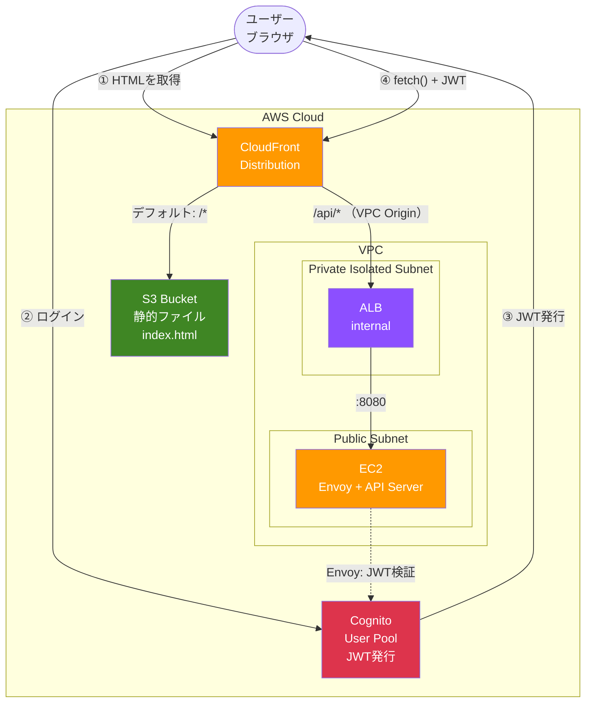

https://qiita.com/official-events/df853677df3984f82556

## はじめに
VPCを消せなくなりました。ENIが残っていて消せません。ENI([Elastic Network Interface](https://docs.aws.amazon.com/ja_jp/AWSEC2/latest/UserGuide/using-eni.html))をコンソールから削除もしくはデタッチしようとしても手動では操作ができませんでした。そこでコマンドを使ってリソースを削除したという話です。技術的にはVPC Originを消したという方が正しいのかもしれません。聞くも涙、語るも涙の物語です。


**重要なのは、ENIを直接削除するのではなく、VpcOriginを削除することです。**

## 私の状況
言ってしまえば、「[はじめに](#はじめに)」に書いた通りのそれだけのことですが、話し始めると長くなります。この記事を読んでいるあなたはきっと同じような状況で困っていることでしょう。あなたと私が書いている状況には微妙な違いがあるかもしれません。そこでできるだけ詳しく私の状況を語ることからはじめたいと思います。

もしかしたら、あなたと私で「ネットワークインターフェースは別のサービスによって使用されており、そのタイプは"cloudfront_managed"です.」という理由は一致しているのかもしれません。この場合は、この記事の手順でうまくいく確率が高いと思います。

前置きはこれくらいにして私の状況を説明します。

私が[AWS CDK](https://docs.aws.amazon.com/ja_jp/cdk/v2/guide/home.html)で作ろうとしていたのは、**「SPAからCognito認証付きAPIを呼び出すデモ」** です。

ALBのCognito認証はブラウザ遷移前提の設計であり、SPAのfetch()呼び出しとは相性が悪く、fetch()するとALBが302リダイレクトを返し、ログイン画面のHTMLがJSONの代わりに返ってきてパースエラーになります。そこでALBには認証させず、EC2上のEnvoyでJWTを検証する構成にしました。

CloudFrontのadditionalBehaviorsで`/api/*`をALBに振り分け、静的配信とAPIを同一ドメインにまとめています。CORSで躓かない、URLが綺麗、運用がシンプルという狙いです。

ALBは**internal**（Private Isolated Subnet）に置き、CloudFrontの**VPC Origin**経由でアクセスさせます。一方EC2は**Public Subnet**に置き、NATなしでUserDataのダウンロードを成立させています（インバウンドはALB SGからのみ許可。検証用のためNATゲートウェイを節約する意図です）。

構成図は以下の通りです。




そしてこの構成の肝であるCloudFront VPC Originが、cdk destroyした後もENIとして残り続け、VPCが削除できなくなった——というのが今回の問題です。

## CDKで書いたコード

次にCDKのコードを全文貼ってもよいのですが、関係のないところも多いので問題が発生した箇所と関連のあるCDKのコードをお見せします。もしかすると書き方が悪いというご指摘をいただけるかもしれないということを心密かに期待しています。

```typescript
// ALB（internal = インターネットに直接公開しない）
const alb = new elbv2.ApplicationLoadBalancer(this, 'Alb', {
  vpc, // vpc はここより前で、new ec2.Vpc()して作ったもの
  internetFacing: false,
  vpcSubnets: { subnetType: ec2.SubnetType.PRIVATE_ISOLATED },
  securityGroup: albSg, // albSg はここよりも前で、new ec2.SecurityGroup()して作ったもの
});

// CloudFront VPC Origin（CloudFrontからinternal ALBへの経路）
const albVpcOrigin = new cloudfront.VpcOrigin(this, 'AlbVpcOrigin', {
  endpoint: cloudfront.VpcOriginEndpoint.applicationLoadBalancer(alb),
  protocolPolicy: cloudfront.OriginProtocolPolicy.HTTP_ONLY,
  httpPort: 80,
});

// CloudFront Distribution
const distribution = new cloudfront.Distribution(this, 'Distribution', {
  defaultBehavior: {
    origin: origins.S3BucketOrigin.withOriginAccessControl(websiteBucket), // websiteBucket はここよりも前で、new s3.Bucket()して作ったもの
    viewerProtocolPolicy: cloudfront.ViewerProtocolPolicy.REDIRECT_TO_HTTPS,
  },
  additionalBehaviors: {
    '/api/*': {
      origin: origins.VpcOrigin.withVpcOrigin(albVpcOrigin),
      viewerProtocolPolicy: cloudfront.ViewerProtocolPolicy.REDIRECT_TO_HTTPS,
      allowedMethods: cloudfront.AllowedMethods.ALLOW_ALL,
      cachePolicy: cloudfront.CachePolicy.CACHING_DISABLED,
      originRequestPolicy: cloudfront.OriginRequestPolicy.ALL_VIEWER_EXCEPT_HOST_HEADER,
    },
  },
  defaultRootObject: 'index.html',
});
```

ポイントは `internetFacing: false` のALBに対して、CloudFrontの `VPC Origin` を使ってアクセスしているところです。この VpcOrigin がPrivate Isolated SubnetにENI（Elastic Network Interface）を作成し、CloudFrontからVPC内部のALBへの通信経路を確立します。

そしてこのENIが `cdk destroy` 後も `cloudfront_managed` タイプとして残り続け、VPCの削除を阻んだ——というのが今回の問題です。

第一に気づく現象としては以下の通りです。
- `cdk destroy`が失敗
- VPCを削除できない
- Private Subnetを削除できない
- Private Subnet内にENIが残っている => コンソールでの手動操作では消せない

## 解決手順

[AWS コマンドラインインターフェイス](https://aws.amazon.com/jp/cli/)を使って、"cloudfront_managed"なENI（Elastic Network Interface）を消します。実際には、VPC Originを消すことで自動的に関連するENIも削除されるという仕掛けです。

私の場合、CloudFront自体は削除が成功しているようで、コンソール上には存在していませんでした。それでまず、VpcOriginのリストを出してみました。
コマンドは[CloudShell](https://aws.amazon.com/jp/cloudshell/)で実行しました。必要な権限ポリシーをもったIAMユーザーでログインしています。

### list-vpc-origins

```bash
aws cloudfront list-vpc-origins --region us-west-2
```

リージョンはお使いの環境にあわせて読み替えてください。

幸い一個だけが該当し、これを削除すればよいことがわかりました。CDKを使ったのでCloudFormationに残っていたId情報とも一致します。

```json
{
    "VpcOriginList": {
        "MaxItems": 100,
        "Quantity": 1,
        "Items": [
            {
                "Id": "vo_xxxxxxxxxxxxx",
                "Name": "CognitoAlbAuthStackAlbVpcOriginBB4F6449",
                "Status": "Deployed",
                ...
```

### get-vpc-origin

次に、削除対象のVPC Originの詳細を取得します。削除コマンド（delete-vpc-origin）には --if-match パラメータでETag（Entity Tag）を指定する必要があります。これはHTTPの楽観的排他制御の仕組みで、「自分が取得した時点のリソース状態と変わっていなければ削除してよい」という意味です。AWSのAPIでは更新・削除系の操作でよく使われるパターンで、CloudFront DistributionやWAF WebACLの削除でも同様にETagが求められます。

```bash
aws cloudfront get-vpc-origin --id vo_xxxxxxxxxxxxx --region us-west-2
```

`vo_xxxxxxxxxxxxx`は、`list-vpc-origins`の結果で読み替えてください。
結果例です。


```json
{
    "ETag": "ETVVVVVVVV",
    "VpcOrigin": {
        "Id": "vo_xxxxxxxxxxxxx",
        ...
```

### delete-vpc-origin
ようやく削除ができます。

```bash
aws cloudfront delete-vpc-origin --id vo_xxxxxxxxxxxxx --if-match ETVVVVVVVV --region us-west-2
```

`ETVVVVVVVV`は、`get-vpc-origin`の結果で読み替えてください。

### get-vpc-origin
消えるまで数分かかります。

```bash
aws cloudfront get-vpc-origin --id vo_xxxxxxxxxxxxx --query "VpcOrigin.Status" --region us-west-2
```

消している間は、設定変更という意味でしょう。出力は、"Deploying" になります。
消えたあとは、`An error occurred (EntityNotFound) when calling the GetVpcOrigin operation: The specified vpc origin does not exist` となり、VPC Originは消え、同時にENIも自動的に消えています。私の場合はこのあと`cdk destroy`をもう一度することできれいにすべてが消えてくれました。


## さいごに

CloudFront VPC Originは、internal ALBをCloudFrontから直接叩ける便利な機能です。ただし cdk destroy やCloudFormationのスタック削除では、VPC Origin自体が先に消えてくれないことがあります。ENIが `cloudfront_managed` として残り、VPCごと道連れで削除不能になります。

CloudFront VPC Origin はCloudFront側のリソースとして管理されており、Distributionの削除とは独立しています。そのため削除順序が適切でない場合、VpcOriginが残り、それに紐づくENIも残存します。

手順をまとめると3ステップです。

1. `aws cloudfront list-vpc-origins` で残っているVPC OriginのIdを特定
2. `aws cloudfront get-vpc-origin --id <Id>` でETagを取得
3. `aws cloudfront delete-vpc-origin --id <Id> --if-match <ETag>` で削除

コンソールからは消せないのでCLIの出番です。同じ状況で困っている方の参考になれば幸いです。

---

この記事の作成および問題の解決には、私の相棒である[Kiro CLI](https://kiro.dev/cli/)や[ChatGPT](https://chatgpt.com/)の協力がありました。生成AI無しには生きてはいけません。
