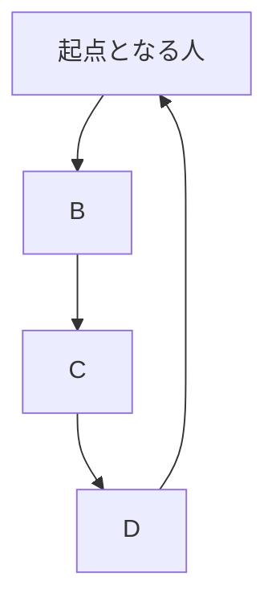

https://qiita.com/official-events/5cb794f7cb9ac194ed70

**虎穴に入らずんば虎児を得ず**

Advent Calendar 2022 22日目[^1]の記事です。
I'm ready for 12/25,2022 :santa::santa_tone1::santa_tone2::santa_tone3::santa_tone4::santa_tone5:
I'm looking forward to 12/25,2022 :santa::santa_tone1::santa_tone2::santa_tone3::santa_tone4::santa_tone5:
I can't wait for 12/25,2022 :santa::santa_tone1::santa_tone2::santa_tone3::santa_tone4::santa_tone5:
私の[Advent Calendar 2022 一覧](https://docs.google.com/spreadsheets/d/1HQvFjagQLRPjOYAjDVzWp9S4b8dKixxvvaz_TtbZWto/edit#gid=1723448955)。

[^1]: @kaizen_nagoya さんの「[「@e99h2121 アドベントカレンダーではありますまいか Advent Calendar 2020」の改訂版ではありますまいか Advent Calendar 2022 １日目　Most Breakthrough Generator](https://qiita.com/kaizen_nagoya/items/49ebebee3a0377f3b59b)」から着想を得て、模倣いたしました。 

---

# はじめに

[Elixir](https://elixir-lang.org/)を楽しんでいますか:bangbang::bangbang::bangbang:
[Livebook](https://github.com/livebook-dev/nerves_livebook)を楽しんでいますか:bangbang::bangbang::bangbang:

**[Livebook](https://github.com/livebook-dev/nerves_livebook)の進化が止まりません!!!**

[Mermaid](https://mermaid-js.github.io/mermaid/#/)という

> Mermaid lets you create diagrams and visualizations using text and code.

こういうものが、[Livebook](https://github.com/livebook-dev/nerves_livebook)のv0.5にビルトインされています。
早速試してみました〜　という記事です :rocket::rocket::rocket: 

<blockquote class="twitter-tweet"><p lang="en" dir="ltr">We have also heard many teams are using Livebook for documentation, so v0.5 has built-in support for Mermaid, for building diagrams and visualisations: <a href="https://t.co/Pi60wn5Rmm">https://t.co/Pi60wn5Rmm</a><br><br>[4/5] <a href="https://t.co/ULxi7INwkb">pic.twitter.com/ULxi7INwkb</a></p>&mdash; José Valim (@josevalim) <a href="https://twitter.com/josevalim/status/1483907956102074370?ref_src=twsrc%5Etfw">January 19, 2022</a></blockquote> <script async src="https://platform.twitter.com/widgets.js" charset="utf-8"></script>

# 使い方

Livebook Markdownセルに以下のように書くだけです。

:::note info

:::


<font color="purple">$\huge{この図どこかでみたこことあるぞ}$</font>

@pojiro さんの**[2022年に向けて](https://qiita.com/pojiro/items/30b6ef01c32882fc7c19#2022%E5%B9%B4%E3%81%AB%E5%90%91%E3%81%91%E3%81%A6)**です。
この中で紹介されている図です。


# [2022年に向けて](https://qiita.com/pojiro/items/30b6ef01c32882fc7c19#2022%E5%B9%B4%E3%81%AB%E5%90%91%E3%81%91%E3%81%A6)の図を[Mermaid](https://mermaid-js.github.io/mermaid/#/)で描いてみる

:::note

:::


**日本語使えた** :tada::tada::tada: 

# サンプル


https://mermaid-js.github.io/mermaid/#/
のトップページにあるものを写してみただけです。

ちなみに、トップページに書いてあるサンプルのうち、**Sequence diagram**はNoteが動きませんでした。
もちろんIssueを書いて、[報告](https://github.com/livebook-dev/livebook/issues/923)しておきました。

# Wrapping up :lgtm::lgtm::lgtm::lgtm::lgtm:

Enjoy [Elixir](https://elixir-lang.org/):bangbang::bangbang::bangbang:
<font color="purple">$\huge{Enjoy\ Elixir🚀}$</font>

[Livebook](https://github.com/livebook-dev/nerves_livebook)に追加された[Mermaid](https://mermaid-js.github.io/mermaid/#/)を使ってみました。
2022年1月22日(土)に行われた「[【オンライン】OSSでガチにプロダクト開発！実状紹介セミナー！](https://algyan.connpass.com/event/232035/)」においても感涙にむせび泣くもの続出であった、@pojiro さんの[2022年に向けて](https://qiita.com/pojiro/items/30b6ef01c32882fc7c19#2022%E5%B9%B4%E3%81%AB%E5%90%91%E3%81%91%E3%81%A6)の図を描いてみました。

[Elixir](https://elixir-lang.org/)の誕生日は、**2012年5月24日**です。
そのため、今年の2022年5月24日は10周年を迎えます。

```elixir
iex> Date.diff(~D[2022-05-24], ~D[2022-01-22])
122
```


2022年に流行る技術予想 ーー それは、[Elixir](https://elixir-lang.org/)です:rocket::rocket::rocket:

---


# [Elixir](https://elixir-lang.org/)

最後の最後に、[Elixir](https://elixir-lang.org/)について紹介します。

- [|>](https://hexdocs.pm/elixir/Kernel.html#%7C%3E/2)でスイスイ、プログラミングしていくことができる素敵なプログラミング言語です
- さっそくプログラムの例を示します
- [Qiita API](https://qiita.com/api/v2/docs)を使わせていただいて、`Elixir`タグがついた最新の記事を20件取得しています
- ここでは雰囲気をつかんでいただければ大丈夫です

```elixir
Mix.install [{:req, "~> 0.2.1"}]

"https://qiita.com/api/v2/items?query=tag:Elixir"
|> URI.encode()
|> Req.get!(finch_options: [pool_timeout: 50000, receive_timeout: 50000])
|> Map.get(:body)
|> Enum.map(& Map.take(&1, ["title", "url"]))

```

## Webアプリケーションを楽しむなら
- [Phoenix](https://www.phoenixframework.org/)

## IoTを楽しむなら
- [Nerves](https://www.nerves-project.org/)

## AIを楽しむなら
- [Nx](https://github.com/elixir-nx/nx) + [Livebook](https://github.com/livebook-dev/livebook)

## もっと[Elixir](https://elixir-lang.org/)のことを知りたい方へオススメの書籍 :books: 
- [プログラミングElixir（第2版）](https://www.ohmsha.co.jp/book/9784274226373/) -- オーム社
- [Elixir実践ガイド](https://book.impress.co.jp/books/1120101021) -- インプレス
- [アルケミスト − 夢を旅した少年](https://www.kadokawa.co.jp/product/199999275001/) -- KADOKAWA

## コミュニティ
- [elixir.jp](https://join.slack.com/t/elixirjp/shared_invite/zt-ae8m5bad-WW69GH1w4iuafm1tKNgd~w) Slack workspaceに参加してみてください
    - マヂ、やさしい人ばっかりのコミュニティ
    - あなたの**困った**をきっと解決してくれるでしょう
- [NervesJP Slack](https://join.slack.com/t/nerves-jp/shared_invite/zt-9vteokip-iVAqi8TkT0ID_uK9dSqVHA) workspaceでは、NervesやIoTが好きな愉快なfolksたちがあなたの訪れを歓迎します :tada:
- たくさんのコミュニティがあります
    - @nako_sleep_9h さん作の素敵な資料をご紹介します
    - [Elixirコミュニティ の歩き方〜国内オンライン編〜](https://speakerdeck.com/elijo/elixirkomiyunitei-falsebu-kifang-guo-nei-onrainbian) :clap::clap_tone1::clap_tone2::clap_tone3::clap_tone4::clap_tone5:


(@piacerex さん作 :pray::pray_tone1::pray_tone2::pray_tone3::pray_tone4::pray_tone5:)


# <u><b>Elixirコミュニティに初めて接する方は下記がオススメです</b></u>

**Elixirコミュニティ の歩き方 －国内オンライン編－**<br>
https://speakerdeck.com/elijo/elixirkomiyunitei-falsebu-kifang-guo-nei-onrainbian

[](https://speakerdeck.com/elijo/elixirkomiyunitei-falsebu-kifang-guo-nei-onrainbian)


---

I organize [autoracex](https://autoracex.connpass.com/).
And I belong to [NervesJP](https://nerves-jp.connpass.com/), [fukuoka.ex](https://fukuokaex.connpass.com/), [EDI](https://fukuokaex.connpass.com/).
I hope someday you'll join us.

[We Are The Alchemists, my friends!](https://www.youtube.com/watch?v=04854XqcfCY)
