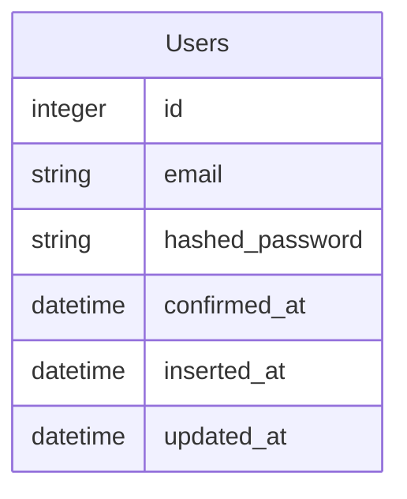

# はじめに

[Ecto](https://hexdocs.pm/ecto/Ecto.html)で生のSQLを実行してみたいとおもいます。
いつかそんな場面にでくわすことがあるかもしれません。

[Ecto.Adapters.SQL.query/4](https://hexdocs.pm/ecto_sql/Ecto.Adapters.SQL.html#query/4)のご紹介です。

`Users`テーブルから一覧を取得してみます。
この記事では、説明を簡単にするため、[Ecto](https://hexdocs.pm/ecto/Ecto.html)の構文でも簡単に書ける単純なものを例にします。




以下、`Ezuka`はプロジェクトの名前です。


# ふつうに[Ecto](https://hexdocs.pm/ecto/Ecto.html)の構文で書く

```elixir
iex> Ezuka.Repo.all(Ezuka.Accounts.User)

[
  #Ezuka.Accounts.User<
    __meta__: #Ecto.Schema.Metadata<:loaded, "users">,
    confirmed_at: nil,
    email: "1",
    id: 1,
    inserted_at: ~N[2022-09-11 11:53:59],
    updated_at: ~N[2022-09-11 11:53:59],
    hashed_password: "...",
    ...
  >, 
  ...
]
```

# 生のSQLを実行する

```elixir
iex> query = "SELECT * from users;"
iex> {:ok, %{columns: columns, rows: rows}} = Ecto.Adapters.SQL.query(Ezuka.Repo, query)
iex> rows |> Enum.map(fn row -> Enum.zip(columns, row) |> Map.new() end)                  
[
  %{
    "confirmed_at" => nil,
    "email" => "1",
    "hashed_password" => "...",
    "id" => 1,
    "inserted_at" => ~N[2022-09-11 11:53:59.000000],
    "updated_at" => ~N[2022-09-11 11:53:59.000000]
  },
  ...
]
```

# おわりに

[Ecto](https://hexdocs.pm/ecto/Ecto.html)で生のSQLを実行してみました。

この記事の例は単純すぎるので、どこにも有り難みはありません。
たいていのものは、[Ecto](https://hexdocs.pm/ecto/Ecto.html)の構文で書けるのだとおもいますし、書けない場合にはどこかでテーブル設計を間違えている気がしないでもないですが、どうしても生のSQLを実行したいという場面が訪れるかもしれません。

[Ecto.Adapters.SQL.query/4](https://hexdocs.pm/ecto_sql/Ecto.Adapters.SQL.html#query/4)のご紹介でした。
