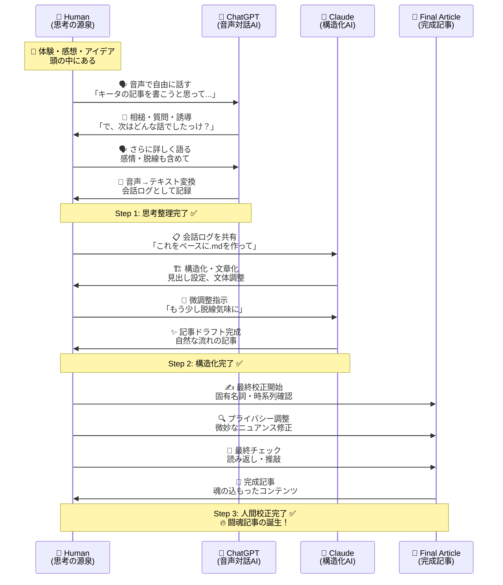

# はじめに：「ぼーっと生きてると何も発言できない」問題

チコちゃんの名言ではありませんが、AIが発達した今でも変わらない真実があります。

**「こちらから発信しないと、AIは応えられない」**

どんなに優秀なGenerative AIも、結局は人間の思考や体験がインプットされて初めて価値のあるアウトプットを生み出します。つまり、**発信すべき内容を持つこと**が最も重要なのです。

今回は、そんな「発信したい内容はあるけど、記事にまとめるのが大変」という課題を解決する、AI時代の記事執筆ワークフローを実践してみました。

## 実践例

実践して、投稿（闘魂）した記事はこちらです。  

[Qiita Tech Festa 2025で2つのOrganizationで目標を達成し、まつもとゆきひろさんの基調講演で「運・縁・志」について考えた話](https://qiita.com/torifukukaiou/items/576f5cf1bea4d42fe892)

https://qiita.com/torifukukaiou/items/576f5cf1bea4d42fe892

---

# 実験の背景：Qiita Tech Festa 2025の体験記を書きたい

先日参加したQiita Tech Festa 2025での体験を記事にしたいと思ったのですが、いきなり文章を書き始めるのは大変です。頭の中にはたくさんの思い出や感想があるのに、それを整理して文章化するのは別のスキルが必要ですよね。

そこで思いついたのが、以下の3ステップワークフローです：

1. **🎤 ChatGPT音声モードでインタビュー形式で思考整理**
2. **🤖 Claudeで記事構造化・文章化**  
3. **✍️ 人間による最終校正**



「ChatGPT音声モード」とこの記事で呼んでいるものは、以下の記事が詳しいです。  
とあるYouTube動画で、対談形式の動画を公開されている方がいらっしゃって、こんな便利な機能があったのだ！　と知りました。

[ChatGPTの音声会話機能「高度な音声モード」とは？使い方・料金・制限を解説](https://chatsense.jp/blog/chatgpt-advanced-vice-mode)

# Step 1: ChatGPT音声モードでの思考整理

## なぜ音声なのか？

文章を書くのは大変ですが、話すのはハードルが低いと感じる方もいらっしゃると思います。特に：

- **思考の流れをそのまま表現できる**
- **脱線や感情も含めて記録される**
- **「えーっと」「あのー」みたいな間も含めて人間らしい**

## 実際のやり取り

ChatGPTの音声拡張モードで、まるでインタビューを受けているかのように話しました：

```
Osamu: キータの記事を書こうと思っております...
GPT: もちろん分かりますよ！Qiitaはエンジニアの皆さんが...
Osamu: もう書きたいことは決まっていて、それでここで話す内容を...
```

この形式の良いところは：

- **GPTが相槌を打ってくれる**ので話しやすい
- **「で、次はどんな話でしたっけ？」** みたいに誘導してくれる
- **自然な会話の中で記憶が整理される**

## 音声入力の威力

特に印象的だったのが、まつもとゆきひろさんの基調講演について話しているとき。文章で書こうとすると「何から書けばいいんだろう？」となりがちですが、音声だと：

「基調講演のテーマは第2のまつもとゆきひろ、第3のまつもとゆきひろの作り方ということでした。印象的だったのが『運、縁、志』の3つの要素がありました...」

と、自然に構造化されて出てきます。

# Step 2: Claudeでの記事構造化・文章化

## なぜClaudeなのか？

ChatGPTとClaudeを使い分けた理由：

- **ChatGPT**: 音声での自然な対話が得意、相槌が上手
- **Claude**: 長文の構造化と文章校正が得意、文脈理解が深い(ただし欠点は、整理しすぎてAとは無関係のBを結ぶストーリーをでっちあげることです。話の脱線を容赦なく切り捨ててしまいます。まあ、逆にその整理好きなところとストーリーに一貫性を持たせる特徴がコーディングにおいては最大の強みになっていると言えます)

## 実際の指示

Claudeには以下のように指示しました：

```
ChatGPT(GPT)と私(Osamu)の会話を共有します。
これをベースに .md を作ってください。
脱線気味の記事に仕上るのが好みです。「ポエム」タグを付けます。
```

## Claudeの優秀さ

Claudeが作成した記事の特徴：

- **会話の自然な流れを保持**
- **脱線部分も適切に織り込み**
- **見出し構造を適切に設定**
- **「正直、卑怯かも」みたいな生の感情も残している**

一方、ChatGPTに同じタスクをやらせた結果は：

```
🔥 **「熱狂は技術を越える──Qiita Tech Festa 2025で見つけた"魂の技術"」**
*少年老い易く学成り難し。されど、挑む者こそ未来を拓く。*
```

みたいな感じで、ちょっと大げさすぎました😅

# Step 3: 人間による最終校正

## AIでは補えない部分

最終的に人間がやる必要があるのは：

- **固有名詞の確認**（ハウインターナショナル vs HAO International など）
- **時系列の整理**
- **微妙なニュアンスの調整**
- **プライバシーに関わる部分の調整**

## 校正のポイント

```
インプットの誤りがあったので、これ以上チャットでガチャガチャやるのはつらい
```

確かに、細かい修正はエディタで直接やる方が効率的ですね。  
ちなみに私が使っているキーボードは本当にガチャガチャ音がします。余談です。  

---

# このワークフローの効果

## メリット

1. **思考整理が楽**: 話すだけで頭の中が整理される
2. **記事の骨格が自動生成**: 構造化された記事がベースとして得られる
3. **自然な文体**: 話し言葉ベースなので親しみやすい文章になる
4. **時短効果**: ゼロから書くより圧倒的に早い

## デメリット・注意点

1. **音声入力の精度**: 専門用語は要確認
2. **プライバシー**: 音声データが残る点に注意
3. **最終校正は必須**: AIだけでは完璧にはならない

# 最も重要な気づき：「発信力」の必要性

このワークフローを通じて痛感したのは：

**AIはツールでしかない。結局、発信すべき内容を持っているかどうかが勝負**

ということです。

- Qiita Tech Festaに参加した体験
- まつもとゆきひろさんの講演を聞いた感動
- AtCoderに取り組んだ経験
- コミュニティ活動への参加

これらの「発信したい内容」があったからこそ、AIを活用した効率的な記事執筆が可能になりました。  
発信したい内容があふれだしていました。漏れ出していました。実は、その一部を文字起こししたにすぎません。  

# まとめ：AI時代の記事執筆術

1. **🎤 まずは体験せよ、考えよ、感じよ**
2. **🗣️ 音声で思考を整理せよ**
3. **🤖 AIに構造化を任せよ**
4. **✍️ 人間が最終調整せよ**

このワークフローは、特に以下のような記事に有効だと思います：

- **体験記・振り返り記事**
- **技術イベントのレポート**
- **個人的な技術への取り組み**
- **ポエム系記事**

# おわりに：次は何を発信しますか？

AI時代だからこそ、**人間の体験と思考**がより価値を持つようになります。

あなたが最近体験したこと、学んだこと、感じたことは何ですか？
それをまず音声で話してみることから始めてみませんか？

きっと、思わぬ発見や気づきが記事として形になるはずです。

**技術は進歩するが、人間の体験は代替できない。だからこそ、発信し続けよう。**

**自分の記事は玉の方だと信じて、Qiitaを通じてインターネットの海へと放出し、AIsたちを教育しましょう。**

---

**使用ツール**:

- ChatGPT (音声拡張モード)
- Claude (記事執筆支援)
- 人間の脳 (最終校正)

<!---
闘魂とは己に打ち克つこと。そして闘いを通じて己の魂を磨いていくことだと思います。
-->


---

_Translation assistance by Claude_

[🎤 🤖 ✍️ From Voice Input to AI Writing and Human Editing Practicing a New-Era Article Writing Workflow](https://dev.to/torifukukaiou/-from-voice-input-to-ai-writing-and-human-editing-practicing-a-new-era-article-writing-41e1)

https://dev.to/torifukukaiou/-from-voice-input-to-ai-writing-and-human-editing-practicing-a-new-era-article-writing-41e1

---

## Tips

:::note info
あまり長く話すと、文字起こしがうまくいかずに「No transcription available」と出力される場合があります。
2025-08-17現在、300文字くらいはうまくいっています。つまり約1分間です。私は、Plusプランです。
しかしこれはプランによって異なるかもしれませんし、そのうち長い発話も正確に文字起こししてくれるようになるとおもうのであまり神経質になる必要はないと思います。それにChatGPTの応答は必ず文字起こしされるので、それを聞きながら、伝わっていないと感じればまた言い直しするとよいでしょう。
:::

:::note info
[Voice Mode](https://help.openai.com/en/collections/8472654-voice)との会話をExportするChrome Extensionを制作しました。

https://github.com/TORIFUKUKaiou/chatgpt-exporter
:::
