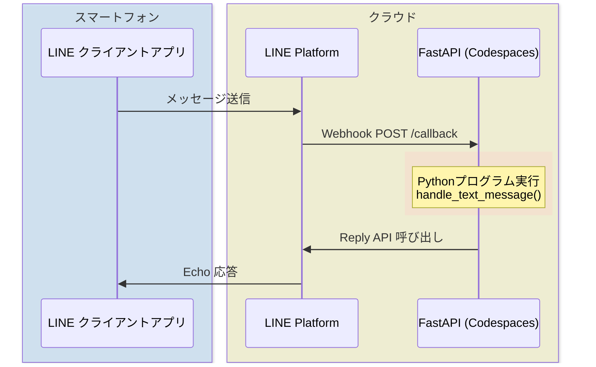

「迷わず行けよ。行けばわかるさ。」――アントニオ猪木

プログラミング学習で最も大切なのは、文法の丸暗記ではなく「動いた！」という成功体験です。この記事では、GitHub Codespaces を使って **3分でLINE Echo Botを動かす** ところから始め、段階的に環境構築の理解を深め、最後にカスタマイズで遊ぶ方法を紹介します。

この記事は、[株式会社ハウインターナショナル](https://www.haw.co.jp/)の門を叩いてくれた初学者インターン生向けの記事であり、エールです。

**わからない言葉が出てきたら**：
- キーワードをGoogle検索
- 生成AI（ChatGPT、Claude、Geminiなど）に質問
- 先輩や同僚に聞く

文字で書ける説明には限界があります。自分で調べ、質問する力こそが、プログラマーの最強スキルです。

## 対象読者

- プログラミング初学者
- LINE Bot を作ってみたい人
- Codespaces / devcontainer に興味がある人
- 環境構築で挫折した経験がある人
- paizaの「[Python3入門編](https://paiza.jp/works/python3/primer)」などで基礎を学び、身につけた知識を実際のアプリ製作で試してみたい人

## この記事で学べること

1. GitHub Codespaces で即座に開発環境を起動
2. LINE Messaging API の基本的な使い方
3. 素のLinuxから手動で環境を構築する方法（上級編）
4. Echo Botのカスタマイズ例



## 1. 事前準備

### 1-1. [GitHub](https://github.com/) アカウント作成

まだお持ちでない方は、以下から作成してください。

- [GitHub でのアカウントの作成](https://docs.github.com/ja/get-started/start-your-journey/creating-an-account-on-github)

**GitHubとは？**

GitHubは、コードを保存・共有するためのプラットフォームです。プログラマーの「Google Drive」のようなものと考えてください。

- **リポジトリ**：プロジェクトのコードを保存する場所（フォルダのようなもの）
- **Codespaces**：ブラウザ上で動く開発環境。自分のPCに何もインストールせずに、すぐにプログラミングを始められます

**なぜCodespacesを使うのか？**

- 「Pythonのバージョンが違う」「パッケージが入らない」といった環境構築の悩みがゼロ
- ブラウザさえあれば、どのPCからでも同じ環境で開発できる
- すぐに開発環境が立ち上がる

つまり、**「環境構築で挫折する」という最大の壁を取り払う**のがCodespacesです。

### 1-2. LINE公式アカウント（Messaging API チャネル）の作成

LINE Developers で Messaging API チャネルを作成し、以下の2つを取得します。

- **チャネルシークレット**
- **チャネルアクセストークン（長期）**

詳細な手順は公式ドキュメントをご参照ください。

- [Messaging APIを始めよう](https://developers.line.biz/ja/docs/messaging-api/getting-started/)

上から順に「2-3」まで進めてください。

---

次に以下の手順を参考に、［あいさつメッセージ］や［応答メッセージ］の設定を［オフ］にしておいてください。

- [LINE Official Account Managerでの設定](https://developers.line.biz/ja/docs/messaging-api/building-bot/#line-manager-settings)


## 2. 「3分クッキング：Codespaces で即起動」

### 2-1. テンプレートリポジトリから起動

以下のリポジトリを開きます。

- [https://github.com/haw/line-echo-bot](https://github.com/haw/line-echo-bot)

画面右上の **「Use this template」** → **「Open in a codespace」** をクリック。

しばらく待つと devcontainer が立ち上がり、Python 3.14 + uv + FastAPI の環境が自動構築されます。  
※ LINE Bot SDK は執筆時点で pydantic v1 系を使っているため、Python 3.14 では警告が 1 行表示されますが、動作には影響しません（無視して問題ありません）。

#### Python 3.14
プログラミング言語。読みやすく、初心者にも優しい。AI、Web開発、データ分析など幅広く使われる。

#### uv
Pythonのパッケージ管理ツール。依存関係のインストールや仮想環境の管理を担当。

#### FastAPI
PythonでWeb APIを作るフレームワーク。LINE Botのような外部サービスとの連携に最適。


### 2-2. 環境変数の設定

**環境変数とは？**

環境変数は、プログラムが動くときに参照する「設定値」です。

- パスワードやAPIキーなど、秘密情報を保存する場所
- コードに直接書くと危険（GitHubに公開されてしまう）
- `.env` ファイルに書いて、プログラムから読み込む

例えば、LINE のアクセストークンを環境変数に入れておけば、コードを公開しても秘密情報は漏れません。

---

**ターミナルとは？**

ターミナルは、キーボードで命令（コマンド）を打ち込んでコンピュータを操作するツールです。

- Codespaces では画面下部に表示されています
- マウスでクリックする代わりに、文字で命令を出します
- 「黒い画面」「コマンドライン」とも呼ばれます

慣れると、マウス操作より速く正確に作業できます。プログラマーの必須ツールです。

---

ターミナルで以下を実行：

```bash
cp .env.example .env
```

`cp` はファイルをコピーするコマンドです。`.env.example`（テンプレート）を `.env`（実際に使うファイル）にコピーしています。

`.env` ファイルを開き、LINE Developers で取得した値を貼り付けます。（左のエクスプローラメニューからファイルを探すとよいでしょう）

```env
LINE_CHANNEL_SECRET=あなたのチャネルシークレット
LINE_CHANNEL_ACCESS_TOKEN=あなたのチャネルアクセストークン
```

デフォルトで自動保存されます。  

### 2-3. FastAPI サーバを起動

```bash
uv run uvicorn app.main:app --host 0.0.0.0 --port 8000
```

起動すると、画面右下に「ポート 8000 が転送されました」という通知が出ます。

アプリケーションのコードは、`app/main.py`です。左のエクスプローラメニューから開いてみましょう。ちなみに、`app/main.py`は、`app`はディレクトリで、その下に`main.py`ファイルがあるということを表しています。覚えておきましょう。

これまで学んできた基礎よりはずいぶん複雑で難しそうに見えるかもしれませんが、似た部分もあるはずです。ポイントは、 `handle_text_message` 関数です。 **Don't think. Feel!** です。なんとなく似ている部分があることをつかんでもらえばまずはOKです。


### 2-4. Webhook URL の設定

1. VS Code の **「PORTS」** タブを開く
2. ポート `8000` の「ポートの表示範囲（Visibility）」を **「Public」** に変更（右クリックでメニュー表示）
3. 表示された URL（例：`https://xxxx-8000.app.github.dev`）をコピー
4. URL の末尾に `/callback` を追加（例：`https://xxxx-8000.app.github.dev/callback`）
5. LINE Developers の「Webhook URL」に貼り付け
6. **「Use webhook」を ON** にして **「検証（Verify）」** をクリック
7. 動作確認が終わったら、PORTS タブでポートを **「Private」** に戻しておく（公開しっぱなしだと第三者から叩かれる恐れがあります）

### 2-5. 動作確認

LINE で Bot を友だち追加し、メッセージを送信してみましょう。  
友だち追加は、Messaging API設定のQRコードを読み込んでください。（自動で「友だち」追加されているかもしれません。見つからない場合には、QRコードを読み込むと確実です）  

```
あなた: こんにちは
Bot: Echo: こんにちは
```

**おめでとうございます！3分クッキングのように LINE Bot が動きました！** 🎉

### 2-6. Codespaces 運用上の注意

**自動停止について**

Codespaces は無操作30分で自動停止します。

**再開手順**：
1. [GitHub Codespaces](https://github.com/codespaces) にアクセス
2. 停止中の Codespace の「...」（3点リーダー）をクリック
3. **「🌐Open in Browser」** を選択

**再開後の重要な作業**：
1. ターミナルで `uv run uvicorn app.main:app --host 0.0.0.0 --port 8000` を実行
2. ポート `8000` を **「Public」** に変更
3. **新しいURL**（`https://xxxx-8000.app.github.dev`）をコピー
4. LINE Developers の **Webhook URL を更新**（末尾に `/callback` を忘れずに）

停止・再開するたびにURLが変わるため、Webhook URLの更新が必須です。

**環境の自動削除について**

未使用連続30日間で Codespace 環境自体が削除されます。定期的にアクセスして環境を維持しましょう。

## 3. 【上級編】素のLinuxから環境構築

「devcontainer の裏側を理解したい」「環境を作る楽しみを味わいたい」という方向けです。

ここは飛ばしても大丈夫です。LINEボットの動作を変更してみたい方は、次の「[4. おうむ返しカスタマイズ集](https://qiita.com/torifukukaiou/items/822bec463a6ff418ad2b#4-%E3%81%8A%E3%81%86%E3%82%80%E8%BF%94%E3%81%97%E3%82%AB%E3%82%B9%E3%82%BF%E3%83%9E%E3%82%A4%E3%82%BA%E9%9B%86)」へ進んでください。

### 3-1. Blank Codespace の起動

[https://github.com/codespaces](https://github.com/codespaces) に行き、「Blank」の「Use this template」ボタンを押す。  

素の Linux 開発環境(2025/12/03現在 Ubuntu 24.04.3 LTS)が立ち上がります。

**ここからは手動で環境を作ります**

2章では devcontainer が自動で環境を構築してくれましたが、ここでは「裏側で何が起きているのか」を理解するために、すべて手動で行います。

- Python のインストール
- Git のインストール
- uv（パッケージ管理ツール）のインストール

これらを自分の手で実行することで、「環境構築とは何か」が体感できます。

### 3-2. 必要なツールのインストール

```bash
# Git のインストール
sudo apt update
sudo apt install -y git

# uv のインストール
curl -LsSf https://astral.sh/uv/install.sh | sh

# uv で Python 3.14 をインストール
uv python install 3.14  # 3.14 では LINE SDK 由来の warning が出ますが無視して問題ありません
```

### 3-3. リポジトリのクローン

```bash
git clone https://github.com/haw/line-echo-bot.git
cd line-echo-bot
```

**コマンドの説明**：

- `git clone`：GitHubからコードをダウンロードするコマンド。「clone（クローン）」は「複製」の意味
- `cd`：ディレクトリ（フォルダ）を移動するコマンド。「change directory」の略

つまり、「GitHubからコードをダウンロードして、そのフォルダに移動する」という操作です。

### 3-4. 環境変数の設定

```bash
cp .env.example .env
# エディタで .env を編集
```

### 3-5. 依存関係のインストールと起動

```bash
uv sync
uv run uvicorn app.main:app --host 0.0.0.0 --port 8000
```

あとは「2-4. Webhook URL の設定」と同じ手順で動作確認できます。（末尾に、 `/callback` を忘れずにつけてください。）

**環境を自分の手で作る達成感を味わえましたか？** 🔥

## 4. おうむ返しカスタマイズ集

`app/main.py` の `handle_text_message` 関数を編集して、Bot の挙動を変えてみましょう。

**コード変更後の手順**：

1. ファイルを保存（デフォルトで自動保存される。明示的に操作する場合は、Ctrl+S または Cmd+S）
2. ターミナルで `Ctrl+C` を押してサーバを停止
3. `uv run uvicorn app.main:app --host 0.0.0.0 --port 8000` で再起動
4. ポート `8000` の「ポートの表示範囲（Visibility）」を **「Public」** に変更（右クリックでメニュー表示）
5. LINE で Bot にメッセージを送って動作確認

サーバを再起動しないと、変更が反映されません。

### 4-1. Echo を削除（そのまま返す）

```python
@handler.add(MessageEvent, message=TextMessageContent)
def handle_text_message(event: MessageEvent):
    text = event.message.text
    try:
        with ApiClient(config) as api_client:
            api = MessagingApi(api_client)
            api.reply_message(
                ReplyMessageRequest(
                    replyToken=event.reply_token,
                    messages=[TextMessage(text=text)],  # Echo: を削除
                )
            )
    except ApiException as exc:
        logger.exception("Failed to reply to LINE event: %s", exc)
        raise
```

### 4-2. 現在時刻を追加

```python
from datetime import datetime, timezone, timedelta

JST = timezone(timedelta(hours=9))

@handler.add(MessageEvent, message=TextMessageContent)
def handle_text_message(event: MessageEvent):
    text = event.message.text
    now = datetime.now(JST).strftime("%Y-%m-%d %H:%M:%S")
    reply_text = f"{text}\n（送信時刻: {now} JST）"
    try:
        with ApiClient(config) as api_client:
            api = MessagingApi(api_client)
            api.reply_message(
                ReplyMessageRequest(
                    replyToken=event.reply_token,
                    messages=[TextMessage(text=reply_text)],
                )
            )
    except ApiException as exc:
        logger.exception("Failed to reply to LINE event: %s", exc)
        raise
```

### 4-3. NGワード検出

```python
NG_WORDS = ["NGワード1", "NGワード2", "NGワード3"]

@handler.add(MessageEvent, message=TextMessageContent)
def handle_text_message(event: MessageEvent):
    text = event.message.text
    
    # NGワードチェック
    if any(ng in text for ng in NG_WORDS):
        reply_text = "そのような言葉は使わないでください。"
    else:
        reply_text = f"Echo: {text}"
    
    try:
        with ApiClient(config) as api_client:
            api = MessagingApi(api_client)
            api.reply_message(
                ReplyMessageRequest(
                    replyToken=event.reply_token,
                    messages=[TextMessage(text=reply_text)],
                )
            )
    except ApiException as exc:
        logger.exception("Failed to reply to LINE event: %s", exc)
        raise
```

授業やチームのポリシーに合わせて `NG_WORDS` を差し替えてください。

### 4-4. 特定ワードで条件分岐

```python
from datetime import datetime, timezone, timedelta

JST = timezone(timedelta(hours=9))

@handler.add(MessageEvent, message=TextMessageContent)
def handle_text_message(event: MessageEvent):
    text = event.message.text
    
    if "天気" in text:
        reply_text = "今日は晴れです☀️"
    elif "時間" in text:
        now = datetime.now(JST).strftime("%H:%M")
        reply_text = f"現在時刻は {now} です（JST）"
    elif "おはよう" in text:
        reply_text = "おはようございます！今日も元気に行きましょう💪"
    else:
        reply_text = f"Echo: {text}"
    
    try:
        with ApiClient(config) as api_client:
            api = MessagingApi(api_client)
            api.reply_message(
                ReplyMessageRequest(
                    replyToken=event.reply_token,
                    messages=[TextMessage(text=reply_text)],
                )
            )
    except ApiException as exc:
        logger.exception("Failed to reply to LINE event: %s", exc)
        raise
```

### 4-5. スタンプ対応（宿題）

スタンプの送受信にも挑戦してみましょう。

公式ドキュメント：
- [スタンプメッセージ](https://developers.line.biz/ja/reference/messaging-api/#sticker-message)

自分で調べて実装してみることが、最高の学びです。**迷わず行けよ！** 🔥

## トラブルシューティング

### Verify が失敗する

- `/callback` を URL に付け忘れていませんか？
- サーバは起動していますか？
- ポートは Public になっていますか？

### 200 OK なのに返信が来ない

- `replyToken` は1回しか使えません
- イベントごとに `reply_message` を呼んでいますか？

### Codespaces が遅い

- ブラウザをリロード
- 一時的に 4-core インスタンスへアップグレード

## まとめ

この記事では、以下の3段階で LINE Echo Bot を学びました。

1. **3分クッキング**：Codespaces で即起動
2. **環境構築の理解**：素のLinuxから手動セットアップ
3. **カスタマイズ**：条件分岐やNGワード検出

「学びの炉は、動いた瞬間に火がつく。」

まずは動かしてみる。そこから理解が深まり、改造の楽しみが生まれます。

**迷わず行けよ。行けばわかるさ。** 🔥

## 参考リンク

- [line-echo-bot テンプレートリポジトリ](https://github.com/haw/line-echo-bot)
- [LINE Messaging API ドキュメント](https://developers.line.biz/ja/docs/messaging-api/)
- [FastAPI 公式ドキュメント](https://fastapi.tiangolo.com/)
- [uv 公式サイト](https://docs.astral.sh/uv/)

---

**闘魂を込めて。世界恒久平和とゴミ問題の解決を目指して。** 🌍✨
