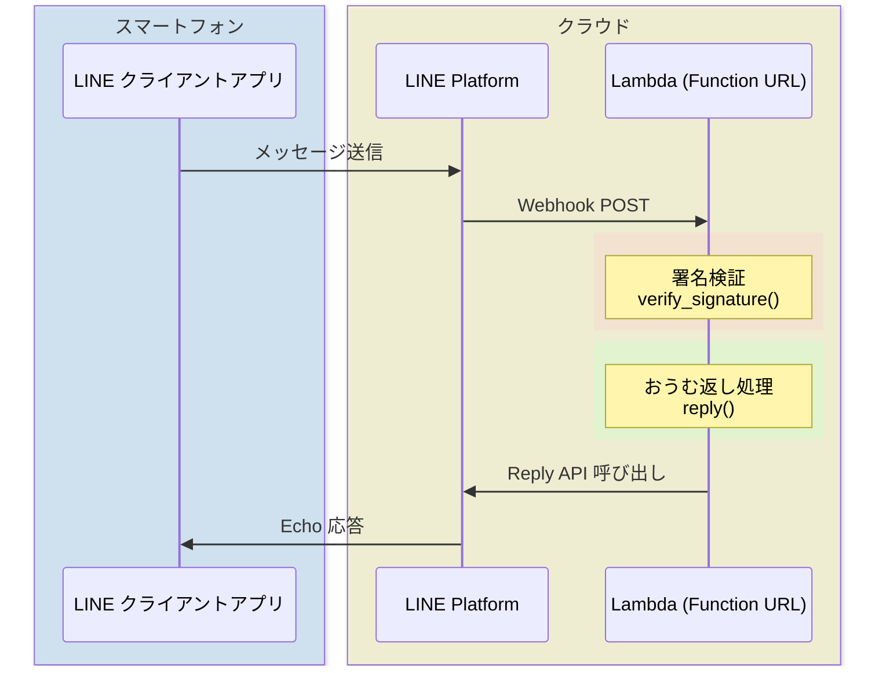
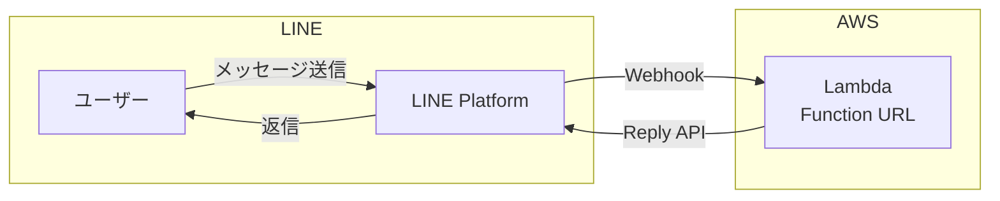

:::note info
**Qiita Advent Calendar 2026**
2026年12月1日を目指して、スタートを切ります。 :tada::tada::tada:
誰よりもこの日を待ち通しく思っています。

2025年12月26日から首を長くして楽しみにしております。
:xmas-wreath1::santa::santa_tone1::santa_tone2::santa_tone3::santa_tone4::santa_tone5: :xmas-tree::xmas-wreath2:
:qiitan::qiitan::qiitan::qiitan::qiitan::qiitan::qiitan::qiitan::qiitan::qiitan::qiitan:
:::

<blockquote class="twitter-tweet"><p lang="ja" dir="ltr">✨⛩️ 新春 <a href="https://twitter.com/hashtag/Qiitan%E3%81%8A%E3%81%BF%E3%81%8F%E3%81%98?src=hash&amp;ref_src=twsrc%5Etfw">#Qiitanおみくじ</a> ⛩️✨<br>2026年の運勢をQiitanが占います！ タップして止まったところが、今年の運勢！？<br>もしかすると、普段とは違う「レアな姿のQiitan」に出会えるかも👀<br><br>何が出たか <a href="https://twitter.com/hashtag/Qiitan%E3%81%8A%E3%81%BF%E3%81%8F%E3%81%98?src=hash&amp;ref_src=twsrc%5Etfw">#Qiitanおみくじ</a> をつけてシェアして教えてください☺️ <a href="https://t.co/HkS4Q4ymXO">pic.twitter.com/HkS4Q4ymXO</a></p>&mdash; Qiita（キータ）公式｜1/16 アドカレ Online Meetup🚀 (@Qiita) <a href="https://twitter.com/Qiita/status/2008016413102150100?ref_src=twsrc%5Etfw">January 5, 2026</a></blockquote> <script async src="https://platform.twitter.com/widgets.js" charset="utf-8"></script>


[前回の記事](https://qiita.com/torifukukaiou/items/822bec463a6ff418ad2b)では、GitHub Codespaces を使って 
LINE Echo Bot を動かしました。しかし Codespaces には「30分で自動停止」「URLが毎回変わる」という制約があります。

https://qiita.com/torifukukaiou/items/822bec463a6ff418ad2b

今回は AWS Lambda + Function URL を使って、**常時稼働する LINE Bot** を構築します。しかも 外部ライブラリ不要。Python標準ライブラリ（urllib, json, hmac）だけで動きます。

pip も requirements.txt も不要。Lambda のコンソールにコードを貼り付けるだけ。

「環境構築で挫折する」という壁を、今度は AWS でも取り払います。

## 対象読者

- [前回の Codespaces 版](https://qiita.com/torifukukaiou/items/822bec463a6ff418ad2b)を試した方
- LINE Bot を常時稼働させたい方
- AWS Lambda を触ってみたい方
- 「pip install できない環境」で Bot を動かしたい方
- なぜかたくさんコールされて料金が発生した場合に、著者に文句を言わない人

## 料金について

AWS Lambda には無料利用枠があります。

- **月100万リクエスト無料**
- **月40万GB秒の実行時間無料**

個人の LINE Bot 程度なら、まず無料枠を超えることはないと思います。仮に超えても、100万リクエストあたり約20円程度です。安心して試してください。

参考: [AWS Lambda 料金](https://aws.amazon.com/jp/lambda/pricing/)

## この記事で学べること

1. AWS Lambda + Function URL で HTTP エンドポイントを公開
2. LINE Webhook の署名検証（セキュリティの基本）
3. 外部ライブラリなしで LINE Messaging API を叩く方法



## 1. 事前準備

AWSアカウントが必要です。
[AWS アカウント作成の流れ](https://aws.amazon.com/jp/register-flow/)を参考に、AWSアカウントを作成してください。

学生の方は[AWS Academy](https://aws.amazon.com/jp/training/awsacademy/)加盟校なら、AWS Cloud Foundations サンドボックスやAWS Academy Learner Labで動作させることが可能です。

## 構成図




## 使用するAWSサービス

### AWS Lambda
- サーバーレスでコード実行
- Function URL でHTTPエンドポイントを公開
- 今回はPython 3.14を使用

## LINE公式アカウント（Messaging API チャネル）の作成

[前回の記事](https://qiita.com/torifukukaiou/items/822bec463a6ff418ad2b)を実施済の場合は、同じLINE公式アカウント（Messaging API チャネルを使い回すこともできます。

### チャネルシークレット と チャネルアクセストークン

LINE Developers で Messaging API チャネルを作成し、以下の2つを取得します。

- **チャネルシークレット**: LINEプラットフォームと開発者の間だけで共有する秘密の値。Webhookリクエストが本当にLINEプラットフォームから来たものかを検証するために使用
- **チャネルアクセストークン（長期）**: チャネルに対してメッセージを送信するための認証トークン。Reply APIを呼び出す際に必要

詳細な手順は公式ドキュメントをご参照ください。

- [Messaging APIを始めよう](https://developers.line.biz/ja/docs/messaging-api/getting-started/)

上から順に「2-3」まで進めてください。

### LINE公式アカウントの設定

次に以下の手順を参考に、［あいさつメッセージ］や［応答メッセージ］の設定を［オフ］にしておいてください。

- [LINE Official Account Managerでの設定](https://developers.line.biz/ja/docs/messaging-api/building-bot/#line-manager-settings)

## Lambda関数の作成

### Step 1: Lambda関数を作成

1. Lambdaコンソールを開く
2. 「関数の作成」をクリック
3. 以下を設定:
   - 関数名: `line-echo-bot`
   - ランタイム: Python 3.14
   - アーキテクチャ: x86_64
   - デフォルトの実行ロールの変更: 
     - 通常環境: 「基本的なLambdaアクセス権限で新しいロールを作成」
     - AWS Academy: 「既存のロールを使用する」→ `LabRole`
   - その他の設定
     - 「ネットワーキング > 関数 URL」を有効化
        - 認証タイプ: NONE
        - 呼び出しモード: BUFFERED (デフォルト)
     - その他の設定は、デフォルト値のまま
4. 「関数の作成」をクリック

### Step 2: 環境変数を設定

1. 「設定」タブ →「環境変数」→「編集」
2. 以下を追加:
   - キー: `LINE_CHANNEL_ACCESS_TOKEN`
   - 値: [上記で取得した](#チャネルシークレット-と-チャネルアクセストークン)チャネルアクセストークン (「Messaging API設定」 タブの一番下)
   - キー: `LINE_CHANNEL_SECRET`
   - 値: [上記で取得した](#チャネルシークレット-と-チャネルアクセストークン)チャネルシークレット(「チャネル基本設定」 タブの下方)
3. 「保存」

### Step 3: コードを貼り付け

「コード」タブで `lambda_function.py` を以下に置き換え（あらかじめ書いてあるコードを全部上書きしてよい）:

```python
import json
import os
import urllib.request
import hashlib
import hmac
import base64

LINE_CHANNEL_ACCESS_TOKEN = os.environ['LINE_CHANNEL_ACCESS_TOKEN']
LINE_CHANNEL_SECRET = os.environ['LINE_CHANNEL_SECRET']

def lambda_handler(event, context):
    # 署名検証
    signature = event['headers'].get('x-line-signature', '')
    body = event['body']
    
    if not verify_signature(body, signature):
        return {'statusCode': 403, 'body': 'Invalid signature'}
    
    body_json = json.loads(body)
    
    for e in body_json['events']:
        if e['type'] == 'message' and e['message']['type'] == 'text':
            reply_token = e['replyToken']
            text = e['message']['text']
            reply(reply_token, text)
    
    return {'statusCode': 200, 'body': 'OK'}

def verify_signature(body, signature):
    hash = hmac.new(
        LINE_CHANNEL_SECRET.encode('utf-8'),
        body.encode('utf-8'),
        hashlib.sha256
    ).digest()
    expected_signature = base64.b64encode(hash).decode('utf-8')
    return hmac.compare_digest(signature, expected_signature)

def reply(token, text):
    url = 'https://api.line.me/v2/bot/message/reply'
    headers = {
        'Content-Type': 'application/json',
        'Authorization': f'Bearer {LINE_CHANNEL_ACCESS_TOKEN}'
    }
    data = json.dumps({
        'replyToken': token,
        'messages': [{'type': 'text', 'text': text}]
    }).encode()
    
    req = urllib.request.Request(url, data=data, headers=headers)
    urllib.request.urlopen(req)
```

4. 「Deploy」をクリック

### Step 4: 関数 URLをコピー

「関数 URL」をコピーする。

---

もし、「[Step 1: Lambda関数を作成](#step-1-lambda関数を作成)」で設定をしていない場合は、下記の手順で有効化して、「関数 URL」をコピーする。

1. 「設定」タブ →「関数 URL」→「関数 URLを作成」
2. 認証タイプ: `NONE`（LINEからのWebhookを受けるため）
3. 「保存」
4. 表示された「関数 URL」をコピー

---

## LINE Webhook設定

1. Lambda関数URLをそのまま使用（例：`https://xxxxxxxxxx.lambda-url.us-east-1.on.aws/`）
2. LINE Developers の「Webhook URL」に貼り付け (「Messaging API設定」タブ)
3. 「Use webhook」を ON にして 「検証（Verify）」 をクリック

## 動作確認

1. LINEで作成したBotを友だち追加
2. メッセージを送信 (テキストメッセージ)
3. 同じメッセージが返ってくれば成功！

## トラブルシューティング

### 返信が来ない場合

1. CloudWatch Logsでエラーを確認:
   - Lambdaコンソール →「モニタリング」→「CloudWatch Logsを表示」
2. よくある原因:
   - `LINE_CHANNEL_ACCESS_TOKEN` が間違っている
   - Webhook URLが間違っている
   - Webhook検証が有効になっている（無効にする）

### 署名検証について

コード内の `verify_signature` 関数で、LINEプラットフォームからのリクエストであることを検証しています。これにより第三者からの不正なリクエストを防ぎます。

## 発展課題

以下に挑戦してみてください:

- 特定のキーワードに反応する（例: 「こんにちは」→「こんにちは！元気ですか？」）
- 現在時刻を返す（例: 「今何時？」→「14:30です」）
- じゃんけんBot（例: 「グー」→ランダムで勝負）

参考: [カスタマイズ集](https://qiita.com/torifukukaiou/items/822bec463a6ff418ad2b#4-%E3%81%8A%E3%81%86%E3%82%80%E8%BF%94%E3%81%97%E3%82%AB%E3%82%B9%E3%82%BF%E3%83%9E%E3%82%A4%E3%82%BA%E9%9B%86)

## クリーンアップ

- Lambda関数の削除
- CloudWatch Logsロググループの削除

※ 演習後に不要なリソースを消しておくことで意図しない課金が発生することを減らせます。

## さいごに

Codespaces版では「30分で停止」「URLが毎回変わる」という制約がありました。Lambda + Function URL なら、**常時稼働**で**URLも固定**。一度設定すれば、あとは放っておいても動き続けます。

**迷わず行けよ。行けばわかるさ。** 🔥


