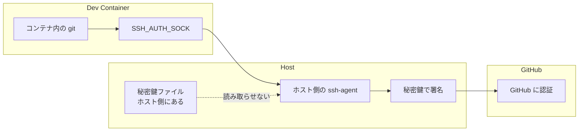

[VS Code Dev Containers](https://code.visualstudio.com/docs/devcontainers/containers)は便利です。

コンテナ内で開発環境をそろえられますし、GitHubへの`push`もそのままできます。

しかし、ふと疑問に思いました。

> なぜコンテナ内から`git push`できるのか？

普通のLinuxコンテナなら、ホストのSSH鍵を勝手に使えるはずがありません。

そしてもう一つ、気になりました。

> npm installなど、依存パッケージ経由のサプライチェーンリスクが気になる作業中にも、GitHub認証できる状態のままでよいのか？

この記事では、VS Code Dev ContainersでGitHub SSH認証が使える仕組みを軽く確認し、npm系の作業中だけSSH agentとの接続を切る小技を紹介します。

## 前提

この記事では、次のような環境を想定します。

- VS Code Dev Containersを使っている
- GitHubへの接続はSSHを使っている
- コンテナ内から`git push`できる
- Node.js / npm系の作業をDev Container内で行っている

自分のDev Containerでは、ワークスペースを次のようにマウントしています。

```json
"workspaceFolder": "/workspace",
"workspaceMount": "source=${localWorkspaceFolder},target=/workspace,type=bind,consistency=cached"
```

この場合、ホスト側のプロジェクトフォルダが、コンテナ内の`/workspace`として見えます。

## なぜDev Container内からgit pushできるのか

VS Code公式ドキュメントには、Dev Containers拡張がコンテナ内からローカルのGit認証情報を使えるようにしていると説明されています。

SSH鍵を使っている場合は、ローカルのSSH agentが動いていれば、Dev Containers拡張が自動的にSSH agentをforwardします。

公式ドキュメントはこちらです。

- [Sharing Git credentials with your container](https://code.visualstudio.com/remote/advancedcontainers/sharing-git-credentials)

つまり、イメージとしてはこうです。



大事なのは、通常は秘密鍵ファイルそのものがコンテナにコピーされているわけではない、という点です。

コンテナ内のプロセスは、秘密鍵の中身を直接読むのではなく、`SSH_AUTH_SOCK`経由でホスト側の`ssh-agent`に署名を依頼します。

## 実際に確認する

Dev Container内で、まずGitHubへのSSH接続を確認します。

```bash
ssh -T git@github.com
```

成功すると、次のようなメッセージが出ます。

```text
Hi USERNAME! You've successfully authenticated, but GitHub does not provide shell access.
```

この状態では、コンテナ内からGitHubへのSSH認証が使えています。

`SSH_AUTH_SOCK`も確認できます。

```bash
echo $SSH_AUTH_SOCK
```

値が入っていれば、コンテナ内のプロセスからSSH agentへ接続できる状態です。

## Dev Containerはホスト直実行より安全か

個人的には、Node.js / npm系の作業をホストで直接行うより、Dev Container内で行うほうが安心感があります。

理由は、ホスト側のファイルシステム全体が見えているわけではないからです。

たとえば、先ほどのようにプロジェクトフォルダだけを`/workspace`へbind mountしている場合、コンテナ内から直接見えるホスト側の主な範囲は、そのプロジェクトフォルダです。

```text
ホスト側のプロジェクトフォルダ
        ↓ bind mount
コンテナ内の /workspace
```

そのため、コンテナ内で何か悪意ある処理が動いても、通常はホストの以下のような場所までは直接見えません。

```text
~/.ssh
~/.aws
~/.config
~/Documents全体
macOS Keychain
他プロジェクトのフォルダ
```

もちろん、`/workspace`配下に`.env`や秘密情報を置いていれば、それはコンテナ内から読めます。

それでも、ホストで直接`npm install`するより、被害範囲をプロジェクトフォルダ中心に狭められるのは大きいです。

## しかしGitHub認証能力は残っている

一方で、コンテナ内から`git push`できるということは、コンテナ内のプロセスがGitHubへのSSH認証能力を使えるということでもあります。

秘密鍵ファイルそのものが見えていなくても、`ssh-agent`に署名を依頼できる状態です。

つまり、悪意ある処理が動いた場合、次のようなことは起こり得ます。


### できる可能性があること
- push権限のあるリポジトリへ勝手にpushする
- ブランチをforce pushで書き換える
- タグを作る、書き換える
- private repositoryをcloneして中身を読む


一方で、SSH Git認証だけなら、通常は次のようなGitHub管理操作までは直接できません。

### 通常はできないこと
- GitHubリポジトリ自体を削除する
- Organization設定を変更する
- GitHub Actions Secretsを直接読む


リポジトリ削除やOrganization設定変更には、GitHub Web/APIの認証情報が必要です。

ただし、Git操作としての破壊的な変更は、権限やブランチ保護の設定次第で可能です。

## npm作業中だけSSH agentへの接続を切る

npm installや依存更新、ビルド確認の最中にGitHub認証は不要です。

そこで、Dev Container内でnpm系の作業をするときだけ、SSH agentへの接続を切ります。

```bash
unset SSH_AUTH_SOCK
```

これで、そのシェルではSSH agentへの接続情報が消えます。

再度確認します。

```bash
ssh -T git@github.com
```

次のように失敗すれば狙い通りです。

```text
git@github.com: Permission denied (publickey).
```

これで、npm作業中にGitHub SSH認証能力を渡さない状態にできます。

## 使い分け

自分は次のように使い分けることにしました。

```text
npm install / npm audit / npm run build
→ Dev Container内で SSH_AUTH_SOCK を unset して実行

git commit / git push
→ ホスト側で実行
```

たとえば、Dev Container内ではこうします。

```bash
unset SSH_AUTH_SOCK
npm install
npm audit
npm run build
```

Git操作はホスト側で行います。

なお、`unset SSH_AUTH_SOCK`は、そのシェルにだけ効きます。

VS CodeでDev Containerの新しいターミナルを開くと、また`SSH_AUTH_SOCK`が設定されている場合があります。

この性質はむしろ便利です。

```text
npm作業用ターミナル
→ unset SSH_AUTH_SOCK 済み

Git操作用ターミナル
→ 通常どおりSSH agentを使う
```

のように分けられます。

## 注意点

この方法は、万能なセキュリティ対策ではありません。

`/workspace`にマウントされているプロジェクトファイルは、当然コンテナ内から読み書きできます。

また、npmスクリプトを実行すれば、そのプロジェクト内ではファイル作成や削除ができます。

さらに、`.env`やAPIキーをプロジェクト配下に置いていれば、それも読めます。

そのため、基本方針は次のようになります。

- 秘密情報をプロジェクト配下に置きすぎない
- npm install時のscripts実行に注意する
- 必要なら `npm config set ignore-scripts true` を使う
- GitHub認証が不要な作業中は SSH_AUTH_SOCK を外す


`unset SSH_AUTH_SOCK`は、あくまで「GitHub SSH認証への橋を一時的に外す」小技です。

## まとめ

Dev Containerは便利です。

ホスト側の環境を汚しにくく、Node.js / npm系の作業もホスト直実行より安心して行えます。

一方で、コンテナ内からGitHubへ`push`できるということは、SSH agent forwardingによって、ホスト側のSSH認証能力を借りているということでもあります。

npm installや依存更新のように、GitHub認証が不要な作業では、次の一行でSSH agentへの接続を切れます。

```bash
unset SSH_AUTH_SOCK
```

小さな一手ですが、サプライチェーンリスクが気になる作業中の安全弁としては、なかなかよいと思います。
