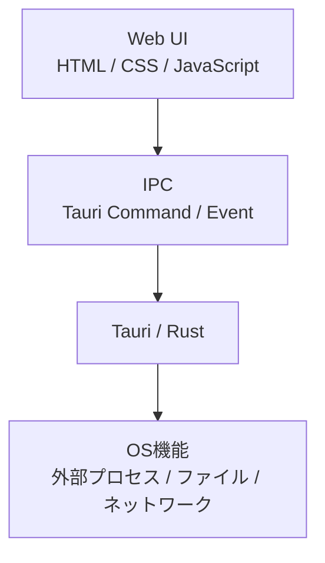
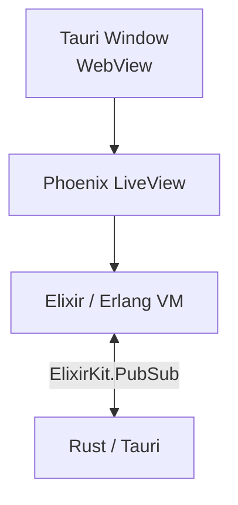
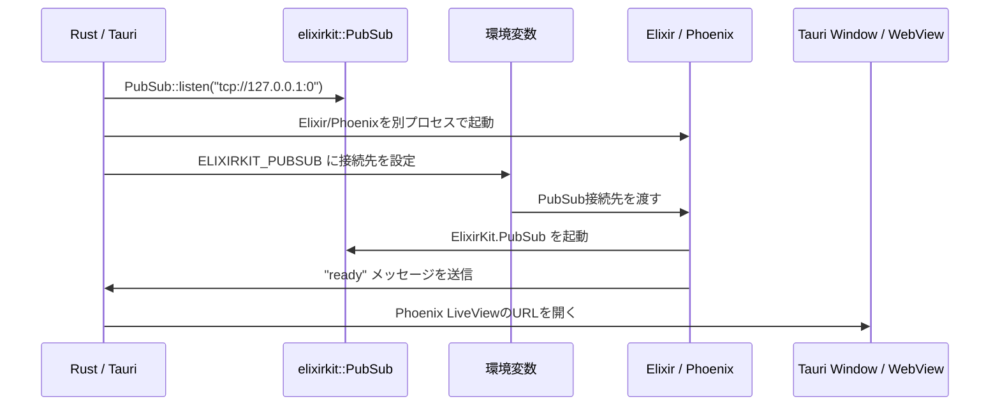

# はじめに

<b><font color="red">$\huge{元氣ですかーーーーッ！！！}$</font></b>

Elixir/Phoenix LiveViewで作ったWebアプリを、そのままデスクトップアプリとして配布できたらうれしいですよね。

[Tauri](https://v2.tauri.app/)を使えば、Rustを土台にした軽量なデスクトップアプリを作ることができます。さらに [elixirkit](https://github.com/livebook-dev/elixirkit) を使うと、Tauriアプリの中からElixirアプリを起動し、Rust側とElixir側でメッセージをやり取りできます。

この記事では、[livebook-dev](https://github.com/livebook-dev) が公開している [elixirkit](https://github.com/livebook-dev/elixirkit) を使って、Tauri上でPhoenix LiveViewアプリを動かしてみます。

リポジトリはこちらです。

https://github.com/livebook-dev/elixirkit

公式ドキュメントはこちらです。

https://elixirkit.hexdocs.pm/tauri.html

「山中（さんちゅう）の賊を破るは易く、心中の賊を破るは難し（かたし）」。

Tauri、Rust、Elixir、Phoenix LiveView、Erlang VM。名前だけ見ると山中の賊どころか山脈のようです。しかし一つずつ進めれば、ちゃんと道は開けます。

# Tauriとは？

Tauriは、デスクトップアプリやモバイルアプリを作るためのフレームワークです。

フロントエンドはHTML、CSS、JavaScript/TypeScriptなどで作れます。バックエンド側にはRustを使います。ElectronのようにChromiumを丸ごと同梱するのではなく、OS標準のWebViewを活用するため、軽量なアプリを作りやすい点が特徴です。

公式サイトでは、Tauriは「Create small, fast, secure, cross-platform applications」を作るためのフレームワークだと説明されています。

https://v2.tauri.app/start/

Tauriの基本構成をざっくり言うと、こうです。



通常は、画面部分をWeb技術で作り、OS寄りの処理をRust側で扱います。

# elixirkitとは？

`elixirkit` は、Tauri/RustアプリからElixirを起動し、Rust側とElixir側でPubSub通信を行うためのライブラリです。

READMEには、次のように説明されています。

> Run Elixir from Rust/Tauri apps and exchange messages over PubSub.

つまり、TauriのRust側からElixirアプリを起動し、Elixir側とRust側でメッセージをやり取りできます。

ざっくり図にすると、こうです。



TauriのWebViewには、Phoenix LiveViewの画面を表示します。  
Rust側はElixirプロセスを起動します。  
Elixir側とRust側は、`ElixirKit.PubSub` で通信します。

# elixirkitはTauriのsidecarなのか？

最初に気になったのはここでした。

Tauriにはsidecarという仕組みがあります。

https://v2.tauri.app/learn/sidecar-nodejs/

sidecarは、Tauriアプリ本体とは別の外部バイナリをアプリに同梱し、Tauriアプリから実行する仕組みです。Node.jsの例では、Node.jsアプリを自己完結したバイナリにして、エンドユーザーがNode.jsをインストールしていなくても動くようにします。

では、elixirkitはsidecarなのでしょうか。

私の理解では、**elixirkitはTauriのsidecar機能そのものではありません**。

しかし、役割としてはかなりsidecar的です。

開発時には、Rust側から次のように `mix phx.server` を起動します。

```rust
fn elixir_command() -> std::process::Command {
    let mut command = elixirkit::mix("phx.server", &[]);
    command.current_dir("..");
    command
}
```

リリース時には、Elixir releaseを作成し、それをTauriアプリのリソースとして同梱します。そしてRust側から次のように起動します。

```rust
let mut command = elixirkit::release(rel_dir, "example");
```

つまり、elixirkitは次の役割を担っています。

- Rust/Tauri側からElixirやMixを起動する
- Elixir releaseを起動する
- Rust側とElixir側をPubSubでつなぐ
- Phoenix LiveViewアプリをTauriのWebViewに表示する流れを作る

sidecarというより、**Elixir/PhoenixアプリをTauriアプリの相棒として起動するための橋渡し役**と呼ぶのがしっくりきます。

# まずはVanillaのTauriプロジェクトを作れるようにする

まず、Tauriの公式ドキュメントに従って、通常のTauriプロジェクトを作れる状態にします。

https://v2.tauri.app/start/

macOSの場合は、XcodeやRustのインストールが必要です。

ドキュメントに従って、素のTauriアプリが動く状態にしておきましょう。


あえて補足しておくと、 `tauri-cli` のインストールが必要です。

```
cargo install tauri-cli --version "^2.0.0" --locked
```

これは、通常、 `~/.cargo/bin/cargo-tauri` にインストールされるのでどのディレクトリで実行しても同じです。


# elixirkitのサンプルプロジェクトを動かす

elixirkit公式ドキュメントでは、Phoenixアプリを作成し、Tauriと統合していく手順が説明されています。

https://elixirkit.hexdocs.pm/tauri.html

ただし、最終形のサンプルはすでにGitHubにあります。

https://github.com/livebook-dev/elixirkit/tree/main/examples/tauri_project

今回は、まずこのサンプルをそのまま動かすのが早いです。

```bash
git clone https://github.com/livebook-dev/elixirkit.git
cd elixirkit/examples/tauri_project
mix setup
cargo tauri dev
```

このサンプルはPhoenixプロジェクトです。中には `src-tauri` ディレクトリも含まれています。

構成のイメージです。

```text
examples/tauri_project
├── lib
├── config
├── priv
├── mix.exs
└── src-tauri
    ├── Cargo.toml
    ├── tauri.conf.json
    └── src
```

Phoenixアプリの中にTauriアプリが同居している形です。


:tada::tada::tada::tada::tada::tada::tada::tada:


カウントアップできます！


# サンプルの動き

elixirkitのTauriガイドでは、次のような流れになっています。




Rust側がまずPubSubの待ち受けを開始します。  
その接続先を `ELIXIRKIT_PUBSUB` としてElixir側へ渡します。  
Elixir/Phoenix側は `ElixirKit.PubSub` を起動し、準備ができたら `"ready"` をRust側へ送ります。  
Rust側は `"ready"` を受け取ってから、Phoenix LiveViewのURLをTauri Windowで開きます。


Rust側の実装イメージです。

```rust
let pubsub = elixirkit::PubSub::listen("tcp://127.0.0.1:0")
    .expect("failed to listen");

pubsub.subscribe("messages", move |msg| {
    if msg == b"ready" {
        create_window(&app_handle);
    }
});
```

Elixir側では、`ElixirKit.PubSub` をsupervision treeに追加します。

```elixir
pubsub = System.get_env("ELIXIRKIT_PUBSUB")

children = [
  {Phoenix.PubSub, name: Example.PubSub},
  {ElixirKit.PubSub,
   connect: pubsub || :ignore,
   on_exit: fn -> System.stop() end},
  ExampleWeb.Endpoint
]
```

`ELIXIRKIT_PUBSUB` が設定されているときだけ、Rust側と接続します。  
設定されていないときは `:ignore` にして、通常のPhoenixアプリとして開発できます。

ここがいいですね。

Tauri統合に引きずられすぎず、Phoenix側だけでも開発できる構成になっています。

# リリース時はどうなるのか？

開発時は `mix phx.server` を起動します。

しかし、このままだとユーザーのPCにElixirやErlangが入っている必要があります。

そこで、リリース時にはElixir releaseを作成します。

公式ガイドでは、Tauriの `beforeBuildCommand` でElixir releaseを作成し、その成果物をTauriの `resources` に含めています。

```json
{
  "build": {
    "beforeBuildCommand": "MIX_ENV=prod mix do compile + assets.deploy + release --overwrite --path src-tauri/target/rel"
  },
  "bundle": {
    "resources": {
      "target/rel": "rel"
    }
  }
}
```

そして、Rust側ではdebugビルドとreleaseビルドで起動方法を分けます。

```rust
fn elixir_command(rel_dir: &std::path::Path) -> std::process::Command {
    if cfg!(debug_assertions) {
        let mut command = elixirkit::mix("phx.server", &[]);
        command.current_dir("..");
        command
    } else {
        let mut command = elixirkit::release(rel_dir, "example");
        command.env("PHX_SERVER", "true");
        command.env("PHX_HOST", "127.0.0.1");
        command.env("PORT", "4000");
        command
    }
}
```

ここで重要なのは、Elixir releaseにはErlang/OTPの実行に必要なものを含めて配布できるという点です。

つまり、エンドユーザーにElixirやErlangを別途インストールしてもらうのではなく、アプリ側に同梱したreleaseを起動する構成になります。

# まとめ

elixirkitを使うと、TauriアプリからElixir/Phoenix LiveViewアプリを起動できます。

私の理解をまとめると、こうです。

- Tauriは軽量なデスクトップアプリを作るためのフレームワーク
- elixirkitはRust/Tauri側からElixirを起動するためのライブラリ
- Rust側とElixir側はPubSubで通信できる
- 開発時は `mix phx.server` を起動する
- リリース時はElixir releaseをTauriアプリに同梱して起動する
- elixirkitはTauriのsidecarそのものではない
- しかし、ElixirアプリをTauriアプリの横で動かすという意味ではsidecar的な役割を果たす

Phoenix LiveViewでデスクトップアプリを作る道が見えてきました。

Webの技術でUIを作り、Elixirの並行処理とOTPを使い、Tauriでデスクトップアプリとして配布する。

これはかなり**夢**があります。

Rust、Tauri、Elixir、Phoenix LiveView。  
一見すると難しそうです。  
しかし、一歩ずつ進めば動きます。

迷わず行けよ、行けばわかるさ。
