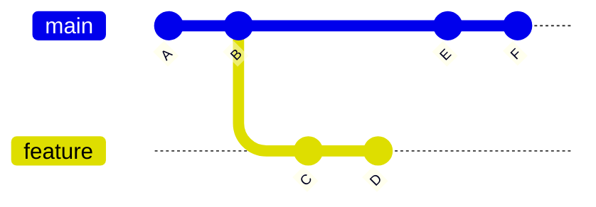
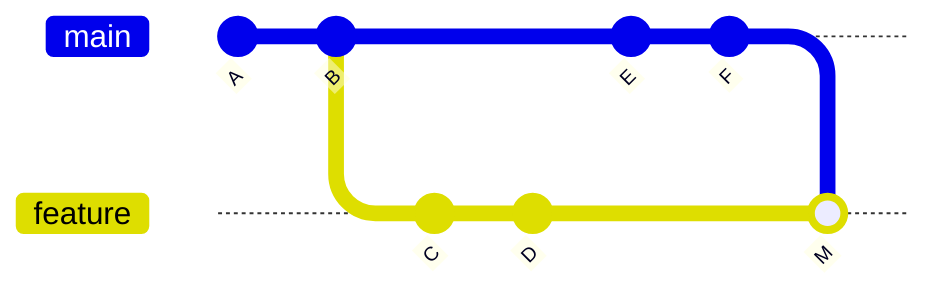

## はじめに

Gitでブランチの変更を取り込む代表的な方法に、`merge` と `rebase` があります。

どちらも目的は同じです。

> 別ブランチの変更を、自分のブランチに取り込むこと

ただし、履歴の残り方が違います。

- `merge` は、分岐と合流の履歴を残す
- `rebase` は、自分の変更を最新の履歴の上に乗せ直す

今年は新入社員が入り、Gitのコンフリクト解消について説明する機会がありました。
そのときの補助資料として、`merge` と `rebase` の違いをQiitaにまとめておきます。

## 結論(のようなもの)

| 場面 | おすすめ |
|---|---|
| 自分だけの作業ブランチを最新化したい | `rebase` |
| 複数人で使っているブランチを最新化したい | `merge` |
| 履歴を正直に残したい | `merge` |
| 履歴をまっすぐ綺麗にしたい | `rebase` |
| Pull Requestを取り込む | チームルールに従う |

## 前提

`main` から `feature` ブランチを作成したあと、両方に変更が入った状態です。



この状態で、`main` の変更を `feature` に取り込みます。

## git merge とは

`merge` は、別ブランチの変更を現在のブランチに合流させる操作です。

### コマンド例

```bash
git switch feature
git fetch origin
git merge origin/main
```

### merge後のイメージ



`M` がマージコミットです。  
「mainをfeatureに取り込んだ」という事実が履歴に残ります。

### merge のメリット

- 分岐と合流の履歴が残る
- 既存コミットを書き換えない
- 共有ブランチでも比較的安全
- いつ統合したのか分かりやすい

### merge のデメリット

- 履歴が複雑になりやすい
- マージコミットが増える
- `git log` が読みにくくなる場合がある

---

## git rebase とは

`rebase` は、自分の変更を別ブランチの最新コミットの上に乗せ直す操作です。

### コマンド例

```bash
git switch feature
git fetch origin
git rebase origin/main
```

### rebase後のイメージ


`C` と `D` が、`main` の最新である `F` の後ろに乗せ直されます。

厳密には、元のコミットが移動するのではなく、新しいコミットとして作り直されます。  
そのため、ここでは `C2`、`D2` と書いています。

### rebase のメリット

- 履歴が一直線になる
- Pull Requestの差分が見やすい
- 余計なマージコミットが増えない
- 自分だけの作業ブランチを整理しやすい

### rebase のデメリット

- コミットIDが変わる
- 共有ブランチで使うと危険
- push済みブランチでは force push が必要になる
- コンフリクトがコミットごとに発生する場合がある

---

## コンフリクトした場合

### merge の場合

```bash
git switch feature
git fetch origin
git merge origin/main
```

コンフリクトしたら、対象ファイルを修正します。
修正後、merge の場合は変更をステージしてコミットします。

```bash
git status
git add .
git commit
```

中止したい場合です。

```bash
git merge --abort
```

---

### rebase の場合

```bash
git switch feature
git fetch origin
git rebase origin/main
```

コンフリクトしたら、対象ファイルを修正します。
修正後、rebase の場合は変更をステージして rebase を続行します。

```bash
git status
git add .
git rebase --continue
```

中止したい場合です。

```bash
git rebase --abort
```

rebase後にpushできない場合は、次を使うことがあります。

```bash
git push --force-with-lease origin feature
```

`--force` より `--force-with-lease` のほうが安全です。

`--force` は、リモートブランチを手元のブランチの状態で強制的に上書きします。
そのため、リモートに他の人の変更が入っていても消してしまいます。

一方、`--force-with-lease` は、リモートブランチが自分の知っている状態から変わっていない場合だけ強制pushします。
他の人が先にpushしていた場合は失敗するため、単純な `--force` より安全です。


## 私の使い分け

私は過去を振り返りません。  
最新しか見ません。

その意味では、最終的なコードが同じなら `merge` でも `rebase` でもよいです。

最初に覚えたのが、 `rebase` だったので、 `rebase` を使っています。

Pull Request上でコンフリクトしたときは、`merge` を使ったほうがよい、いやどんなときも `rebase` 一択だ、という両方の意見を聞きます。

一般的には、共有済みのブランチでは履歴を書き換えない `merge` のほうが無難です。  
一方で、自分だけが使っている作業ブランチなら、履歴を整理しやすい `rebase` も便利です。

「一般的に」と言うには少し大きい言い方かもしれません。

ただ、Git公式のPro Gitでは、他人が作業の土台にしている可能性のある公開済みコミットを `rebase` してはいけない、という趣旨の注意が書かれています。
また、GitHub公式ドキュメントでも、Pull Requestの競合解消は「merge conflict」として説明されています。

参考:

- https://git-scm.com/book/en/v2/Git-Branching-Rebasing
- https://docs.github.com/ja/pull-requests/collaborating-with-pull-requests/addressing-merge-conflicts/about-merge-conflicts

OSS への Pull Request では、少し事情が変わります。

fork した自分のリポジトリ上の作業ブランチで Pull Request を出している場合、そのブランチを他の人が作業の土台にしていることは多くありません。  
このような「公開はされているが、実質的には自分だけの作業ブランチ」では、`main` の変更を取り込むときに `rebase` が選ばれることも多いです。

理由は、Pull Request の履歴に「main を取り込んだだけの merge commit」を増やさず、自分の変更だけを最新の `main` の上に並べられるからです。  
レビューする側から見ると、Pull Request の意図が追いやすくなります。

ただし、これは絶対のルールではありません。  
プロジェクトが `merge` を推奨しているならそれに従うべきですし、複数人で同じブランチに push しているなら、履歴を書き換える `rebase` には注意が必要です。

実は私は、どちらでもよいと思っています。  
さきほど申し上げた通り、過去を気にしないからです。最新状態しか見ないからです。

## まとめ（のようなもの）

まとめのようなものを書きます。

| 観点 | merge | rebase |
|---|---|---|
| 履歴 | 分岐と合流が残る | 一直線になる |
| 安全性 | 共有ブランチでも使いやすい | 共有ブランチでは注意 |
| コミットID | 変わらない | 変わる |
| マージコミット | 作られることがある | 作られない |
| 向いている場面 | チーム共有、履歴重視 | 個人作業、履歴整理 |
