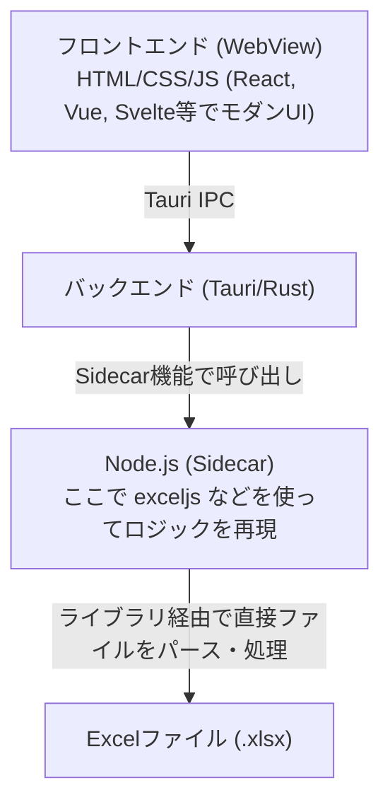

## はじめに

どれだけDXやシステム化が叫ばれても、会社組織の中には「どうしても無くならないエクセル業務」が必ず存在します。

「毎月1回、数時間かけて手作業でデータを集計・転記しているエクセル業務」
「誰が作ったかも分からないけれど、動かなくなったら業務が止まる秘伝のマクロシート」

きっと、あなたの会社の中にも心当たりがあるはずです。

そんな切実な業務課題を、「今すぐなんとかしたい！」というパッションのまま現場主導で解決する「Vibe Coding（環境構築すら不要で、ノリと勢いでその場ですぐに動かすスタイル）」において、Excel VBAは今でも有力な選択肢の一つです。なぜなら、Excelというグリッド自体が、データ入力・表示・確認のためのUIとして最初から機能しているからです。やりたいことをVBAで書き、実行ボタンを押せば、目の前のセルが物理的に動く。この「動いた！」というフィードバックの早さは、開発者に計り知れない「元氣」と確信を与えてくれます。

しかし、こうしてVibe Codingで泥臭く作り上げたExcelツールを、そのままマクロ有効ブック（.xlsm）として配布しようとすると、以下のような壁にぶつかります。

- ExcelのレガシーなUI（UserFormなど）だと、デザインに限界がある。
- セキュリティ設定（マクロブロックの警告ポップアップなど）の観点から嫌がられる。
- そもそもユーザーにExcelを直接触らせたくない（壊されるリスク、操作ミスの防止）。

そこで今回、「まずはExcel VBAでロジックを構築して『動く仕様書』とし、それを設計図にして[Tauri](https://v2.tauri.app/ja/) + Node.js (sidecar) のモダンなWindowsアプリへ移植する」というアプローチを実践してみました。これが非常に体験として良かったので共有します。

## アーキテクチャの全体像

本アプローチにおける、開発から製品化までの流れとアプリ構造のレイヤーは以下の通りです。

### 1. 開発（プロトタイプ）フェーズ

まずはExcel上でVBAをゴリゴリ書き、ロジックを確定させます。

### 2. 製品（プロダクション）フェーズ

確定したロジックを設計図（動く仕様書）として、Node.jsに移植します。

## なぜNode.jsを挟む（Sidecar）のか？

Tauriは基本、Rustでバックエンドを書きますが、RustでExcelファイルを読み書きするよりも、Node.jsの豊富なエコシステム（exceljs や xlsx など）を利用する方がスピーディーに実装できます。そこで、処理の中継役としてNode.jsを選びました。「フロントエンド（Web技術）側がJS/TSなので、なんとなくバックエンドもNode.jsにした」というシンプルな理由です。（※Pythonなどの他言語と厳密に優劣を比較したわけではありません。）

Node.js環境をTauriの Sidecar（サイドカー）機能 でアプリに同梱し、裏で常駐させてRust経由で通信させます。これで「UIはTauri、Excelファイルのロジック処理は使い慣れたNode.js」という役割分担が綺麗に成立します。

## なぜ「Excel操作はVBAが一番表現しやすい」のか？

最初から exceljs などのコードでExcel操作を書こうとすると、データの流れが抽象的になりがちで、「本当にこれで正しく計算できているか？」の検証に時間がかかります。

しかし、VBAには圧倒的な「視認性」と「直感性」があります。

- **オブジェクトモデルの直感性**：`Cells(1, 1).Value` や `Range` 操作、シートのコピーなど、Excelそのものが持っている機能をストレートに表現できる。
- **動作確認の容易さ**：VBAエディタ（VBE）を開いてF8キーで1行ずつステップ実行すれば、セルがどう変化するかをリアルタイムに目で追える。
- **豊富な情報量**：ネット上には、Excel自動化に関するVBAのコードスニペットが数多く存在します。

「やりたいこと」をスピーディーに具現化し、計算ロジックの正しさを確認するフェーズにおいて、VBAは非常に頼りになる選択肢です。

## VBAは「動く仕様書」になる

Vibe CodingでVBAのコードをガリガリ書き、Excelが完璧に期待通りに動くようになったら、そのマクロ（.xlsm）は単なるExcelツールではなく、「仕様を完全に満たした、絶対にブレない『動く仕様書』兼『コアロジック』」に進化します。

アプリ化のフェーズでは、このVBAの処理フローを「設計図」として、Node.js（Sidecar）側の exceljs などのライブラリへ「翻訳（移植）」していきます。ここで現代における最強の武器、「生成AI」の出番です。

「このVBAマクロのコードを、Node.jsの exceljs を使った関数に書き換えて」とプロンプトを添えてコードをそのまま生成AIに投げます。

VBAは手続き型で良くも悪くもロジックの流れが非常にストレートに書かれているため、生成AIにとって理解しやすく、翻訳の精度も比較的高いと感じています。そのため、AIを活用すれば、モダンで非同期なNode.jsコードへの移植（翻訳）作業を、スピーディーかつ高い精度で進められます。

すでに元となるロジックの正しさはVBA側で検証済み（テスト駆動開発のテストが完璧に通っているような状態）であり、そこからのコード翻訳はAIが代行してくれる。この組み合わせは、効率的なプロダクト移行プロセスの一つだと感じています。

あとは、フロントエンド（WebView）に綺麗な入力フォームを作り、ボタンが押されたらSidecarにリクエストを送って、移植されたNode.jsのロジックを走らせるだけ。ユーザーは、裏でExcelアプリケーションが立ち上がる重苦しさを一切感じることなく、超高速かつモダンなUIでExcelファイルを処理できるようになります。

## このアプローチのメリット

### ロジックの検証コストを大きく減らせる

最初からコードだけで書くとバグの特定が面倒なExcel操作も、VBAという「動く仕様書」が手元にあるため、移植時のロジックミスに気づきやすくなります。

### 「とりあえず動く」までのスピードが尋常じゃない

最初に複雑なUI設計や通信プロトコルの設計で悩む必要はありません。まずVBAで泥臭くロジックを完成させ（道を開き）、あとからTauriという美しい「ヨロイ」を着せるだけです。

## おわりに

「Excel VBAは古い」「レガシーだ」と言われがちですが、その圧倒的な手軽さと検証のしやすさは、現代のモダンなツール群と組み合わせることで真価を発揮します。

迷わずVBAで書き、ロジックを視覚的に検証して「動く仕様書」を作り、Tauri + Node.jsでモダンにラッピングして高速化する。「どうってことねえよ」の精神で、泥臭い技術とモダンな技術を総合格闘技のように組み合わせれば、現場を救う強力なアプリケーションが爆速で誕生します。

皆さんもぜひ、手元のExcel VBAを「動く仕様書」にして、新しいWindowsアプリ開発の道を切り拓いてみてください！
