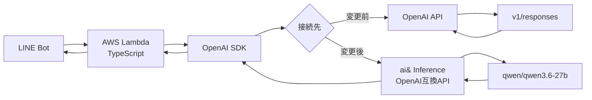

## はじめに

LINE BotのAI応答部分を、OpenAIのAPIから [ai&](https://www.aiand.com/jp/) InferenceのOpenAI互換APIへ載せ替えました。

「[OpenAI・Claude APIと互換性あり！国内AIモデル推論プラットフォーム『ai& Inference』を使ってみよう](https://qiita.com/official-events/750d1f37b7217167b1ad)」キャンペーンへの応募記事です。

結論から言うと、基本的には公式ドキュメントにある通り、OpenAI SDKを使ったまま `baseURL` とモデル名を変更すれば動きました。

ただし、実際に動かすまでに次の2点で少し詰まりました。

- ドキュメント上のモデル名が、実際には使えなかった
- `System message must be at the beginning.` という400エラーが出た

この記事では、その対応内容を短く記録します。

本当は語るも涙、聞くも涙の物語なのですが、それは私の胸の奥にだけそっとしまっておいて、要点だけをコンパクトにお伝えします。

## 環境

今回の構成は次のようなものです。



OpenAIのAPIは、元々 [/v1/responses](https://developers.openai.com/api/reference/resources/responses/methods/create) を使っていました。

## 変更したこと

OpenAI SDKのクライアント生成部分を、ai& Inference向けに変更しました。

https://docs.aiand.com/migrating-openai/

ドキュメントは上記です。

```ts
import OpenAI from "openai";

const client = new OpenAI({
  baseURL: "https://api.aiand.com/v1",
  apiKey: aiANDAPIKey,
});
```

ポイントは `baseURL` です。

OpenAI SDKをそのまま使い、接続先だけ ai& Inferenceに向けています。

## モデル名は `/v1/models` で確認したほうがよい

最初は[ドキュメント](https://docs.aiand.com/migrating-openai/)に載っていた次のモデルを指定しました。

```ts
const MODEL_NAME = "qwen/qwen3.5-9b";
```

しかし、実行すると次のようなエラーになりました。

```text
400 Model 'qwen/qwen3.5-9b' is not supported. Use GET /v1/models for available models.
```

そこで、実際に `/v1/models` をコールして確認しました。

```bash
curl https://api.aiand.com/v1/models \
  -H "Authorization: Bearer your-api-key"
```

2026-06-21時点では、私の環境では次のモデル一覧が返ってきました。

```json
{
  "object": "list",
  "data": [
    {
      "id": "zai-org/glm-5.2",
      "name": "zai-org/glm-5.2",
      "object": "model",
      "created": 1781883319,
      "owned_by": "ai&",
      "provider": "zai-org",
      "context_window": 1048576,
      "capabilities": [
        "reasoning",
        "tool_calling"
      ],
      "description": null,
      "currency": "jpy",
      "input_per_1m": "160.000000",
      "output_per_1m": "650.000000"
    },
    {
      "id": "moonshotai/kimi-k2.7-code",
      "name": "moonshotai/kimi-k2.7-code",
      "object": "model",
      "created": 1781883794,
      "owned_by": "ai&",
      "provider": "moonshotai",
      "context_window": 262144,
      "capabilities": [
        "reasoning",
        "tool_calling",
        "vision",
        "document"
      ],
      "description": "Kimi K2.7-Code by Moonshot AI",
      "currency": "jpy",
      "input_per_1m": "125.000000",
      "output_per_1m": "560.000000"
    },
    {
      "id": "deepseek-ai/deepseek-v4-pro",
      "name": "deepseek-ai/DeepSeek-V4-Pro",
      "object": "model",
      "created": 1780245364,
      "owned_by": "ai&",
      "provider": "deepseek-ai",
      "context_window": 1048576,
      "capabilities": [
        "reasoning",
        "tool_calling"
      ],
      "description": "DeepSeek-V4-Pro",
      "currency": "jpy",
      "input_per_1m": "160.000000",
      "output_per_1m": "400.000000"
    },
    {
      "id": "deepseek-ai/deepseek-v4-flash",
      "name": "deepseek-ai/DeepSeek-V4-Flash",
      "object": "model",
      "created": 1780245232,
      "owned_by": "ai&",
      "provider": "deepseek-ai",
      "context_window": 1048576,
      "capabilities": [
        "reasoning",
        "tool_calling"
      ],
      "description": "DeepSeek-V4-Flash",
      "currency": "jpy",
      "input_per_1m": "25.000000",
      "output_per_1m": "40.000000"
    },
    {
      "id": "qwen/qwen3.6-27b",
      "name": "qwen/qwen3.6-27b",
      "object": "model",
      "created": 1780245077,
      "owned_by": "ai&",
      "provider": "qwen",
      "context_window": 262144,
      "capabilities": [
        "reasoning",
        "tool_calling"
      ],
      "description": "Qwen3.6-27B",
      "currency": "jpy",
      "input_per_1m": "0.000000",
      "output_per_1m": "0.000000"
    },
    {
      "id": "google/gemma-4-31b-it",
      "name": "google/gemma-4-31b-it",
      "object": "model",
      "created": 1775474514,
      "owned_by": "ai&",
      "provider": "google",
      "context_window": 262144,
      "capabilities": [
        "reasoning",
        "tool_calling",
        "vision",
        "video",
        "document"
      ],
      "description": "Google Gemma 4 31B instruction-tuned",
      "currency": "jpy",
      "input_per_1m": "30.000000",
      "output_per_1m": "80.000000"
    },
    {
      "id": "zai-org/glm-5.1",
      "name": "zai-org/glm-5.1",
      "object": "model",
      "created": 1775633064,
      "owned_by": "ai&",
      "provider": "zai-org",
      "context_window": 202752,
      "capabilities": [
        "reasoning",
        "tool_calling"
      ],
      "description": "GLM-5.1 by ZhipuAI",
      "currency": "jpy",
      "input_per_1m": "220.000000",
      "output_per_1m": "700.000000"
    },
    {
      "id": "openai/gpt-oss-120b",
      "name": "openai/gpt-oss-120b",
      "object": "model",
      "created": 1775474514,
      "owned_by": "ai&",
      "provider": "openai",
      "context_window": 131072,
      "capabilities": [
        "reasoning",
        "tool_calling"
      ],
      "description": "OpenAI GPT OSS 120B",
      "currency": "jpy",
      "input_per_1m": "25.000000",
      "output_per_1m": "95.000000"
    },
    {
      "id": "moonshotai/kimi-k2.6",
      "name": "moonshotai/kimi-k2.6",
      "object": "model",
      "created": 1777544690,
      "owned_by": "ai&",
      "provider": "moonshotai",
      "context_window": 262144,
      "capabilities": [
        "reasoning",
        "tool_calling",
        "vision",
        "document"
      ],
      "description": "Kimi K2.6 by Moonshot AI",
      "currency": "jpy",
      "input_per_1m": "125.000000",
      "output_per_1m": "560.000000"
    }
  ]
}
```

この結果を見て、モデル名を次のように変更しました。

```ts
const MODEL_NAME = "qwen/qwen3.6-27b";
```

これでモデル指定のエラーは解消しました。

## `System message must be at the beginning.` への対応

モデル名を修正したあと、今度は次のエラーが出ました。

```text
400 System message must be at the beginning.
```

ログの一部です。

```text
BadRequestError: 400 System message must be at the beginning.
...
error: {
  message: 'System message must be at the beginning.',
  type: 'invalid_request_error',
  code: 'invalid_value'
}
```

原因は、入力に複数の `system` メッセージを入れていたことでした。

もともとは次のような構成でした。

```ts
return [
  { role: "system", content: PERSONA_PROMPT },
  { role: "system", content: memoryContext },
  { role: "user", content: text },
];
```

OpenAI側ではこの形でも動いていました。

しかし、ai& Inference側では `system` メッセージの扱いがより厳密だったようです。

そこで、`system` メッセージを1つにまとめました。

```ts
return [
  {
    role: "system",
    content: `${PERSONA_PROMPT}\n\n${memoryContext}`,
  },
  { role: "user", content: text },
];
```

これでエラーは解消しました。

## 最終的な変更ポイント

今回の載せ替えで重要だった変更は、次の3点です。

### 1. OpenAI SDKの接続先をai& Inferenceのエンドポイントに変える

```ts
const client = new OpenAI({
  baseURL: "https://api.aiand.com/v1",
  apiKey: aiANDAPIKey,
});
```

https://docs.aiand.com/migrating-openai/

### 2. モデル名は `/v1/models` で確認する

```bash
curl https://api.aiand.com/v1/models \
  -H "Authorization: Bearer your-api-key"
```

ドキュメントに載っているモデル名でも、手元の環境では使えない場合があります。

そのため、実際に利用可能なモデルは `/v1/models` で確認するのが確実です。

https://docs.aiand.com/api/models/

### 3. systemメッセージは先頭に1つだけ置く

複数の `system` メッセージを使っている場合は、1つにまとめておくと互換APIでも通るようになります。

```ts
{
  role: "system",
  content: `${personaPrompt}\n\n${memoryContext}`,
}
```

## クレジットについて

私の環境では、[プロモーションコード](https://qiita.com/official-events/750d1f37b7217167b1ad)で $50 を受け取る前、つまり `Credits:¥0` の状態でも、`qwen/qwen3.6-27b` を指定した呼び出しは動きました。

ただし、これは2026-06-21時点での私の環境での確認結果です。

課金や無料枠の扱いは変わる可能性があります。実際に使う際は、コンソールや `/v1/models` のレスポンスで確認してください。

## まとめ

OpenAI APIから ai& InferenceのOpenAI互換APIへの載せ替えは、想像よりも小さな変更で済みました。

実際に必要だったのは、主に次の変更です。

- `baseURL` を `https://api.aiand.com/v1` に変更する
- API key を ai& Inferenceのものに変更する
- モデル名を `/v1/models` で確認して指定する
- 複数の `system` メッセージを1つにまとめる

OpenAI SDKを使っている既存アプリなら、簡単に移行できると思います。

API移行も、やる前は少し面倒に見えます。しかし実際に一歩踏み出すと、壁の正体はだいたいログに出ています。
ログを読み、モデル一覧を確認し、systemメッセージを整える。
それだけで、 **既存のAIアプリを別の推論基盤でも動かすことができました**。
