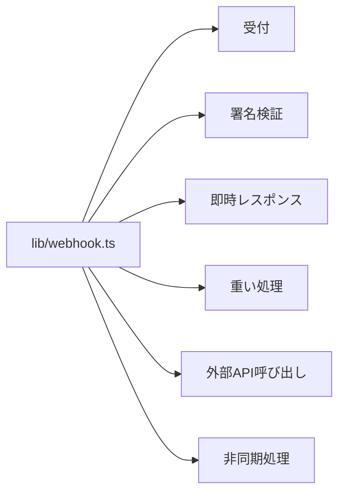
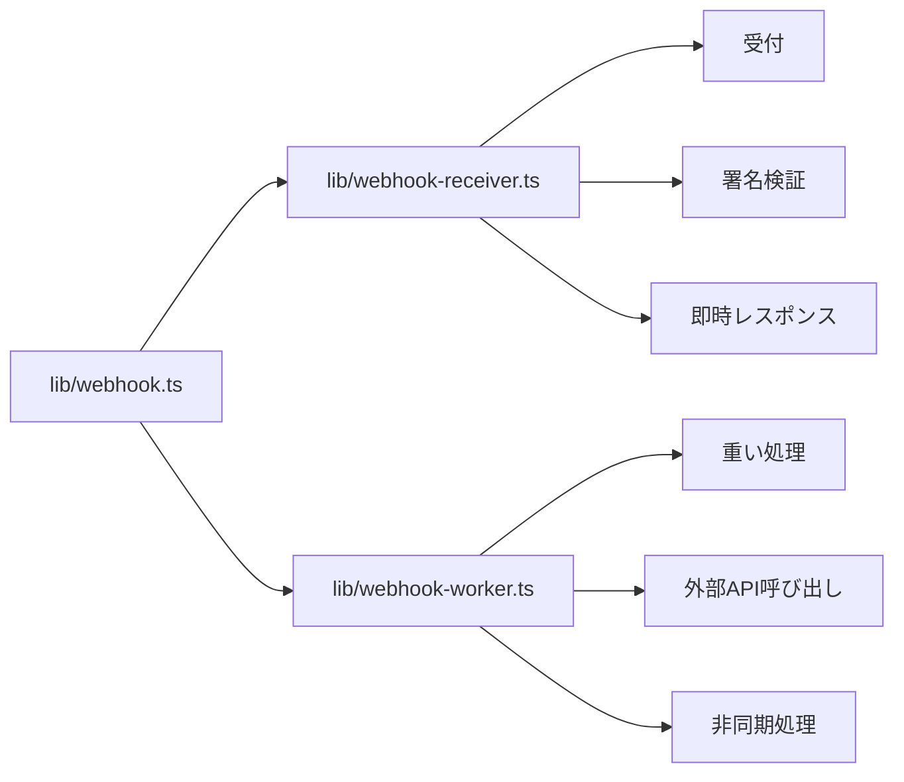
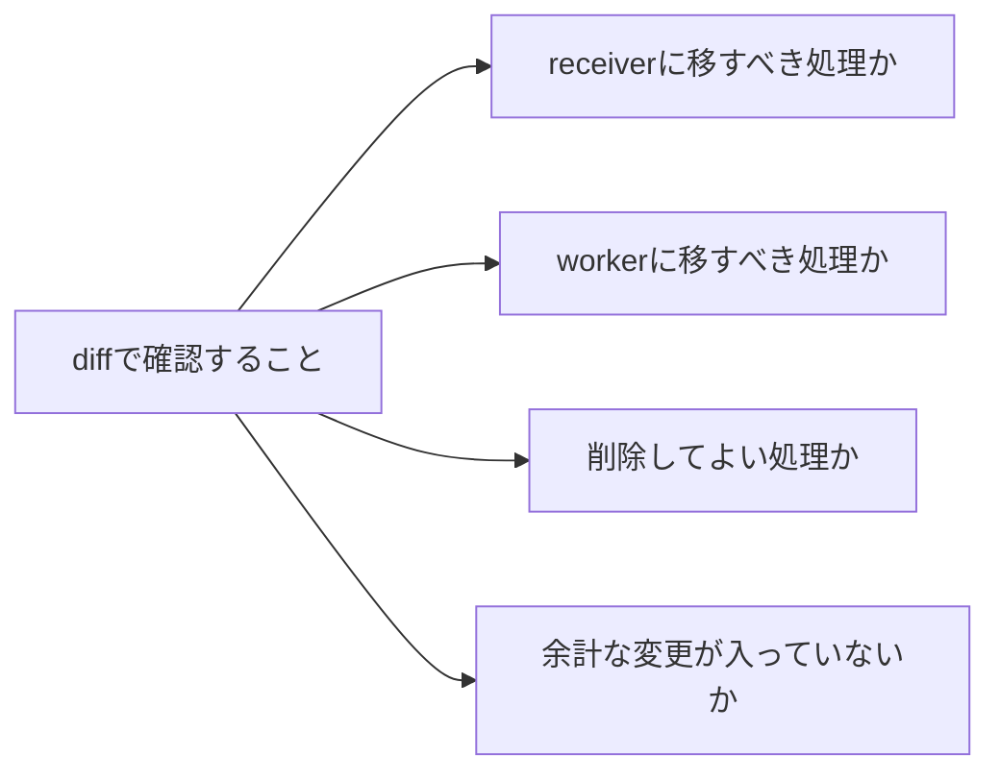

## はじめに

生成AIにファイル分割を任せると便利です。

たとえば、1つのファイルにまとまっていた処理を、受付側とワーカー側に分けるような作業です。

しかし、少し気になることがあります。

「ファイルを分けるだけのつもりだったのに、余計な変更まで入っていないか？」

この記事では、削除済みの元ファイルを Git から取り出し、新しく作られたファイルと diff する小技を紹介します。

## 今回の例

もともと、次の1ファイルに処理がまとまっていたとします。

```text
lib/webhook.ts
```



これを、次の2ファイルに分割しました。

```text
lib/webhook-receiver.ts
lib/webhook-worker.ts
```

元の `lib/webhook.ts` は不要になったので削除済みです。



## 削除済みファイルと diff する

`lib/webhook.ts` は削除済みです。

しかし、Git の履歴には残っています。

たとえば、削除前のファイルが1つ前のコミットにあるなら、次のように比較できます。

```bash
git diff -w HEAD~1:lib/webhook.ts lib/webhook-worker.ts
git diff -w HEAD~1:lib/webhook.ts lib/webhook-receiver.ts
```

`HEAD~1:lib/webhook.ts` は、「1つ前のコミットにあった `lib/webhook.ts`」という意味です。

`-w` は空白の変更を無視するオプションです。  
ファイル分割ではインデントが変わりやすいため、ロジックの差分を見たいときに便利です。

## VS Code で見る

ターミナルの diff だけでは追いにくい場合は、VS Code で開けます。

```bash
git show HEAD~1:lib/webhook.ts | code --diff - lib/webhook-worker.ts
git show HEAD~1:lib/webhook.ts | code --diff - lib/webhook-receiver.ts
```

`git show HEAD~1:lib/webhook.ts` で、削除前のファイル内容を取り出します。

それを `code --diff - 現在のファイル` に渡すことで、VS Code の diff 画面で比較できます。


## 何を見るか

見るポイントは、次の4つです。



特に見たいのは、最後の「余計な変更」です。

ファイル分割のつもりなのに、条件分岐、戻り値、エラーハンドリングなどが変わっていたら注意します。

## まとめ

削除済みのファイルでも、Git の履歴に残っていれば diff できます。

```bash
git diff -w HEAD~1:lib/webhook.ts lib/webhook-worker.ts
git diff -w HEAD~1:lib/webhook.ts lib/webhook-receiver.ts
```

VS Code で見たい場合はこちらです。

```bash
git show HEAD~1:lib/webhook.ts | code --diff - lib/webhook-worker.ts
git show HEAD~1:lib/webhook.ts | code --diff - lib/webhook-receiver.ts
```

生成AIに任せると、作業は速くなります。

しかし、最後に差分を読むのは自分です。

「分割しただけ」のつもりが、意図しない仕様変更になっていないか。  
その確認に、削除済みファイルとの diff が役立つことがあります。
