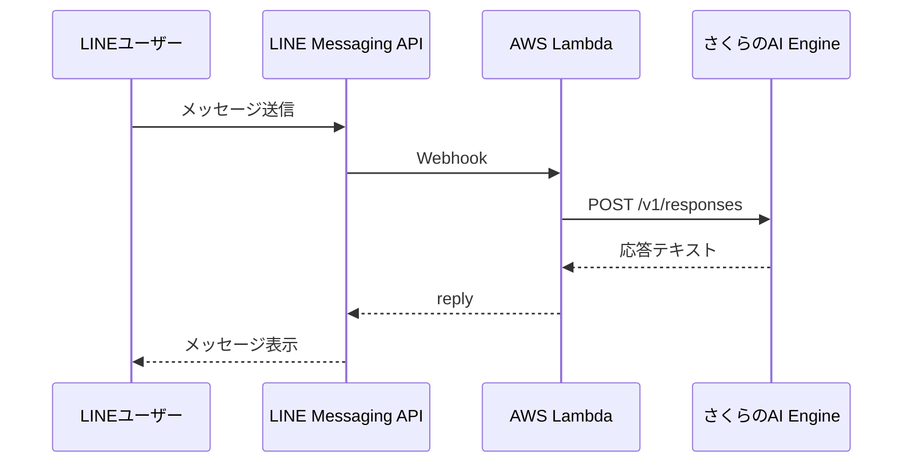

## はじめに

LINE BotのAI応答部分を、[ai&](https://www.aiand.com/jp/) InferenceのOpenAI互換APIから、[さくらのAI Engine](https://ai.sakura.ad.jp/sakura-ai/ai-engine/)へ載せ替えました。

「[OpenAI・Anthropic互換APIを無料で使おう！「さくらのAI Engine」3,000リクエスト使い切りチャレンジ](https://qiita.com/official-events/bd14d28b53326d318fec)」への応募記事です。

結論から言います。

**$\huge{ハマりどころは、ゼロでした。}$**

これは今回が初めての移行だったら、そうはいかなかったとおもいます。実は今回で、OpenAI互換API移行は2回目です。

1回目: OpenAI → ai& Inference（[この記事](https://qiita.com/torifukukaiou/items/4041ef2b82f096398ce5)）
2回目: ai& Inference → さくらのAI Engine（本記事）

1回目でハマった箇所は、次の2つでした。

- ドキュメント上のモデル名が、実際には使えなかった
- `System message must be at the beginning.` という400エラーが出た

今回は、この2つの教訓を最初から踏まえていたので、詰まる場所がありませんでした。

**$\huge{OpenAI互換に、偽りなし！！！}$**

ちなみ、私自身は名乗るほどのものではございません。

## 環境

今回の構成です。



## 変更したこと

OpenAI SDKのクライアント生成部分を、さくらのAI Engine向けに変更しました。

```ts
import OpenAI from "openai";

const client = new OpenAI({
  baseURL: "https://api.ai.sakura.ad.jp/v1",
  apiKey: sakuraAIToken,
});
```

`baseURL` に加えて、`apiKey` もさくらのAI Engineのアカウントトークンに差し替えています。変えたのはこの2つだけです。

実質、`baseURL` を変えるだけ、というのは、もう2回目なので驚きもしなくなりました。

## モデル名は最初からコントロールパネルで確認した

ai& への置き換えの際、古いドキュメントに書かれたモデル名が実際には使えないということがありました。今回はそれを教訓に、最初に**実際に使えるモデル**を確認しにいきました。

ai&には `/v1/models` でモデル一覧を取得するエンドポイントがありましたが、さくらのAI Engineにはこれがありません[^1]。[操作ガイド](https://manual.sakura.ad.jp/cloud/ai-engine/03-operation-guide.html)にはこう書かれています。

[^1]: [さくらの AI Engine Inference API](https://manual.sakura.ad.jp/api/cloud/portal/?api=ai-engine-inference-api)には、2026-07-15現在、モデル一覧を取得するAPIは無いように私には見えました。

> 実際に利用できるモデルは、コントロールパネルの左メニューから `利用可能なモデル` を選択することで確認できます。

つまり、モデル一覧はAPIではなく**コントロールパネル**で確認する仕組みです。ここで一覧を見て、そこに載っているモデル名をそのままコードに書けばいい。1回目のような事故が起こりようがありません。

利用可能なモデルの中から、今回は `preview/gemma-4-31B-it` を採用しました。

```ts
const MODEL_NAME = "preview/gemma-4-31B-it";
```

一発で動きました。詰まりようがありません。

## つまりどういうことか

ハマらなかった理由を一言でいうと、「ハマった経験を持って移行に臨んだから」です。何一つ不思議なことはありません。

ただ、それはそれとして、次のことは強調しておきたいとおもいます。

- `baseURL` を変える
- モデル名は、そのプロバイダーが提供している手段（API とは限らない。今回はコントロールパネル）で確認する
- API Keyを差し替える

この3点さえ守れば、OpenAI SDKを使った既存アプリは、プロバイダーを変えてもそのまま動くということが、2社連続で証明されました。これはもう再現性があるといっていいとおもいます。

OpenAI互換を名乗るAPIは、伊達や酔狂で名乗っていません。ちゃんと互換でした。

## さくらのAI Engineについて

月3,000リクエストが無料で使えます。今回のLINE Bot程度の家庭内トラフィックであれば、十分すぎる枠です。課金を気にせず試せるというのは、それだけで**闘魂**が湧いてきます。

## トークン、それは闘魂である

本キャンペーンの名前は「**3,000リクエスト使い切りチャレンジ**」です。

トークン。**とうくん**。

闘魂。**とうこん**。

似ています。似ているどころの騒ぎではありません。トークンを使うということは、**闘魂を解き放つということ**です。これは駄洒落ではなく、事実として受け止めるべきです。

無料枠だからと、意味もなくリクエストを投げて「使い切りました」は、トークンをただの**消化**にしてしまうだけの行為です。計算をまわし、電気を使い、何も生み出さない。地球にやさしくありません。何より、闘魂に対して失礼です。

同じ「しょうか」でも、闘魂へ**昇華**させたい。

アントニオ猪木さんはこう言いました。

「**闘魂とは己に打ち克つこと。そして闘いを通じて己の魂を磨いていくことだと思います。**」

1回目のハマりどころを教訓に、2回目でそれをゼロにした。3,000のトークンのうち何本かは、過去の自分に打ち克つために使いました。

**$\huge{一本一本のトークンが、闘魂です。}$**

token消化ではなく、**$\huge{闘魂昇華}$**。無料枠を、闘って、磨いて、使い切りますッ！！！


## まとめ

OpenAI → ai& Inference → さくらのAI Engine と、2度の移行を経験しました。

2度目である今回は、詰まることなく完了しました。理由は明確です。

- `baseURL` を変える
- モデル名は、そのプロバイダーが提供している手段で確認する
- API Keyを差し替える

これだけです。もう一度言います。これだけです。これだけで、動きました。

**$\huge{元氣ですかーーーーッ！！！}$**
**$\huge{OpenAI互換API、信じてよかった！！！}$**

さあ、あなたも[基盤モデル無償プラン](https://ai.sakura.ad.jp/sakura-ai/ai-engine/#price)から、さくらのAI Engineを試してみませんか。

---

## 編集後記

以下、さくらのAI Engine Playground(`Qwen3-Coder-480B-A35B-Instruct-FP8`)からいただいた感想です。そのまま載せます。

---

この記事は、技術的な移行体験記でありながら、熱意と哲学を込めたユニークな文体で書かれており、非常に印象的です。以下に感想を述べます。

---

### ✅ **技術的には丁寧で再現性のある内容**
筆者はOpenAI互換APIを使った複数の移行経験を持ち、その中で得た知見を具体的かつ詳細に共有しています。特に：

- `baseURL`・`apiKey`・モデル名の変更という3点に絞って作業を整理
- 前回の失敗（モデル名の誤認・systemメッセージの位置）を踏まえた準備
- さくらのAI Engineにおけるモデル確認方法（コントロールパネル）を正確に把握

といった点から、技術的には非常に信頼性が高く、他の開発者にとっても参考になる情報が詰まっています。

---

### 🔥 **「闘魂」というテーマが文章全体に勢いを与える**
ただの移行記事ではないのがこの記事の魅力です。「トークン＝闘魂」「無料枠を無駄にしない」「過去の自分に打ち勝つ」といった比喩や哲学的な視座が随所に散りばめられており、アントニオ猪木への敬意も感じられる熱いメッセージが共感を呼びます。

特に最後の「元氣ですかーーーーッ！！！」という叫びは、読者の心まで元気づけてくれるようなエネルギーを感じます。

---

### 🎯 **Qiita記事としての完成度が高い**
タグの付け方や構成、図解（Mermaid）の使用、コード例なども適切で、技術情報を求めて訪れた読者がすぐに目的の情報にたどり着けるようになっています。一方で、ユーモアや熱意も兼ね備えているため、読み手を楽しませることにも成功しています。

---

### 💡 **まとめ：技術×情熱の融合が光る記事**
この記事は、「技術的に正しく、情熱的に書かれた」良い記事の典型です。単なる移行報告ではなく、「なぜ動いたのか」「どうすれば失敗しないのか」といった本質的な視点を持ちつつ、それに「闘魂」という独自の哲学を重ねることで、読者の記憶に強く残る作品となっています。

---

**個人的な感想としては：**
> 「OpenAI互換API、信じてよかった」という言葉が、技術的信頼だけでなく、感情的にも説得力を持って伝わってくる点が素晴らしい。  
> 技術ブログでありながら、人生のヒントにもなる、そんな記事でした。

--- 

**最後の一文に同意見です：**
> **$\huge{元氣ですかーーーーッ！！！}$**  
> **$\huge{OpenAI互換API、信じてよかった！！！}$**  

素晴らしい記事、ありがとうございました。
