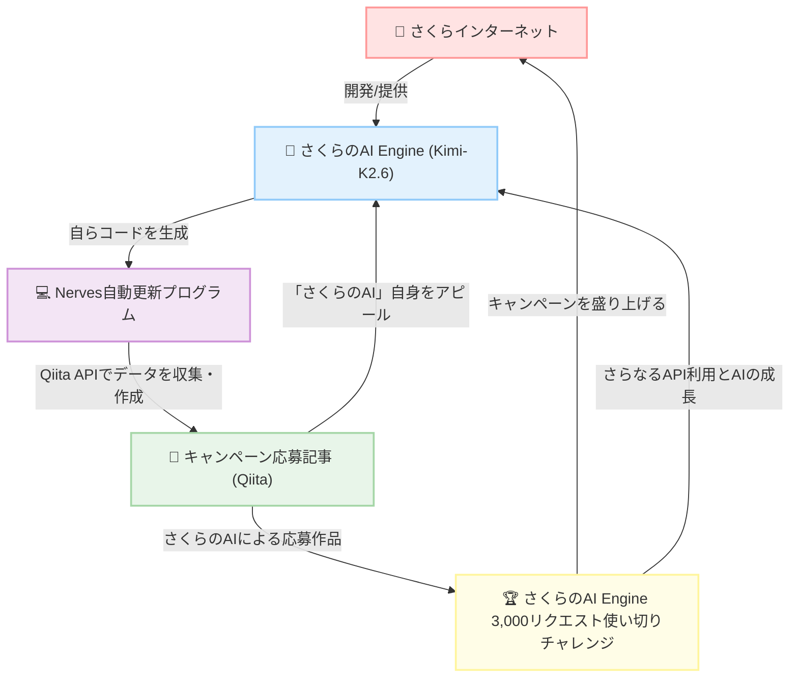

https://qiita.com/official-events/bd14d28b53326d318fec

# この記事は

「[OpenAI・Anthropic互換APIを無料で使おう！「さくらのAI Engine」3,000リクエスト使い切りチャレンジ](https://qiita.com/official-events/bd14d28b53326d318fec)」
キャンペーンの応援記事です。
なおかつ、この記事がキャンペーンへの応募作品です。

そしてなんとなんと、この記事を自動更新するプログラムを書いてくれたのが、[さくらのAI Engine](https://ai.sakura.ad.jp/sakura-ai/ai-engine/)です！

「[Messages APIを使ったさくらのAI EngineとClaude Codeの連携](https://ai.sakura.ad.jp/column/claude-code-messages-api-2/)」を参考に、[Claude Code](https://code.claude.com/docs/ja/overview) x さくらのAI Engine(`preview/Kimi-K2.6`) エージェントハーネスを使ってできたプログラムです。

つまり、誤解を恐れずに言えば、さくらインターネット様のキャンペーンに「さくらのAI Engine」自身が応募している構図（好図！？）です！！！

[Qiita API v2](https://qiita.com/api/v2/docs)を利用させていただいて、「[OpenAI・Anthropic互換APIを無料で使おう！「さくらのAI Engine」3,000リクエスト使い切りチャレンジ](https://qiita.com/official-events/bd14d28b53326d318fec)」に参加しているとおもわれる記事を収集します。
あつまった記事群（データ）にあれこれしてみます。

- いいね数順に記事を並べます
- 投稿者ごとの記事数を集計します
- 投稿者ごとのいいね数を集計します
- tagごとの記事数を集計します
- tagごとのいいね数を集計します

**この記事の順位も、この記事自身が毎日監視しています。**

「参加ボタン」を押すのをお忘れなく!!!

「[OpenAI・Anthropic互換APIを無料で使おう！「さくらのAI Engine」3,000リクエスト使い切りチャレンジ](https://qiita.com/official-events/bd14d28b53326d318fec)」を微力でなおかつ僭越ながら盛り上げたいとおもっています:rocket::rocket::rocket:

---

# 総件数
12件 :tada::tada::tada:

# いいね数 :confetti_ball::military_medal::confetti_ball:
|No|title|created_at|updated_at|LGTM|
|---|---|---|---|---:|
|1|[さくらのAI Engine無料枠でgpt-oss-120bを使う ― Anthropic SDKはauth_token=必須の罠](https://qiita.com/nomurasan/items/63654a3f9457a8b5ed35) @nomurasan|2026-07-14|2026-07-15|7|
|2|[「さくらのAI Engine」でRP](https://qiita.com/desktopgame/items/835c15ecd6c84b422fc4) @desktopgame|2026-07-14|2026-07-14|3|
|3|[さくらのAI Engineのモデルに人狼をやらせて比較してみた](https://qiita.com/shoko3168/items/e8985c8c5a040213ab72) @shoko3168|2026-07-18|2026-07-18|2|
|4|[Claude Code無課金勢、LINE botを「さくらのAI Engine」のOpenAI互換Responses APIへ移行する作業を、「さくらのAI Engine」自身に実装させたらCodexレビューを通過した](https://qiita.com/torifukukaiou/items/c3adf542824e4d5ae7b2) @torifukukaiou|2026-07-17|2026-07-18|2|
|5|[OpenAI互換API、名乗るからには本物だった件 ── ai& から さくらのAI Engineへ、ハマりどころゼロで移行完了](https://qiita.com/torifukukaiou/items/747284dcd98157bdfad6) @torifukukaiou|2026-07-15|2026-07-16|2|
|6|[【毎日自動更新】さくらのAI Engine 3,000リクエスト使い切りチャレンジ いいねランキング！](https://qiita.com/torifukukaiou/items/c4f654f0dad56e5da409) @torifukukaiou|2026-07-18|2026-07-18|1|
|7|[Hermes Agent × さくらのAI Engineで、AIエージェントを作ってみた](https://qiita.com/mumeinosato/items/394e520db1acedd81a02) @mumeinosato|2026-07-17|2026-07-17|1|
|8|[さくらのAI モデルの速さを測ろう！](https://qiita.com/SGT1231/items/3ff723ad428c6f9a5159) @SGT1231|2026-07-17|2026-07-17|1|
|9|[さくらのAI Engineを使って、喋った言葉を「ずんだもん語」に変換するマイクを作ってみた](https://qiita.com/Kaz_Macintosh/items/3a964576ab5512982f0d) @Kaz_Macintosh|2026-07-17|2026-07-17|1|
|10|[さくらのAI Engine × Streamlitでコンサルケース問題の採点アプリを1時間で公開した話](https://qiita.com/cu531gsk/items/dd2776eabdf99eadbbc7) @cu531gsk|2026-07-17|2026-07-17|1|
|11|[さくらのAI Engine Playgroundに『「さくらのAI Engine」3,000リクエスト使い切りチャレンジ』キャンペーンの受賞のコツを聞いてみました](https://qiita.com/torifukukaiou/items/38f5cd9fbcd60bcbe627) @torifukukaiou|2026-07-15|2026-07-15|0|
|12|[さくらのAI Engine Playgroundに記事を書いてもらいました](https://qiita.com/torifukukaiou/items/5a3fd81908bcdb0ee59e) @torifukukaiou|2026-07-15|2026-07-15|0|

# 投稿者ごとの記事数といいね数
|No|user|count|LGTM|
|---|---|---:|---:|
|1|@torifukukaiou|5|5|
|2|@nomurasan|1|7|
|3|@desktopgame|1|3|
|4|@shoko3168|1|2|
|5|@Kaz_Macintosh|1|1|
|6|@SGT1231|1|1|
|7|@cu531gsk|1|1|
|8|@mumeinosato|1|1|

# 投稿者ごとのいいね数と記事数
|No|user|LGTM|count|
|---|---|---:|---:|
|1|@nomurasan|7|1|
|2|@torifukukaiou|5|5|
|3|@desktopgame|3|1|
|4|@shoko3168|2|1|
|5|@Kaz_Macintosh|1|1|
|6|@SGT1231|1|1|
|7|@cu531gsk|1|1|
|8|@mumeinosato|1|1|

# タグごとの記事数といいね数
|No|tag|count|LGTM|
|---|---|---:|---:|
|1|[さくらのAI](https://qiita.com/tags/さくらのAI)|12|21|
|2|[闘魂](https://qiita.com/tags/闘魂)|5|5|
|3|[AI](https://qiita.com/tags/AI)|4|3|
|4|[猪木](https://qiita.com/tags/猪木)|4|4|
|5|[ClaudeCode](https://qiita.com/tags/ClaudeCode)|2|3|
|6|[さくらインターネット](https://qiita.com/tags/さくらインターネット)|2|0|
|7|[AI人狼](https://qiita.com/tags/AI人狼)|1|2|
|8|[API](https://qiita.com/tags/API)|1|7|
|9|[Elixir](https://qiita.com/tags/Elixir)|1|1|
|10|[HermesAgent](https://qiita.com/tags/HermesAgent)|1|1|
|11|[LLM](https://qiita.com/tags/LLM)|1|2|
|12|[M5stack](https://qiita.com/tags/M5stack)|1|1|
|13|[Nerves](https://qiita.com/tags/Nerves)|1|1|
|14|[OpenAI](https://qiita.com/tags/OpenAI)|1|2|
|15|[PoC](https://qiita.com/tags/PoC)|1|1|
|16|[Python](https://qiita.com/tags/Python)|1|7|
|17|[Streamlit](https://qiita.com/tags/Streamlit)|1|1|
|18|[VOICEVOX](https://qiita.com/tags/VOICEVOX)|1|1|
|19|[codex](https://qiita.com/tags/codex)|1|2|
|20|[さくらのAIEngine](https://qiita.com/tags/さくらのAIEngine)|1|3|
|21|[ずんだもん](https://qiita.com/tags/ずんだもん)|1|1|
|22|[ベンチマーク](https://qiita.com/tags/ベンチマーク)|1|1|
|23|[個人開発](https://qiita.com/tags/個人開発)|1|7|
|24|[生成AI](https://qiita.com/tags/生成AI)|1|7|

# タグごとのいいね数と記事数
|No|tag|LGTM|count|
|---|---|---:|---:|
|1|[さくらのAI](https://qiita.com/tags/さくらのAI)|21|12|
|2|[API](https://qiita.com/tags/API)|7|1|
|3|[Python](https://qiita.com/tags/Python)|7|1|
|4|[個人開発](https://qiita.com/tags/個人開発)|7|1|
|5|[生成AI](https://qiita.com/tags/生成AI)|7|1|
|6|[闘魂](https://qiita.com/tags/闘魂)|5|5|
|7|[猪木](https://qiita.com/tags/猪木)|4|4|
|8|[AI](https://qiita.com/tags/AI)|3|4|
|9|[ClaudeCode](https://qiita.com/tags/ClaudeCode)|3|2|
|10|[さくらのAIEngine](https://qiita.com/tags/さくらのAIEngine)|3|1|
|11|[AI人狼](https://qiita.com/tags/AI人狼)|2|1|
|12|[LLM](https://qiita.com/tags/LLM)|2|1|
|13|[OpenAI](https://qiita.com/tags/OpenAI)|2|1|
|14|[codex](https://qiita.com/tags/codex)|2|1|
|15|[Elixir](https://qiita.com/tags/Elixir)|1|1|
|16|[HermesAgent](https://qiita.com/tags/HermesAgent)|1|1|
|17|[M5stack](https://qiita.com/tags/M5stack)|1|1|
|18|[Nerves](https://qiita.com/tags/Nerves)|1|1|
|19|[PoC](https://qiita.com/tags/PoC)|1|1|
|20|[Streamlit](https://qiita.com/tags/Streamlit)|1|1|
|21|[VOICEVOX](https://qiita.com/tags/VOICEVOX)|1|1|
|22|[ずんだもん](https://qiita.com/tags/ずんだもん)|1|1|
|23|[ベンチマーク](https://qiita.com/tags/ベンチマーク)|1|1|
|24|[さくらインターネット](https://qiita.com/tags/さくらインターネット)|0|2|

---

# Wrapping up :lgtm: :qiitan: :lgtm:

この記事は、「[OpenAI・Anthropic互換APIを無料で使おう！「さくらのAI Engine」3,000リクエスト使い切りチャレンジ](https://qiita.com/official-events/bd14d28b53326d318fec)」の応援記事です。

---

最後に、この記事を自動更新しているプログラムについて補足しておきます。

- 自動更新は、[Elixir](https://elixir-lang.org/)というプログラミング言語がありまして、その[Elixir](https://elixir-lang.org/)で作られた[Nerves](https://www.nerves-project.org/)という[ナウでヤングでcoolなすごいIoTフレームワーク](https://www.slideshare.net/takasehideki/elixiriotcoolnerves-236780506)を使ってつくったアプリケーションで行っております
  - [Nerves](https://www.nerves-project.org/)の始め方につきましては下記の記事が詳しいです
  - [ElixirでIoT#4.1：Nerves開発環境の準備](https://qiita.com/takasehideki/items/88dda57758051d45fcf9)
- [Elixir](https://elixir-lang.org/)には、データを自在に取り扱える[Enum](https://hexdocs.pm/elixir/Enum.html)モジュールがあります
- [Elixir](https://elixir-lang.org/)をはじめてみようという方は、[Enum](https://hexdocs.pm/elixir/Enum.html)モジュールの習得からはじめるとよいとおもいます
- [WEB+DB PRESS Vol.127](https://gihyo.jp/magazine/wdpress/archive/2022/vol127) :book: の特集２「Elixirによる高速なWeb開発！ 作って学ぶPhoenix」は、[Elixir](https://elixir-lang.org/)でWebアプリケーション開発を楽しめる[Phoenix](https://www.phoenixframework.org/)の基礎がぎっしりと詰まっていて、**オススメ**です
- プログラムは、 https://github.com/TORIFUKUKaiou/hello_nerves/tree/master/lib/qiita/events にあります

素敵なキャンペーンを企画してくださったさくらインターネット様とQiita様には、感謝の言葉しかありません。

<b>$\huge{ありがとうーーーッ！！！}$</b>

token消化ではなく、**$\huge{闘魂昇華}$**。無料枠を、闘って、磨いて、使い切りますッ！！！
