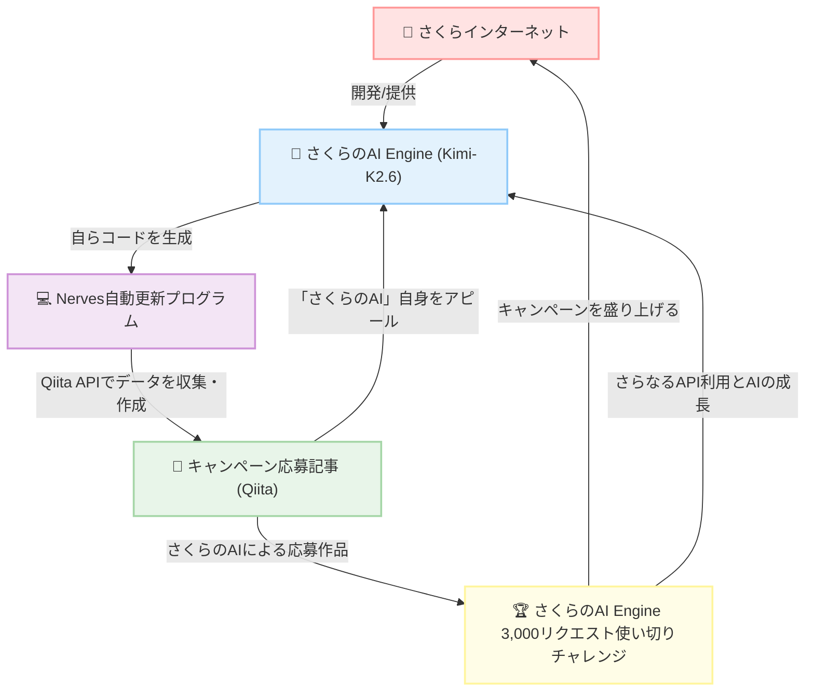

https://qiita.com/official-events/bd14d28b53326d318fec

# この記事は

「[OpenAI・Anthropic互換APIを無料で使おう！「さくらのAI Engine」3,000リクエスト使い切りチャレンジ](https://qiita.com/official-events/bd14d28b53326d318fec)」キャンペーンの応援記事です。
なおかつ、この記事がキャンペーンへの応募作品です。

**キャンペーンに参加するすべてのみなさま、つまりは全人類を応援します！**

そしてなんとなんと、この記事を自動更新するプログラムを書いてくれたのが、[さくらのAI Engine](https://ai.sakura.ad.jp/sakura-ai/ai-engine/)です！

「[Messages APIを使ったさくらのAI EngineとClaude Codeの連携](https://ai.sakura.ad.jp/column/claude-code-messages-api-2/)」を参考に、[Claude Code](https://code.claude.com/docs/ja/overview) x さくらのAI Engine(`preview/Kimi-K2.6`) エージェントハーネスを使ってできたプログラムです。

つまり、誤解を恐れずに言えば、さくらインターネット様のキャンペーンに「さくらのAI Engine」自身が応募している構図（好図！？）です！！！

[Qiita API v2](https://qiita.com/api/v2/docs)を利用させていただいて、「[OpenAI・Anthropic互換APIを無料で使おう！「さくらのAI Engine」3,000リクエスト使い切りチャレンジ](https://qiita.com/official-events/bd14d28b53326d318fec)」に参加しているとおもわれる記事を収集します。
あつまった記事群（データ）にあれこれしてみます。

- いいね数順に記事を並べます
- 投稿者ごとの記事数を集計します
- 投稿者ごとのいいね数を集計します
- tagごとの記事数を集計します
- tagごとのいいね数を集計します

**この記事の順位も、この記事自身が毎日監視しています。**

「参加ボタン」を押すのをお忘れなく!!!

「[OpenAI・Anthropic互換APIを無料で使おう！「さくらのAI Engine」3,000リクエスト使い切りチャレンジ](https://qiita.com/official-events/bd14d28b53326d318fec)」を微力でなおかつ僭越ながら盛り上げたいとおもっています:rocket::rocket::rocket:

---

# 総件数
29件 :tada::tada::tada:

# いいね数 :confetti_ball::military_medal::confetti_ball:
|No|title|created_at|updated_at|LGTM|
|---|---|---|---|---:|
|1|[さくらのAI Engine無料枠でgpt-oss-120bを使う ― Anthropic SDKはauth_token=必須の罠](https://qiita.com/nomurasan/items/63654a3f9457a8b5ed35) @nomurasan|2026-07-14|2026-07-15|10|
|2|[さくらのAI Engineに書いてもらったコードで、さくらのAI Engineの「ずんだもん」に毎朝私は起こしてもらう](https://qiita.com/torifukukaiou/items/3c03c45da77e9cb7cf6b) @torifukukaiou|2026-07-18|2026-07-21|8|
|3|[さくらのAI Engineのモデルに人狼をやらせて比較してみた](https://qiita.com/shoko3168/items/e8985c8c5a040213ab72) @shoko3168|2026-07-18|2026-07-18|8|
|4|[【毎日自動更新】さくらのAI Engine 3,000リクエスト使い切りチャレンジ いいねランキング！](https://qiita.com/torifukukaiou/items/c4f654f0dad56e5da409) @torifukukaiou|2026-07-18|2026-07-23|3|
|5|[Claude Code無課金勢、LINE botを「さくらのAI Engine」のOpenAI互換Responses APIへ移行する作業を、「さくらのAI Engine」自身に実装させたらCodexレビューを通過した](https://qiita.com/torifukukaiou/items/c3adf542824e4d5ae7b2) @torifukukaiou|2026-07-17|2026-07-18|3|
|6|[「さくらのAI Engine」でRP](https://qiita.com/desktopgame/items/835c15ecd6c84b422fc4) @desktopgame|2026-07-14|2026-07-14|3|
|7|[Chat月3,000リクエストを「経営予算」に──さくらのAI Engineで問い合わせ一次対応PoCを作った](https://qiita.com/YushiYamamoto/items/b7b3529ed14751fda13a) @YushiYamamoto|2026-07-22|2026-07-23|2|
|8|[さくらのAI Engineを無料枠で触ってみて、最初につまずいた話](https://qiita.com/TheGateBreaker/items/855ee917db41fbe11fdd) @TheGateBreaker|2026-07-20|2026-07-20|2|
|9|[生成AI初心者がAIに聞きながら「さくらのAI Engine」無償プランを契約〜PowerShellで初APIコールしてみた【公式ドキュメント答え合わせ付き】](https://qiita.com/miyacha/items/93a667c6117b1d46db55) @miyacha|2026-07-18|2026-07-18|2|
|10|[Hermes Agent × さくらのAI Engineで、AIエージェントを作ってみた](https://qiita.com/mumeinosato/items/394e520db1acedd81a02) @mumeinosato|2026-07-17|2026-07-17|2|
|11|[さくらのAI モデルの速さを測ろう！](https://qiita.com/SGT1231/items/3ff723ad428c6f9a5159) @SGT1231|2026-07-17|2026-07-17|2|
|12|[OpenAI互換API、名乗るからには本物だった件 ── ai& から さくらのAI Engineへ、ハマりどころゼロで移行完了](https://qiita.com/torifukukaiou/items/747284dcd98157bdfad6) @torifukukaiou|2026-07-15|2026-07-16|2|
|13|[LinuxのエラーをAIに自動解析させるCLIツールを作ってみた🐱](https://qiita.com/yuta1610/items/50b625a99a556b064405) @yuta1610|2026-07-23|2026-07-23|1|
|14|[token消化ではなく、記事のご縁を可視化！さくらのAI Engine RAGでチャレンジ参加記事の相関図を描いてみた🌸](https://qiita.com/TheGateBreaker/items/ffbed5bbd48d4ec45452) @TheGateBreaker|2026-07-23|2026-07-23|1|
|15|[さくらのAIエンジン無料枠でハンズフリーのお料理アシスタントアプリを作る](https://qiita.com/pesipesi/items/f47c9d98e40a6eed0897) @pesipesi|2026-07-23|2026-07-23|1|
|16|[「さくらのAI Engine」のOpenAI・Anthropic互換APIを使ってみた](https://qiita.com/Erga-mion/items/e712abee3cd8587cf3b9) @Erga-mion|2026-07-21|2026-07-22|1|
|17|[Laravel×さくらのAI Engineで自分専用の記事下書きツールを作る。](https://qiita.com/miyacha/items/f4db3964afad5142113e) @miyacha|2026-07-20|2026-07-20|1|
|18|[MoodleのAIプロバイダでさくらのAI Engineをつかいたおす](https://qiita.com/papillon/items/d0d64609fc63d659a7ef) @papillon|2026-07-19|2026-07-19|1|
|19|[SpringのA2Aサンプルを動かす](https://qiita.com/kanata564/items/fdcc579e6502c5e8c07b) @kanata564|2026-07-19|2026-07-19|1|
|20|[さくらのAI Engineを使って、喋った言葉を「ずんだもん語」に変換するマイクを作ってみた](https://qiita.com/Kaz_Macintosh/items/3a964576ab5512982f0d) @Kaz_Macintosh|2026-07-17|2026-07-17|1|
|21|[さくらのAI Engine × Streamlitでコンサルケース問題の採点アプリを1時間で公開した話](https://qiita.com/cu531gsk/items/dd2776eabdf99eadbbc7) @cu531gsk|2026-07-17|2026-07-17|1|
|22|[「ミスったな…」と落ち込む夜に。親の感情に寄り添い、子どもへの「別の声かけ」を提案する子育てサポートAI「oyagokoro」を作ってみた](https://qiita.com/shungo-555/items/7077dcc96d96cb5802e0) @shungo-555|2026-07-23|2026-07-23|0|
|23|[さくらのAI Engine `/v1/messages` は `stream: true` で動くか？ token消化ではなく闘魂に昇華して、SSEの深淵を覗く](https://qiita.com/torifukukaiou/items/b090f60b13c8dcdfce94) @torifukukaiou|2026-07-23|2026-07-23|0|
|24|[さくらのAI Engineで合成した声を、さくらのAI Engineで文字起こしして、文章をさくらのAI Engineで直す](https://qiita.com/torifukukaiou/items/f37cc5c2b09732e63e7e) @torifukukaiou|2026-07-23|2026-07-23|0|
|25|[「This model is not available.」── さくらのAI Engineの提供モデルが厳選されていました](https://qiita.com/torifukukaiou/items/ab729b521f14a017e6b6) @torifukukaiou|2026-07-22|2026-07-22|0|
|26|[さくらのAI Engineのマルチモーダル：画像を送ってテキストを受け取る](https://qiita.com/torifukukaiou/items/036be30164bab7d6baa8) @torifukukaiou|2026-07-20|2026-07-20|0|
|27|[満開のさくら街道をゆく――さくらのAI Engine無償枠3,000回を従量課金で歩き直してみた](https://qiita.com/torifukukaiou/items/b2e3ec8a4fb986aa786f) @torifukukaiou|2026-07-19|2026-07-19|0|
|28|[さくらのAI Engine Playgroundに『「さくらのAI Engine」3,000リクエスト使い切りチャレンジ』キャンペーンの受賞のコツを聞いてみました](https://qiita.com/torifukukaiou/items/38f5cd9fbcd60bcbe627) @torifukukaiou|2026-07-15|2026-07-15|0|
|29|[さくらのAI Engine Playgroundに記事を書いてもらいました（応答が速い🚀🚀🚀)](https://qiita.com/torifukukaiou/items/5a3fd81908bcdb0ee59e) @torifukukaiou|2026-07-15|2026-07-21|0|

# 投稿者ごとの記事数といいね数
|No|user|count|LGTM|
|---|---|---:|---:|
|1|@torifukukaiou|11|16|
|2|@TheGateBreaker|2|3|
|3|@miyacha|2|3|
|4|@nomurasan|1|10|
|5|@shoko3168|1|8|
|6|@desktopgame|1|3|
|7|@SGT1231|1|2|
|8|@YushiYamamoto|1|2|
|9|@mumeinosato|1|2|
|10|@Erga-mion|1|1|
|11|@Kaz_Macintosh|1|1|
|12|@cu531gsk|1|1|
|13|@kanata564|1|1|
|14|@papillon|1|1|
|15|@pesipesi|1|1|
|16|@yuta1610|1|1|
|17|@shungo-555|1|0|

# 投稿者ごとのいいね数と記事数
|No|user|LGTM|count|
|---|---|---:|---:|
|1|@torifukukaiou|16|11|
|2|@nomurasan|10|1|
|3|@shoko3168|8|1|
|4|@TheGateBreaker|3|2|
|5|@desktopgame|3|1|
|6|@miyacha|3|2|
|7|@SGT1231|2|1|
|8|@YushiYamamoto|2|1|
|9|@mumeinosato|2|1|
|10|@Erga-mion|1|1|
|11|@Kaz_Macintosh|1|1|
|12|@cu531gsk|1|1|
|13|@kanata564|1|1|
|14|@papillon|1|1|
|15|@pesipesi|1|1|
|16|@yuta1610|1|1|
|17|@shungo-555|0|1|

# タグごとの記事数といいね数
|No|tag|count|LGTM|
|---|---|---:|---:|
|1|[さくらのAI](https://qiita.com/tags/さくらのAI)|29|56|
|2|[闘魂](https://qiita.com/tags/闘魂)|11|16|
|3|[さくらインターネット](https://qiita.com/tags/さくらインターネット)|10|5|
|4|[猪木](https://qiita.com/tags/猪木)|9|5|
|5|[AI](https://qiita.com/tags/AI)|6|6|
|6|[生成AI](https://qiita.com/tags/生成AI)|5|16|
|7|[ClaudeCode](https://qiita.com/tags/ClaudeCode)|4|9|
|8|[さくらのAIEngine](https://qiita.com/tags/さくらのAIEngine)|4|6|
|9|[OpenAI](https://qiita.com/tags/OpenAI)|3|5|
|10|[Python](https://qiita.com/tags/Python)|3|11|
|11|[初心者](https://qiita.com/tags/初心者)|3|4|
|12|[ずんだもん](https://qiita.com/tags/ずんだもん)|3|9|
|13|[Nerves](https://qiita.com/tags/Nerves)|2|11|
|14|[VOICEVOX](https://qiita.com/tags/VOICEVOX)|2|2|
|15|[AIではなく人間が書いてます](https://qiita.com/tags/AIではなく人間が書いてます)|2|0|
|16|[Elixir](https://qiita.com/tags/Elixir)|2|11|
|17|[Laravel](https://qiita.com/tags/Laravel)|1|1|
|18|[HermesAgent](https://qiita.com/tags/HermesAgent)|1|2|
|19|[Kimi-K2](https://qiita.com/tags/Kimi-K2)|1|2|
|20|[Streamlit](https://qiita.com/tags/Streamlit)|1|1|
|21|[PowerShell](https://qiita.com/tags/PowerShell)|1|2|
|22|[Linux](https://qiita.com/tags/Linux)|1|1|
|23|[PoC](https://qiita.com/tags/PoC)|1|1|
|24|[Anthropic](https://qiita.com/tags/Anthropic)|1|1|
|25|[spring](https://qiita.com/tags/spring)|1|1|
|26|[Supabase](https://qiita.com/tags/Supabase)|1|0|
|27|[A2A](https://qiita.com/tags/A2A)|1|1|
|28|[M5stack](https://qiita.com/tags/M5stack)|1|1|
|29|[LLM](https://qiita.com/tags/LLM)|1|8|
|30|[rag](https://qiita.com/tags/rag)|1|1|
|31|[Kimi](https://qiita.com/tags/Kimi)|1|0|
|32|[AI活用](https://qiita.com/tags/AI活用)|1|1|
|33|[API](https://qiita.com/tags/API)|1|10|
|34|[個人開発](https://qiita.com/tags/個人開発)|1|10|
|35|[料理](https://qiita.com/tags/料理)|1|1|
|36|[n8n](https://qiita.com/tags/n8n)|1|2|
|37|[Vercel](https://qiita.com/tags/Vercel)|1|0|
|38|[LLM-jp](https://qiita.com/tags/LLM-jp)|1|2|
|39|[codex](https://qiita.com/tags/codex)|1|3|
|40|[Linuxコマンド](https://qiita.com/tags/Linuxコマンド)|1|1|
|41|[Moodle](https://qiita.com/tags/Moodle)|1|1|
|42|[AI人狼](https://qiita.com/tags/AI人狼)|1|8|
|43|[CodexCLI](https://qiita.com/tags/CodexCLI)|1|2|
|44|[育児](https://qiita.com/tags/育児)|1|0|
|45|[Java](https://qiita.com/tags/Java)|1|1|
|46|[ベンチマーク](https://qiita.com/tags/ベンチマーク)|1|2|

# タグごとのいいね数と記事数
|No|tag|LGTM|count|
|---|---|---:|---:|
|1|[さくらのAI](https://qiita.com/tags/さくらのAI)|56|29|
|2|[生成AI](https://qiita.com/tags/生成AI)|16|5|
|3|[闘魂](https://qiita.com/tags/闘魂)|16|11|
|4|[Nerves](https://qiita.com/tags/Nerves)|11|2|
|5|[Python](https://qiita.com/tags/Python)|11|3|
|6|[Elixir](https://qiita.com/tags/Elixir)|11|2|
|7|[API](https://qiita.com/tags/API)|10|1|
|8|[個人開発](https://qiita.com/tags/個人開発)|10|1|
|9|[ClaudeCode](https://qiita.com/tags/ClaudeCode)|9|4|
|10|[ずんだもん](https://qiita.com/tags/ずんだもん)|9|3|
|11|[LLM](https://qiita.com/tags/LLM)|8|1|
|12|[AI人狼](https://qiita.com/tags/AI人狼)|8|1|
|13|[AI](https://qiita.com/tags/AI)|6|6|
|14|[さくらのAIEngine](https://qiita.com/tags/さくらのAIEngine)|6|4|
|15|[OpenAI](https://qiita.com/tags/OpenAI)|5|3|
|16|[猪木](https://qiita.com/tags/猪木)|5|9|
|17|[さくらインターネット](https://qiita.com/tags/さくらインターネット)|5|10|
|18|[初心者](https://qiita.com/tags/初心者)|4|3|
|19|[codex](https://qiita.com/tags/codex)|3|1|
|20|[HermesAgent](https://qiita.com/tags/HermesAgent)|2|1|
|21|[Kimi-K2](https://qiita.com/tags/Kimi-K2)|2|1|
|22|[PowerShell](https://qiita.com/tags/PowerShell)|2|1|
|23|[VOICEVOX](https://qiita.com/tags/VOICEVOX)|2|2|
|24|[n8n](https://qiita.com/tags/n8n)|2|1|
|25|[LLM-jp](https://qiita.com/tags/LLM-jp)|2|1|
|26|[CodexCLI](https://qiita.com/tags/CodexCLI)|2|1|
|27|[ベンチマーク](https://qiita.com/tags/ベンチマーク)|2|1|
|28|[Laravel](https://qiita.com/tags/Laravel)|1|1|
|29|[Streamlit](https://qiita.com/tags/Streamlit)|1|1|
|30|[Linux](https://qiita.com/tags/Linux)|1|1|
|31|[PoC](https://qiita.com/tags/PoC)|1|1|
|32|[Anthropic](https://qiita.com/tags/Anthropic)|1|1|
|33|[spring](https://qiita.com/tags/spring)|1|1|
|34|[A2A](https://qiita.com/tags/A2A)|1|1|
|35|[M5stack](https://qiita.com/tags/M5stack)|1|1|
|36|[rag](https://qiita.com/tags/rag)|1|1|
|37|[AI活用](https://qiita.com/tags/AI活用)|1|1|
|38|[料理](https://qiita.com/tags/料理)|1|1|
|39|[Linuxコマンド](https://qiita.com/tags/Linuxコマンド)|1|1|
|40|[Moodle](https://qiita.com/tags/Moodle)|1|1|
|41|[Java](https://qiita.com/tags/Java)|1|1|
|42|[Supabase](https://qiita.com/tags/Supabase)|0|1|
|43|[Kimi](https://qiita.com/tags/Kimi)|0|1|
|44|[Vercel](https://qiita.com/tags/Vercel)|0|1|
|45|[AIではなく人間が書いてます](https://qiita.com/tags/AIではなく人間が書いてます)|0|2|
|46|[育児](https://qiita.com/tags/育児)|0|1|

---

# Wrapping up :lgtm: :qiitan: :lgtm:

この記事は、「[OpenAI・Anthropic互換APIを無料で使おう！「さくらのAI Engine」3,000リクエスト使い切りチャレンジ](https://qiita.com/official-events/bd14d28b53326d318fec)」の応援記事です。

---

最後に、この記事を自動更新しているプログラムについて補足しておきます。

- 自動更新は、[Elixir](https://elixir-lang.org/)というプログラミング言語がありまして、その[Elixir](https://elixir-lang.org/)で作られた[Nerves](https://www.nerves-project.org/)という[ナウでヤングでcoolなすごいIoTフレームワーク](https://www.slideshare.net/takasehideki/elixiriotcoolnerves-236780506)を使ってつくったアプリケーションで行っております
  - [Nerves](https://www.nerves-project.org/)の始め方につきましては下記の記事が詳しいです
  - [ElixirでIoT#4.1：Nerves開発環境の準備](https://qiita.com/takasehideki/items/88dda57758051d45fcf9)
- [Elixir](https://elixir-lang.org/)には、データを自在に取り扱える[Enum](https://hexdocs.pm/elixir/Enum.html)モジュールがあります
- [Elixir](https://elixir-lang.org/)をはじめてみようという方は、[Enum](https://hexdocs.pm/elixir/Enum.html)モジュールの習得からはじめるとよいとおもいます
- [WEB+DB PRESS Vol.127](https://gihyo.jp/magazine/wdpress/archive/2022/vol127) :book: の特集２「Elixirによる高速なWeb開発！ 作って学ぶPhoenix」は、[Elixir](https://elixir-lang.org/)でWebアプリケーション開発を楽しめる[Phoenix](https://www.phoenixframework.org/)の基礎がぎっしりと詰まっていて、**オススメ**です
- プログラムは、 https://github.com/TORIFUKUKaiou/hello_nerves/tree/master/lib/qiita/events にあります

素敵なキャンペーンを企画してくださったさくらインターネット様とQiita様には、感謝の言葉しかありません。

<b>$\huge{ありがとうーーーッ！！！}$</b>

token消化ではなく、**$\huge{闘魂昇華}$**。無料枠を、闘って、磨いて、使い切りますッ！！！

