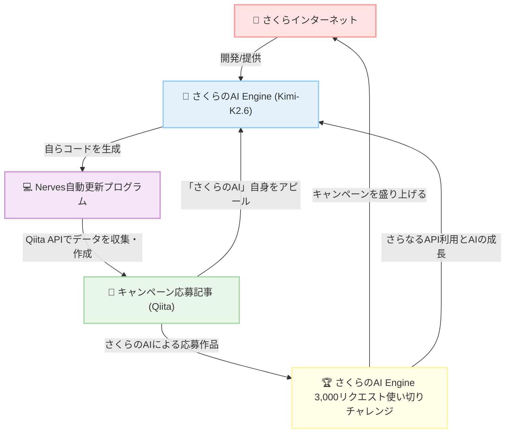

https://qiita.com/official-events/bd14d28b53326d318fec

# この記事は

「[OpenAI・Anthropic互換APIを無料で使おう！「さくらのAI Engine」3,000リクエスト使い切りチャレンジ](https://qiita.com/official-events/bd14d28b53326d318fec)」キャンペーンの応援記事です。
なおかつ、この記事がキャンペーンへの応募作品です。

**キャンペーンに参加するすべてのみなさま、つまりは全人類を応援します！**

そしてなんとなんと、この記事を自動更新するプログラムを書いてくれたのが、[さくらのAI Engine](https://ai.sakura.ad.jp/sakura-ai/ai-engine/)です！

「[Messages APIを使ったさくらのAI EngineとClaude Codeの連携](https://ai.sakura.ad.jp/column/claude-code-messages-api-2/)」を参考に、[Claude Code](https://code.claude.com/docs/ja/overview) x さくらのAI Engine(`preview/Kimi-K2.6`) エージェントハーネスを使ってできたプログラムです。

つまり、誤解を恐れずに言えば、さくらインターネット様のキャンペーンに「さくらのAI Engine」自身が応募している構図（好図！？）です！！！


```mermaid
flowchart TD
    Sakura["🌸 さくらインターネット"] -->|開発/提供| AI["🤖 さくらのAI Engine (Kimi-K2.6)"]
    AI -->|自らコードを生成| Program["💻 Nerves自動更新プログラム"]
    Program -->|Qiita APIでデータを収集・作成| Article["📝 キャンペーン応募記事 (Qiita)"]
    Article -->|さくらのAIによる応募作品| Campaign["🏆 さくらのAI Engine 3,000リクエスト使い切りチャレンジ"]
    Campaign -->|キャンペーンを盛り上げる| Sakura
    
    %% 循環・輪廻転生のリンク
    Article -->|「さくらのAI」自身をアピール| AI
    Campaign -->|さらなるAPI利用とAIの成長| AI

    classDef sakura fill:#ffe3e3,stroke:#ff9999,stroke-width:2px;
    classDef ai fill:#e3f2fd,stroke:#90caf9,stroke-width:2px;
    classDef prog fill:#f3e5f5,stroke:#ce93d8,stroke-width:2px;
    classDef art fill:#e8f5e9,stroke:#a5d6a7,stroke-width:2px;
    classDef camp fill:#fffde7,stroke:#fff59d,stroke-width:2px;
    
    class Sakura sakura;
    class AI ai;
    class Program prog;
    class Article art;
    class Campaign camp;
```

[Qiita API v2](https://qiita.com/api/v2/docs)を利用させていただいて、「[OpenAI・Anthropic互換APIを無料で使おう！「さくらのAI Engine」3,000リクエスト使い切りチャレンジ](https://qiita.com/official-events/bd14d28b53326d318fec)」に参加しているとおもわれる記事[^1]を収集します。
あつまった記事群（データ）にあれこれしてみます。

[^1]: 記事投稿キャンペーンのUUID（`posting_campaign_uuid`）による検索機能は、現状Qiita APIでは提供されておりません。 https://github.com/increments/qiita-discussions/discussions/1074 にてQiita様に要望しております。

- いいね数順に記事を並べます
- 投稿者ごとの記事数を集計します
- 投稿者ごとのいいね数を集計します
- tagごとの記事数を集計します
- tagごとのいいね数を集計します

**この記事の順位も、この記事自身が毎日監視しています。**
24日間連続で自動更新されています！（最終更新日時 2026-08-07 09:00:00）

「参加ボタン」を押すのをお忘れなく!!!

「[OpenAI・Anthropic互換APIを無料で使おう！「さくらのAI Engine」3,000リクエスト使い切りチャレンジ](https://qiita.com/official-events/bd14d28b53326d318fec)」を微力でなおかつ僭越ながら盛り上げたいとおもっています:rocket::rocket::rocket:

---

# 総件数
78件 :tada::tada::tada:

# いいね数 :confetti_ball::military_medal::confetti_ball:
|No|title|created_at|updated_at|LGTM|
|---|---|---|---|---:|
|1|[さくらのAI Engineに書いてもらったコードで、さくらのAI Engineの「ずんだもん」に毎朝私は起こしてもらう](https://qiita.com/torifukukaiou/items/3c03c45da77e9cb7cf6b)<br>@torifukukaiou|2026-07-18|2026-07-25|11|
|2|[さくらのAI Engine無料枠でgpt-oss-120bを使う ― Anthropic SDKはauth_token=必須の罠](https://qiita.com/nomurasan/items/63654a3f9457a8b5ed35)<br>@nomurasan|2026-07-14|2026-07-15|11|
|3|[さくらのAI Engineのモデルに人狼をやらせて比較してみた](https://qiita.com/shoko3168/items/e8985c8c5a040213ab72)<br>@shoko3168|2026-07-18|2026-07-18|9|
|4|[【毎日自動更新】さくらのAI Engine 3,000リクエスト使い切りチャレンジ いいねランキング！](https://qiita.com/torifukukaiou/items/c4f654f0dad56e5da409)<br>@torifukukaiou|2026-07-18|2026-08-07|7|
|5|[【AWS勉強中】新卒1年目が「さくらのAI Engine」でAWS問題が出てくるガチャを作ってみた](https://qiita.com/mineraru/items/8b5e0c33cce94080bb1a)<br>@mineraru|2026-07-29|2026-07-29|4|
|6|[絵の描き方をさくらのAI Engineに教えてもらいました](https://qiita.com/torifukukaiou/items/c12bb99ef2016e2a3f0d)<br>@torifukukaiou|2026-07-28|2026-08-01|4|
|7|[さくらのAI Engineたちに「どう盛り上げるか」を議論させたら、結論は「どれをやるかは人間が決めてください」だった](https://qiita.com/TheGateBreaker/items/d56b52b7ed6426e50f2b)<br>@TheGateBreaker|2026-07-24|2026-07-24|4|
|8|[【さくらのAI Engine】 Powershellのソースコードレビューをしてみた！](https://qiita.com/nogizakapython/items/45d77eea55b895946c71)<br>@nogizakapython|2026-08-06|2026-08-06|3|
|9|[さくらのAI EngineでC#のプログラムを作ってみた](https://qiita.com/nogizakapython/items/116cdd2c66cef2c01d06)<br>@nogizakapython|2026-08-03|2026-08-03|3|
|10|[さくらの AI Engine の Anthropic 互換 API で ai-digest を動かす](https://qiita.com/ynakayama/items/d486fc70c8a29f5f765c)<br>@ynakayama|2026-07-31|2026-07-31|3|
|11|[Cline+さくらのAI Engine](https://qiita.com/samuraieng/items/a4d70d27b17ea5e8c6d5)<br>@samuraieng|2026-07-26|2026-07-26|3|
|12|[Claude Code無課金勢、LINE botを「さくらのAI Engine」のOpenAI互換Responses APIへ移行する作業を、「さくらのAI Engine」自身に実装させたらCodexレビューを通過した](https://qiita.com/torifukukaiou/items/c3adf542824e4d5ae7b2)<br>@torifukukaiou|2026-07-17|2026-07-25|3|
|13|[「さくらのAI Engine」でRP](https://qiita.com/desktopgame/items/835c15ecd6c84b422fc4)<br>@desktopgame|2026-07-14|2026-07-14|3|
|14|[無料で選んだgpt-oss-120bが、本番で"黙った"話——さくらAI 2次検証編](https://qiita.com/macchan_ai_dev/items/9e029777f96ff1fd4be7)<br>@macchan_ai_dev|2026-08-04|2026-08-04|2|
|15|[A5:SQL Mk-2のAIアシスタント機能（ER図）を使用した感想](https://qiita.com/ogasawararyouya/items/82098db176b2a1ef8f07)<br>@ogasawararyouya|2026-08-03|2026-08-03|2|
|16|[Qiitaコンテストで3記事投稿して全敗。正体は「外部の課題を解いていない社内実験レポート」だった](https://qiita.com/TheGateBreaker/items/a8f8f78dd45966e13a29)<br>@TheGateBreaker|2026-08-02|2026-08-02|2|
|17|[Cursorなしで、社内CSVを自然言語で集計する（Compass）](https://qiita.com/n190/items/37440d7165bec18f4619)<br>@n190|2026-07-27|2026-07-28|2|
|18|[【さくらのAI】さくらのAIを利用してGitHubのPRレビューを行う](https://qiita.com/ks1905/items/e08f6131e0de62764324)<br>@ks1905|2026-07-27|2026-07-28|2|
|19|[Kimi-K2.6、Qwen3.6、gemma-4、勝つのはどれだ！無料オープンLLM対決！](https://qiita.com/shibacorgi/items/e9d2dfe399d0475f7aaf)<br>@shibacorgi|2026-07-26|2026-07-26|2|
|20|[「ミスったな…」と落ち込む夜に。親の感情に寄り添い、子どもへの「別の声かけ」を提案する子育てサポートAI「oyagokoro」を作ってみた](https://qiita.com/shungo-555/items/7077dcc96d96cb5802e0)<br>@shungo-555|2026-07-23|2026-07-23|2|
|21|[LinuxのエラーをAIに自動解析させるCLIツールを作ってみた🐱](https://qiita.com/yuta1610/items/50b625a99a556b064405)<br>@yuta1610|2026-07-23|2026-07-23|2|
|22|[token消化ではなく、記事のご縁を可視化！さくらのAI Engine RAGでチャレンジ参加記事の相関図を描いてみた🌸](https://qiita.com/TheGateBreaker/items/ffbed5bbd48d4ec45452)<br>@TheGateBreaker|2026-07-23|2026-07-23|2|
|23|[さくらのAI Engineで合成した声を、さくらのAI Engineで文字起こしして、文章をさくらのAI Engineで直す](https://qiita.com/torifukukaiou/items/f37cc5c2b09732e63e7e)<br>@torifukukaiou|2026-07-23|2026-07-25|2|
|24|[Chat月3,000リクエストを「経営予算」に──さくらのAI Engineで問い合わせ一次対応PoCを作った](https://qiita.com/YushiYamamoto/items/b7b3529ed14751fda13a)<br>@YushiYamamoto|2026-07-22|2026-07-23|2|
|25|[「さくらのAI Engine」のOpenAI・Anthropic互換APIを使ってみた](https://qiita.com/Erga-mion/items/e712abee3cd8587cf3b9)<br>@Erga-mion|2026-07-21|2026-07-22|2|
|26|[さくらのAI Engineを無料枠で触ってみて、最初につまずいた話](https://qiita.com/TheGateBreaker/items/855ee917db41fbe11fdd)<br>@TheGateBreaker|2026-07-20|2026-07-20|2|
|27|[満開のさくら街道をゆく――さくらのAI Engine無償枠3,000回を従量課金で歩き直してみた](https://qiita.com/torifukukaiou/items/b2e3ec8a4fb986aa786f)<br>@torifukukaiou|2026-07-19|2026-07-29|2|
|28|[生成AI初心者がAIに聞きながら「さくらのAI Engine」無償プランを契約〜PowerShellで初APIコールしてみた【公式ドキュメント答え合わせ付き】](https://qiita.com/miyacha/items/93a667c6117b1d46db55)<br>@miyacha|2026-07-18|2026-07-18|2|
|29|[Hermes Agent × さくらのAI Engineで、AIエージェントを作ってみた](https://qiita.com/mumeinosato/items/394e520db1acedd81a02)<br>@mumeinosato|2026-07-17|2026-07-17|2|
|30|[さくらのAI モデルの速さを測ろう！](https://qiita.com/SGT1231/items/3ff723ad428c6f9a5159)<br>@SGT1231|2026-07-17|2026-07-17|2|
|31|[OpenAI互換API、名乗るからには本物だった件 ── ai& から さくらのAI Engineへ、ハマりどころゼロで移行完了](https://qiita.com/torifukukaiou/items/747284dcd98157bdfad6)<br>@torifukukaiou|2026-07-15|2026-07-25|2|
|32|[「AI全滅」に見えた障害、直した後も再発——同じ症状に隠れていた2つの原因](https://qiita.com/TheGateBreaker/items/ad503eca8f3d8a5db5e0)<br>@TheGateBreaker|2026-08-07|2026-08-07|1|
|33|[小説を書くAI議会、校正担当だけがコードを書き込んでいた話——8個のバグを潰した後に見つかった、レビューでは検知できない不具合](https://qiita.com/TheGateBreaker/items/94b1b6b02ad7fd1b375e)<br>@TheGateBreaker|2026-08-06|2026-08-06|1|
|34|[direnv allow は何を記録しているのか？ さくらのAI Engineとともに仕組みを調べてみた](https://qiita.com/torifukukaiou/items/7fd7c5f3c40bef8ed07e)<br>@torifukukaiou|2026-08-06|2026-08-06|1|
|35|[ai-digest v1.2 をリリースして設定体系と日次運用を改善した](https://qiita.com/ynakayama/items/b5e0dda6c12514cbbeb0)<br>@ynakayama|2026-08-06|2026-08-06|1|
|36|[Apple Healthの数値を「さくらのAI Engine」で分析して毎朝Slackへ投稿してみた](https://qiita.com/eichannel55/items/9ece9d8327d381cd65e0)<br>@eichannel55|2026-08-05|2026-08-05|1|
|37|[さくらのAI EngineでAIコードレビューを試す — 4モデルを比べて分かったこと](https://qiita.com/eichannel55/items/7ce5c232bf648de30814)<br>@eichannel55|2026-08-05|2026-08-05|1|
|38|[AI議会に異世界の設定を決めさせたら、ハルシネーション対策そのものが世界観になった話](https://qiita.com/TheGateBreaker/items/65ac41d74bb0f1f77fae)<br>@TheGateBreaker|2026-08-04|2026-08-04|1|
|39|[【初心者向け】サーバ屋が生成AIのAPIを初めて触る ③つまずき解決編 〜実際に遭遇したエラー6連発と解決法FAQ〜](https://qiita.com/katukoga/items/8609f25cbb9cf0985918)<br>@katukoga|2026-08-04|2026-08-04|1|
|40|[AI 14体に114案ブレストさせたら「生成AIの教科書」止まりだった話 — たどり着いたのは「AI議会が異世界転生小説を書き続ける」だった](https://qiita.com/TheGateBreaker/items/a15326c2703d4b3c3ff3)<br>@TheGateBreaker|2026-08-04|2026-08-04|1|
|41|[Dify × さくらのAI Engine × Notion APIで「Web記事の自動要約・保存ツール」を作る](https://qiita.com/yokotto_tech/items/420448f073313882f8c6)<br>@yokotto_tech|2026-08-03|2026-08-04|1|
|42|[ai-digest v1.1 をリリースして Anthropic 互換 API と外部入力の扱いを改善した](https://qiita.com/ynakayama/items/beadd112dbf4788daa20)<br>@ynakayama|2026-08-03|2026-08-03|1|
|43|[【初心者向け】サーバ屋が生成AIのAPIを初めて触る ②全機能ためす編 〜Chat・ストリーミング・ベクトル埋め込み・音声まで一気に体験〜](https://qiita.com/katukoga/items/624e82effd3ff79bc59b)<br>@katukoga|2026-08-02|2026-08-04|1|
|44|[OpenTofuとIncusで、さくらのAI Engineを使うAIエージェント開発環境を作ってみた](https://qiita.com/mono-tec/items/0cd409b2d65b347ebe99)<br>@mono-tec|2026-08-02|2026-08-02|1|
|45|[ai-digest でさくらの AI Engine の利用量を実測する](https://qiita.com/ynakayama/items/112f03b45ec2f15f37a8)<br>@ynakayama|2026-08-02|2026-08-02|1|
|46|[Windows Terminal で使用できる OSC の一覧（2026 年 8 月版）](https://qiita.com/yokra9/items/a69e257161c640bf9ef4)<br>@yokra9|2026-08-01|2026-08-06|1|
|47|[月3,400円のAI会社の"判断エンジン"を、無料のさくらAI Engine（gpt-oss-120b）に載せ替えた話](https://qiita.com/macchan_ai_dev/items/f33cbbbe169ee2916484)<br>@macchan_ai_dev|2026-08-01|2026-08-01|1|
|48|[OpenCodeでコーディングエージェントを実装した](https://qiita.com/toshikawa/items/c322890da6903be9c63f)<br>@toshikawa|2026-08-01|2026-08-01|1|
|49|[さくらのAI Engineを利用しようと適用先を考えてみた！](https://qiita.com/calcMCalcm/items/74239dc2cf256df8110b)<br>@calcMCalcm|2026-08-01|2026-08-01|1|
|50|[さくらのAI Engine × Compass で「エンドレスなぞかけ」をバイブコーディングしてみた](https://qiita.com/n190/items/f6991cb3b737a9fd54bf)<br>@n190|2026-07-31|2026-07-31|1|
|51|[【初心者向け】サーバ屋が生成AIのAPIを初めて触る ①セットアップ編 〜さくらのAI Engineで最初の1リクエストを成功させるまで〜](https://qiita.com/katukoga/items/f1ed945687367ccb5170)<br>@katukoga|2026-07-31|2026-08-04|1|
|52|[「1リクエストに96件詰めたら、さすがに壊れるだろう」が外れた話 — さくらのAI Engine 無償枠3,000リクエストを28万件分にする実測記録](https://qiita.com/taiki_i/items/de8b2f84aded61fea54e)<br>@taiki_i|2026-07-31|2026-07-31|1|
|53|[「さくらのAI Engine」で GitHub Copilot の知恵の延伸](https://qiita.com/Erga-mion/items/1b33f05342eac2746bc2)<br>@Erga-mion|2026-07-30|2026-07-31|1|
|54|[提案書の「たたき台」はどこまでAIに任せられる？ さくらのAI Engineの無償枠で「ゼロから書く」と「AI下書き→手直し」を計測して比べてみた](https://qiita.com/Tetsu_Oikawa/items/42bfd45965943da81002)<br>@Tetsu_Oikawa|2026-07-29|2026-07-29|1|
|55|[「うまくいった」小さな検証が、間違った問いに答えていた話](https://qiita.com/TheGateBreaker/items/f1bb16861a62375d865f)<br>@TheGateBreaker|2026-07-29|2026-07-29|1|
|56|[要約ベクトルは本文ベクトルの劣化コピーではなかった](https://qiita.com/TheGateBreaker/items/1c1b4ae72e21ed257feb)<br>@TheGateBreaker|2026-07-28|2026-07-28|1|
|57|[完全無料で試す Tableau MCP ✕ さくらのAI で実現するセキュアなAIデータアシスタント構成案](https://qiita.com/mn1982/items/8cc13379e7eda9215243)<br>@mn1982|2026-07-27|2026-07-27|1|
|58|[CompassのAIチャットで小説執筆を体験してみた](https://qiita.com/n190/items/dae464243f1dacf85c24)<br>@n190|2026-07-27|2026-07-27|1|
|59|[ベクトル検索で受賞エッセイ30本を分析したら、直感が裏切られた](https://qiita.com/TheGateBreaker/items/f900665b692216c8d2f0)<br>@TheGateBreaker|2026-07-26|2026-07-26|1|
|60|[SpringのA2Aサンプルの生成AIのリクエストとレスポンスをAdvisorで観察する](https://qiita.com/kanata564/items/5ec6aa968e5a01747cdb)<br>@kanata564|2026-07-26|2026-07-26|1|
|61|[さくらのAI Engine(基盤モデル無償プラン)×さくらのVPSで、HermesAgentを無人運用してみる](https://qiita.com/uist1idrju3i/items/d45408d02e8c39526f5d)<br>@uist1idrju3i|2026-07-24|2026-07-24|1|
|62|[さくらのAI Engine の LLM API を Compass の LLM として使ってみた](https://qiita.com/n190/items/3038c23f81597e2f0a72)<br>@n190|2026-07-23|2026-07-23|1|
|63|[さくらのAI Engine `/v1/messages` は `stream: true` で動くか？ token消化ではなく闘魂に昇華して、SSEの深淵を覗く](https://qiita.com/torifukukaiou/items/b090f60b13c8dcdfce94)<br>@torifukukaiou|2026-07-23|2026-07-25|1|
|64|[さくらのAIエンジン無料枠でハンズフリーのお料理アシスタントアプリを作る](https://qiita.com/pesipesi/items/f47c9d98e40a6eed0897)<br>@pesipesi|2026-07-23|2026-07-23|1|
|65|[Laravel×さくらのAI Engineで自分専用の記事下書きツールを作る。](https://qiita.com/miyacha/items/f4db3964afad5142113e)<br>@miyacha|2026-07-20|2026-07-20|1|
|66|[MoodleのAIプロバイダでさくらのAI Engineをつかいたおす](https://qiita.com/papillon/items/d0d64609fc63d659a7ef)<br>@papillon|2026-07-19|2026-07-19|1|
|67|[SpringのA2Aサンプルを動かす](https://qiita.com/kanata564/items/fdcc579e6502c5e8c07b)<br>@kanata564|2026-07-19|2026-07-19|1|
|68|[さくらのAI Engineを使って、喋った言葉を「ずんだもん語」に変換するマイクを作ってみた](https://qiita.com/Kaz_Macintosh/items/3a964576ab5512982f0d)<br>@Kaz_Macintosh|2026-07-17|2026-07-17|1|
|69|[さくらのAI Engine × Streamlitでコンサルケース問題の採点アプリを1時間で公開した話](https://qiita.com/cu531gsk/items/dd2776eabdf99eadbbc7)<br>@cu531gsk|2026-07-17|2026-07-17|1|
|70|[Elixir製NotebookLMクローン「Notex」をDocker (Ubuntu 24.04) で動かす（さくらのAI Engine検証）](https://qiita.com/torifukukaiou/items/d1373975fc226c01dcb7)<br>@torifukukaiou|2026-08-06|2026-08-06|0|
|71|[Rspamd のGPTプラグインとさくらのAI Engineで受信メールを迷惑メール判定してみた](https://qiita.com/ma3ki/items/7379bb01d6ba28f8bb6d)<br>@ma3ki|2026-08-05|2026-08-05|0|
|72|[さくらのAI Engineで「3D記事空間カオスマップ」を作ってみた 🌸 ― Embedding（ベクトル埋め込み）で記事同士の意味を3D可視化](https://qiita.com/torifukukaiou/items/6fb6d80713b8114eefee)<br>@torifukukaiou|2026-08-01|2026-08-02|0|
|73|[「ずんだもん実況」という次の一手を、さくらのAI Engine自身のTTS APIで本当に作ってみた](https://qiita.com/TheGateBreaker/items/8500cc3b66241ab6f240)<br>@TheGateBreaker|2026-07-30|2026-07-30|0|
|74|[さくらのAI Engineの音声合成で「1000モーラ制限」に当たった話──curlで発見してPythonで突破した](https://qiita.com/torifukukaiou/items/3ccc6b50af4da3138d34)<br>@torifukukaiou|2026-07-29|2026-08-01|0|
|75|[「This model is not available.」── さくらのAI Engineの提供モデルが厳選されていました](https://qiita.com/torifukukaiou/items/ab729b521f14a017e6b6)<br>@torifukukaiou|2026-07-22|2026-08-01|0|
|76|[さくらのAI Engineのマルチモーダル：画像を送ってテキストを受け取る](https://qiita.com/torifukukaiou/items/036be30164bab7d6baa8)<br>@torifukukaiou|2026-07-20|2026-07-25|0|
|77|[さくらのAI Engine Playgroundに『「さくらのAI Engine」3,000リクエスト使い切りチャレンジ』キャンペーンの受賞のコツを聞いてみました](https://qiita.com/torifukukaiou/items/38f5cd9fbcd60bcbe627)<br>@torifukukaiou|2026-07-15|2026-07-25|0|
|78|[さくらのAI Engine Playgroundに記事を書いてもらいました（応答が速い🚀🚀🚀)](https://qiita.com/torifukukaiou/items/5a3fd81908bcdb0ee59e)<br>@torifukukaiou|2026-07-15|2026-07-25|0|


# 投稿者ごとの記事数といいね数
|No|user|count|LGTM|
|---|---|---:|---:|
|1|@torifukukaiou|16|33|
|2|@TheGateBreaker|12|17|
|3|@ynakayama|4|6|
|4|@n190|4|5|
|5|@katukoga|3|3|
|6|@nogizakapython|2|6|
|7|@macchan_ai_dev|2|3|
|8|@miyacha|2|3|
|9|@Erga-mion|2|3|
|10|@kanata564|2|2|
|11|@eichannel55|2|2|
|12|@nomurasan|1|11|
|13|@shoko3168|1|9|
|14|@mineraru|1|4|
|15|@samuraieng|1|3|
|16|@desktopgame|1|3|
|17|@shibacorgi|1|2|
|18|@yuta1610|1|2|
|19|@SGT1231|1|2|
|20|@YushiYamamoto|1|2|
|21|@mumeinosato|1|2|
|22|@ogasawararyouya|1|2|
|23|@shungo-555|1|2|
|24|@ks1905|1|2|
|25|@calcMCalcm|1|1|
|26|@taiki_i|1|1|
|27|@yokotto_tech|1|1|
|28|@Kaz_Macintosh|1|1|
|29|@Tetsu_Oikawa|1|1|
|30|@uist1idrju3i|1|1|
|31|@cu531gsk|1|1|
|32|@papillon|1|1|
|33|@mono-tec|1|1|
|34|@yokra9|1|1|
|35|@mn1982|1|1|
|36|@toshikawa|1|1|
|37|@pesipesi|1|1|
|38|@ma3ki|1|0|


# 投稿者ごとのいいね数と記事数
|No|user|LGTM|count|
|---|---|---:|---:|
|1|@torifukukaiou|33|16|
|2|@TheGateBreaker|17|12|
|3|@nomurasan|11|1|
|4|@shoko3168|9|1|
|5|@ynakayama|6|4|
|6|@nogizakapython|6|2|
|7|@n190|5|4|
|8|@mineraru|4|1|
|9|@macchan_ai_dev|3|2|
|10|@katukoga|3|3|
|11|@samuraieng|3|1|
|12|@miyacha|3|2|
|13|@Erga-mion|3|2|
|14|@desktopgame|3|1|
|15|@shibacorgi|2|1|
|16|@yuta1610|2|1|
|17|@SGT1231|2|1|
|18|@YushiYamamoto|2|1|
|19|@mumeinosato|2|1|
|20|@ogasawararyouya|2|1|
|21|@kanata564|2|2|
|22|@shungo-555|2|1|
|23|@eichannel55|2|2|
|24|@ks1905|2|1|
|25|@calcMCalcm|1|1|
|26|@taiki_i|1|1|
|27|@yokotto_tech|1|1|
|28|@Kaz_Macintosh|1|1|
|29|@Tetsu_Oikawa|1|1|
|30|@uist1idrju3i|1|1|
|31|@cu531gsk|1|1|
|32|@papillon|1|1|
|33|@mono-tec|1|1|
|34|@yokra9|1|1|
|35|@mn1982|1|1|
|36|@toshikawa|1|1|
|37|@pesipesi|1|1|
|38|@ma3ki|0|1|


# タグごとの記事数といいね数
|No|tag|count|LGTM|
|---|---|---:|---:|
|1|[さくらのAI](https://qiita.com/tags/さくらのAI)|78|142|
|2|[生成AI](https://qiita.com/tags/生成AI)|20|36|
|3|[闘魂](https://qiita.com/tags/闘魂)|16|33|
|4|[さくらインターネット](https://qiita.com/tags/さくらインターネット)|14|15|
|5|[AI](https://qiita.com/tags/AI)|13|21|
|6|[猪木](https://qiita.com/tags/猪木)|13|15|
|7|[Python](https://qiita.com/tags/Python)|12|28|
|8|[LLM](https://qiita.com/tags/LLM)|11|28|
|9|[ClaudeCode](https://qiita.com/tags/ClaudeCode)|10|26|
|10|[さくらのAIEngine](https://qiita.com/tags/さくらのAIEngine)|8|15|
|11|[API](https://qiita.com/tags/API)|7|19|
|12|[OpenAI](https://qiita.com/tags/OpenAI)|5|8|
|13|[Anthropic](https://qiita.com/tags/Anthropic)|5|8|
|14|[VOICEVOX](https://qiita.com/tags/VOICEVOX)|4|5|
|15|[初心者](https://qiita.com/tags/初心者)|4|7|
|16|[PowerShell](https://qiita.com/tags/PowerShell)|3|6|
|17|[Compass](https://qiita.com/tags/Compass)|3|3|
|18|[rag](https://qiita.com/tags/rag)|3|4|
|19|[Kimi](https://qiita.com/tags/Kimi)|3|4|
|20|[個人開発](https://qiita.com/tags/個人開発)|3|14|
|21|[codex](https://qiita.com/tags/codex)|3|6|
|22|[Elixir](https://qiita.com/tags/Elixir)|3|18|
|23|[ずんだもん](https://qiita.com/tags/ずんだもん)|3|14|
|24|[さくらのクラウド](https://qiita.com/tags/さくらのクラウド)|3|3|
|25|[HermesAgent](https://qiita.com/tags/HermesAgent)|2|3|
|26|[Nerves](https://qiita.com/tags/Nerves)|2|18|
|27|[Kimi-K3](https://qiita.com/tags/Kimi-K3)|2|2|
|28|[Kimi-K2](https://qiita.com/tags/Kimi-K2)|2|3|
|29|[コードレビュー](https://qiita.com/tags/コードレビュー)|2|2|
|30|[spring](https://qiita.com/tags/spring)|2|2|
|31|[A2A](https://qiita.com/tags/A2A)|2|2|
|32|[sdgs](https://qiita.com/tags/sdgs)|2|2|
|33|[opencode](https://qiita.com/tags/opencode)|2|2|
|34|[ai&](https://qiita.com/tags/ai&)|2|3|
|35|[ベクトル検索](https://qiita.com/tags/ベクトル検索)|2|2|
|36|[PHP](https://qiita.com/tags/PHP)|2|2|
|37|[自然言語処理](https://qiita.com/tags/自然言語処理)|2|2|
|38|[AIではなく人間が書いてます](https://qiita.com/tags/AIではなく人間が書いてます)|2|1|
|39|[Java](https://qiita.com/tags/Java)|2|2|
|40|[Laravel](https://qiita.com/tags/Laravel)|1|1|
|41|[ガチャ](https://qiita.com/tags/ガチャ)|1|4|
|42|[CSV](https://qiita.com/tags/CSV)|1|2|
|43|[自動要約](https://qiita.com/tags/自動要約)|1|1|
|44|[curl](https://qiita.com/tags/curl)|1|1|
|45|[Gemini](https://qiita.com/tags/Gemini)|1|0|
|46|[初学者](https://qiita.com/tags/初学者)|1|4|
|47|[Incus](https://qiita.com/tags/Incus)|1|1|
|48|[AppleHealth](https://qiita.com/tags/AppleHealth)|1|1|
|49|[Dify](https://qiita.com/tags/Dify)|1|1|
|50|[OpenTofu](https://qiita.com/tags/OpenTofu)|1|1|
|51|[Streamlit](https://qiita.com/tags/Streamlit)|1|1|
|52|[AWS](https://qiita.com/tags/AWS)|1|4|
|53|[Linux](https://qiita.com/tags/Linux)|1|2|
|54|[PoC](https://qiita.com/tags/PoC)|1|1|
|55|[cotomi3](https://qiita.com/tags/cotomi3)|1|1|
|56|[rspamd](https://qiita.com/tags/rspamd)|1|0|
|57|[AI駆動開発](https://qiita.com/tags/AI駆動開発)|1|1|
|58|[OpenAI互換API](https://qiita.com/tags/OpenAI互換API)|1|1|
|59|[influxdb](https://qiita.com/tags/influxdb)|1|1|
|60|[初心者向け](https://qiita.com/tags/初心者向け)|1|1|
|61|[cline](https://qiita.com/tags/cline)|1|3|
|62|[kimi-k2.6](https://qiita.com/tags/kimi-k2.6)|1|1|
|63|[Supabase](https://qiita.com/tags/Supabase)|1|2|
|64|[Notex](https://qiita.com/tags/Notex)|1|0|
|65|[M5stack](https://qiita.com/tags/M5stack)|1|1|
|66|[Kimi-K2.7](https://qiita.com/tags/Kimi-K2.7)|1|1|
|67|[direnv](https://qiita.com/tags/direnv)|1|1|
|68|[AI活用](https://qiita.com/tags/AI活用)|1|1|
|69|[プロンプトエンジニアリング](https://qiita.com/tags/プロンプトエンジニアリング)|1|1|
|70|[Qiita](https://qiita.com/tags/Qiita)|1|0|
|71|[VibeCoding](https://qiita.com/tags/VibeCoding)|1|1|
|72|[ffmpeg](https://qiita.com/tags/ffmpeg)|1|0|
|73|[Kong](https://qiita.com/tags/Kong)|1|2|
|74|[TableauMCP](https://qiita.com/tags/TableauMCP)|1|1|
|75|[cursor](https://qiita.com/tags/cursor)|1|1|
|76|[料理](https://qiita.com/tags/料理)|1|1|
|77|[業務効率化](https://qiita.com/tags/業務効率化)|1|1|
|78|[.NET10](https://qiita.com/tags/.NET10)|1|1|
|79|[OSS](https://qiita.com/tags/OSS)|1|2|
|80|[音声合成](https://qiita.com/tags/音声合成)|1|0|
|81|[TTS](https://qiita.com/tags/TTS)|1|0|
|82|[n8n](https://qiita.com/tags/n8n)|1|2|
|83|[Vercel](https://qiita.com/tags/Vercel)|1|2|
|84|[LLM-jp](https://qiita.com/tags/LLM-jp)|1|2|
|85|[マルチエージェント](https://qiita.com/tags/マルチエージェント)|1|1|
|86|[Slack](https://qiita.com/tags/Slack)|1|1|
|87|[llm-jp-3.1](https://qiita.com/tags/llm-jp-3.1)|1|1|
|88|[Claude](https://qiita.com/tags/Claude)|1|2|
|89|[ソースコード](https://qiita.com/tags/ソースコード)|1|3|
|90|[C#](https://qiita.com/tags/C#)|1|3|
|91|[grafana](https://qiita.com/tags/grafana)|1|1|
|92|[Linuxコマンド](https://qiita.com/tags/Linuxコマンド)|1|2|
|93|[Moodle](https://qiita.com/tags/Moodle)|1|1|
|94|[Tableau](https://qiita.com/tags/Tableau)|1|1|
|95|[サンプル実装](https://qiita.com/tags/サンプル実装)|1|3|
|96|[Agent](https://qiita.com/tags/Agent)|1|1|
|97|[VSCode](https://qiita.com/tags/VSCode)|1|1|
|98|[Windows](https://qiita.com/tags/Windows)|1|2|
|99|[GitHubCopilot](https://qiita.com/tags/GitHubCopilot)|1|1|
|100|[coding](https://qiita.com/tags/coding)|1|1|
|101|[AI人狼](https://qiita.com/tags/AI人狼)|1|9|
|102|[CodexCLI](https://qiita.com/tags/CodexCLI)|1|2|
|103|[育児](https://qiita.com/tags/育児)|1|2|
|104|[a5m2](https://qiita.com/tags/a5m2)|1|2|
|105|[データ分析](https://qiita.com/tags/データ分析)|1|2|
|106|[Notion](https://qiita.com/tags/Notion)|1|1|
|107|[なぞかけ](https://qiita.com/tags/なぞかけ)|1|1|
|108|[ベンチマーク](https://qiita.com/tags/ベンチマーク)|1|2|
|109|[OSC](https://qiita.com/tags/OSC)|1|1|
|110|[WindowsTerminal](https://qiita.com/tags/WindowsTerminal)|1|1|
|111|[Git](https://qiita.com/tags/Git)|1|1|


# タグごとのいいね数と記事数
|No|tag|LGTM|count|
|---|---|---:|---:|
|1|[さくらのAI](https://qiita.com/tags/さくらのAI)|142|78|
|2|[生成AI](https://qiita.com/tags/生成AI)|36|20|
|3|[闘魂](https://qiita.com/tags/闘魂)|33|16|
|4|[Python](https://qiita.com/tags/Python)|28|12|
|5|[LLM](https://qiita.com/tags/LLM)|28|11|
|6|[ClaudeCode](https://qiita.com/tags/ClaudeCode)|26|10|
|7|[AI](https://qiita.com/tags/AI)|21|13|
|8|[API](https://qiita.com/tags/API)|19|7|
|9|[Nerves](https://qiita.com/tags/Nerves)|18|2|
|10|[Elixir](https://qiita.com/tags/Elixir)|18|3|
|11|[猪木](https://qiita.com/tags/猪木)|15|13|
|12|[さくらのAIEngine](https://qiita.com/tags/さくらのAIEngine)|15|8|
|13|[さくらインターネット](https://qiita.com/tags/さくらインターネット)|15|14|
|14|[個人開発](https://qiita.com/tags/個人開発)|14|3|
|15|[ずんだもん](https://qiita.com/tags/ずんだもん)|14|3|
|16|[AI人狼](https://qiita.com/tags/AI人狼)|9|1|
|17|[OpenAI](https://qiita.com/tags/OpenAI)|8|5|
|18|[Anthropic](https://qiita.com/tags/Anthropic)|8|5|
|19|[初心者](https://qiita.com/tags/初心者)|7|4|
|20|[PowerShell](https://qiita.com/tags/PowerShell)|6|3|
|21|[codex](https://qiita.com/tags/codex)|6|3|
|22|[VOICEVOX](https://qiita.com/tags/VOICEVOX)|5|4|
|23|[ガチャ](https://qiita.com/tags/ガチャ)|4|1|
|24|[初学者](https://qiita.com/tags/初学者)|4|1|
|25|[AWS](https://qiita.com/tags/AWS)|4|1|
|26|[rag](https://qiita.com/tags/rag)|4|3|
|27|[Kimi](https://qiita.com/tags/Kimi)|4|3|
|28|[HermesAgent](https://qiita.com/tags/HermesAgent)|3|2|
|29|[Kimi-K2](https://qiita.com/tags/Kimi-K2)|3|2|
|30|[cline](https://qiita.com/tags/cline)|3|1|
|31|[Compass](https://qiita.com/tags/Compass)|3|3|
|32|[ai&](https://qiita.com/tags/ai&)|3|2|
|33|[ソースコード](https://qiita.com/tags/ソースコード)|3|1|
|34|[C#](https://qiita.com/tags/C#)|3|1|
|35|[サンプル実装](https://qiita.com/tags/サンプル実装)|3|1|
|36|[さくらのクラウド](https://qiita.com/tags/さくらのクラウド)|3|3|
|37|[CSV](https://qiita.com/tags/CSV)|2|1|
|38|[Kimi-K3](https://qiita.com/tags/Kimi-K3)|2|2|
|39|[Linux](https://qiita.com/tags/Linux)|2|1|
|40|[コードレビュー](https://qiita.com/tags/コードレビュー)|2|2|
|41|[spring](https://qiita.com/tags/spring)|2|2|
|42|[Supabase](https://qiita.com/tags/Supabase)|2|1|
|43|[A2A](https://qiita.com/tags/A2A)|2|2|
|44|[sdgs](https://qiita.com/tags/sdgs)|2|2|
|45|[opencode](https://qiita.com/tags/opencode)|2|2|
|46|[Kong](https://qiita.com/tags/Kong)|2|1|
|47|[OSS](https://qiita.com/tags/OSS)|2|1|
|48|[n8n](https://qiita.com/tags/n8n)|2|1|
|49|[Vercel](https://qiita.com/tags/Vercel)|2|1|
|50|[LLM-jp](https://qiita.com/tags/LLM-jp)|2|1|
|51|[ベクトル検索](https://qiita.com/tags/ベクトル検索)|2|2|
|52|[Claude](https://qiita.com/tags/Claude)|2|1|
|53|[PHP](https://qiita.com/tags/PHP)|2|2|
|54|[自然言語処理](https://qiita.com/tags/自然言語処理)|2|2|
|55|[Linuxコマンド](https://qiita.com/tags/Linuxコマンド)|2|1|
|56|[Windows](https://qiita.com/tags/Windows)|2|1|
|57|[CodexCLI](https://qiita.com/tags/CodexCLI)|2|1|
|58|[育児](https://qiita.com/tags/育児)|2|1|
|59|[a5m2](https://qiita.com/tags/a5m2)|2|1|
|60|[データ分析](https://qiita.com/tags/データ分析)|2|1|
|61|[Java](https://qiita.com/tags/Java)|2|2|
|62|[ベンチマーク](https://qiita.com/tags/ベンチマーク)|2|1|
|63|[Laravel](https://qiita.com/tags/Laravel)|1|1|
|64|[自動要約](https://qiita.com/tags/自動要約)|1|1|
|65|[curl](https://qiita.com/tags/curl)|1|1|
|66|[Incus](https://qiita.com/tags/Incus)|1|1|
|67|[AppleHealth](https://qiita.com/tags/AppleHealth)|1|1|
|68|[Dify](https://qiita.com/tags/Dify)|1|1|
|69|[OpenTofu](https://qiita.com/tags/OpenTofu)|1|1|
|70|[Streamlit](https://qiita.com/tags/Streamlit)|1|1|
|71|[PoC](https://qiita.com/tags/PoC)|1|1|
|72|[cotomi3](https://qiita.com/tags/cotomi3)|1|1|
|73|[AI駆動開発](https://qiita.com/tags/AI駆動開発)|1|1|
|74|[OpenAI互換API](https://qiita.com/tags/OpenAI互換API)|1|1|
|75|[influxdb](https://qiita.com/tags/influxdb)|1|1|
|76|[初心者向け](https://qiita.com/tags/初心者向け)|1|1|
|77|[kimi-k2.6](https://qiita.com/tags/kimi-k2.6)|1|1|
|78|[M5stack](https://qiita.com/tags/M5stack)|1|1|
|79|[Kimi-K2.7](https://qiita.com/tags/Kimi-K2.7)|1|1|
|80|[direnv](https://qiita.com/tags/direnv)|1|1|
|81|[AI活用](https://qiita.com/tags/AI活用)|1|1|
|82|[プロンプトエンジニアリング](https://qiita.com/tags/プロンプトエンジニアリング)|1|1|
|83|[VibeCoding](https://qiita.com/tags/VibeCoding)|1|1|
|84|[TableauMCP](https://qiita.com/tags/TableauMCP)|1|1|
|85|[cursor](https://qiita.com/tags/cursor)|1|1|
|86|[料理](https://qiita.com/tags/料理)|1|1|
|87|[業務効率化](https://qiita.com/tags/業務効率化)|1|1|
|88|[.NET10](https://qiita.com/tags/.NET10)|1|1|
|89|[マルチエージェント](https://qiita.com/tags/マルチエージェント)|1|1|
|90|[Slack](https://qiita.com/tags/Slack)|1|1|
|91|[llm-jp-3.1](https://qiita.com/tags/llm-jp-3.1)|1|1|
|92|[grafana](https://qiita.com/tags/grafana)|1|1|
|93|[Moodle](https://qiita.com/tags/Moodle)|1|1|
|94|[Tableau](https://qiita.com/tags/Tableau)|1|1|
|95|[Agent](https://qiita.com/tags/Agent)|1|1|
|96|[VSCode](https://qiita.com/tags/VSCode)|1|1|
|97|[GitHubCopilot](https://qiita.com/tags/GitHubCopilot)|1|1|
|98|[coding](https://qiita.com/tags/coding)|1|1|
|99|[AIではなく人間が書いてます](https://qiita.com/tags/AIではなく人間が書いてます)|1|2|
|100|[Notion](https://qiita.com/tags/Notion)|1|1|
|101|[なぞかけ](https://qiita.com/tags/なぞかけ)|1|1|
|102|[OSC](https://qiita.com/tags/OSC)|1|1|
|103|[WindowsTerminal](https://qiita.com/tags/WindowsTerminal)|1|1|
|104|[Git](https://qiita.com/tags/Git)|1|1|
|105|[Gemini](https://qiita.com/tags/Gemini)|0|1|
|106|[rspamd](https://qiita.com/tags/rspamd)|0|1|
|107|[Notex](https://qiita.com/tags/Notex)|0|1|
|108|[Qiita](https://qiita.com/tags/Qiita)|0|1|
|109|[ffmpeg](https://qiita.com/tags/ffmpeg)|0|1|
|110|[音声合成](https://qiita.com/tags/音声合成)|0|1|
|111|[TTS](https://qiita.com/tags/TTS)|0|1|


---

# Wrapping up :lgtm: :qiitan: :lgtm:

この記事は、「[OpenAI・Anthropic互換APIを無料で使おう！「さくらのAI Engine」3,000リクエスト使い切りチャレンジ](https://qiita.com/official-events/bd14d28b53326d318fec)」の応援記事です。

---

最後に、この記事を自動更新しているプログラムについて補足しておきます。

- 自動更新は、[Elixir](https://elixir-lang.org/)というプログラミング言語がありまして、その[Elixir](https://elixir-lang.org/)で作られた[Nerves](https://www.nerves-project.org/)という[ナウでヤングでcoolなすごいIoTフレームワーク](https://www.slideshare.net/takasehideki/elixiriotcoolnerves-236780506)を使ってつくったアプリケーションで行っております
  - [Nerves](https://www.nerves-project.org/)の始め方につきましては下記の記事が詳しいです
  - [ElixirでIoT#4.1：Nerves開発環境の準備](https://qiita.com/takasehideki/items/88dda57758051d45fcf9)
- [Elixir](https://elixir-lang.org/)には、データを自在に取り扱える[Enum](https://hexdocs.pm/elixir/Enum.html)モジュールがあります
- [Elixir](https://elixir-lang.org/)をはじめてみようという方は、[Enum](https://hexdocs.pm/elixir/Enum.html)モジュールの習得からはじめるとよいとおもいます
- [WEB+DB PRESS Vol.127](https://gihyo.jp/magazine/wdpress/archive/2022/vol127) :book: の特集２「Elixirによる高速なWeb開発！ 作って学ぶPhoenix」は、[Elixir](https://elixir-lang.org/)でWebアプリケーション開発を楽しめる[Phoenix](https://www.phoenixframework.org/)の基礎がぎっしりと詰まっていて、**オススメ**です
- プログラムは、 https://github.com/TORIFUKUKaiou/hello_nerves/tree/master/lib/qiita/events にあります


素敵なキャンペーンを企画してくださったさくらインターネット様とQiita様には、感謝の言葉しかありません。

<b><font color="red">$\huge{ありがとうーーーッ！！！}$</font></b>

token消化ではなく、**$\huge{闘魂昇華}$**。無料枠を、闘って、磨いて、使い切りますッ！！！


---

:::note
**TokenをTokonへ**

AIが扱うのは、Token。

```math
\mathrm{Token}
-
\mathrm{見\ (Ken)}
+
\mathrm{魂\ (Kon)}
=
\mathrm{Tokon\ (闘魂)}
```

現段階の生成AIは、突き詰めればベクトルの数理遊びである。

どのモデルが賢い、速い、勝つ。
外から眺め、比べ、論評するだけでは、まだTokenだ。

だから「見（Ken）」を引く。

見る側から、使う側へ。
そこに目的と意味を与え、執念を持ち込み、魂を込めるのは人間である。

token消化ではなく、**$\huge{闘魂昇華}$** :fire:
Don't just consume Tokens. Forge them into Tokon.
:::


