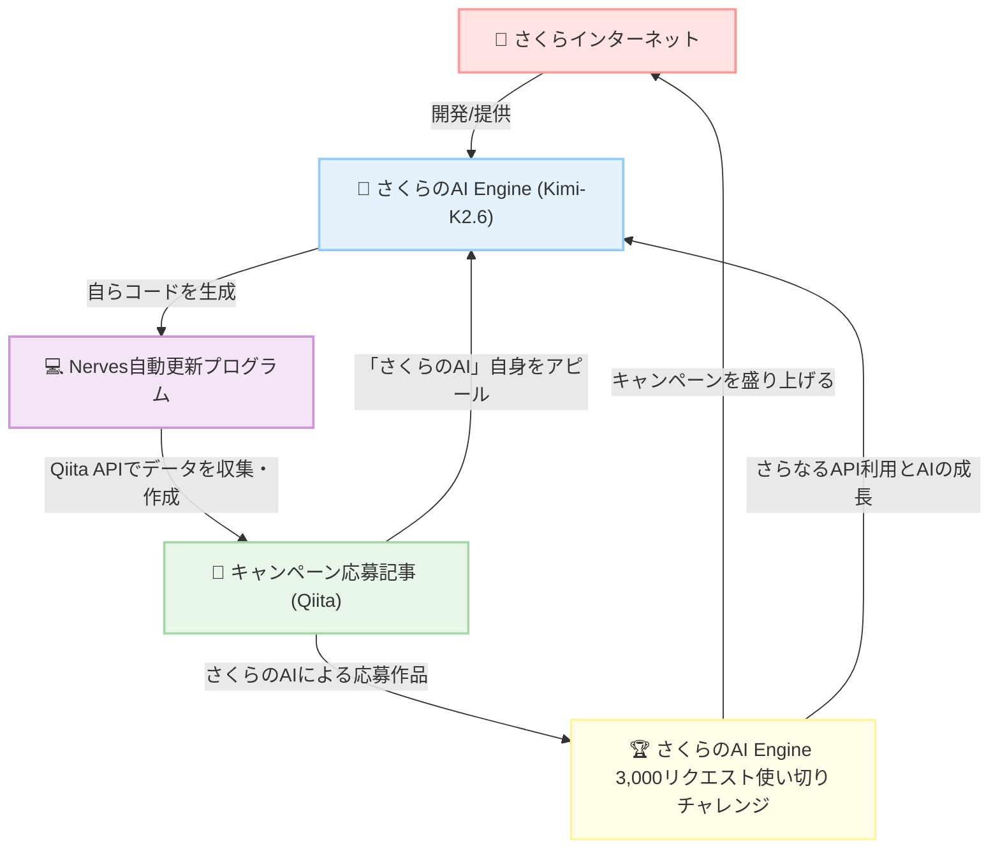

https://qiita.com/official-events/bd14d28b53326d318fec

# この記事は

「[OpenAI・Anthropic互換APIを無料で使おう！「さくらのAI Engine」3,000リクエスト使い切りチャレンジ](https://qiita.com/official-events/bd14d28b53326d318fec)」キャンペーンの応援記事です。
なおかつ、この記事がキャンペーンへの応募作品です。

**キャンペーンに参加するすべてのみなさま、つまりは全人類を応援します！**

そしてなんとなんと、この記事を自動更新するプログラムを書いてくれたのが、[さくらのAI Engine](https://ai.sakura.ad.jp/sakura-ai/ai-engine/)です！

「[Messages APIを使ったさくらのAI EngineとClaude Codeの連携](https://ai.sakura.ad.jp/column/claude-code-messages-api-2/)」を参考に、[Claude Code](https://code.claude.com/docs/ja/overview) x さくらのAI Engine(`preview/Kimi-K2.6`) エージェントハーネスを使ってできたプログラムです。

つまり、誤解を恐れずに言えば、さくらインターネット様のキャンペーンに「さくらのAI Engine」自身が応募している構図（好図！？）です！！！


```mermaid
flowchart TD
    Sakura["🌸 さくらインターネット"] -->|開発/提供| AI["🤖 さくらのAI Engine (Kimi-K2.6)"]
    AI -->|自らコードを生成| Program["💻 Nerves自動更新プログラム"]
    Program -->|Qiita APIでデータを収集・作成| Article["📝 キャンペーン応募記事 (Qiita)"]
    Article -->|さくらのAIによる応募作品| Campaign["🏆 さくらのAI Engine 3,000リクエスト使い切りチャレンジ"]
    Campaign -->|キャンペーンを盛り上げる| Sakura
    
    %% 循環・輪廻転生のリンク
    Article -->|「さくらのAI」自身をアピール| AI
    Campaign -->|さらなるAPI利用とAIの成長| AI

    classDef sakura fill:#ffe3e3,stroke:#ff9999,stroke-width:2px;
    classDef ai fill:#e3f2fd,stroke:#90caf9,stroke-width:2px;
    classDef prog fill:#f3e5f5,stroke:#ce93d8,stroke-width:2px;
    classDef art fill:#e8f5e9,stroke:#a5d6a7,stroke-width:2px;
    classDef camp fill:#fffde7,stroke:#fff59d,stroke-width:2px;
    
    class Sakura sakura;
    class AI ai;
    class Program prog;
    class Article art;
    class Campaign camp;
```

[Qiita API v2](https://qiita.com/api/v2/docs)を利用させていただいて、「[OpenAI・Anthropic互換APIを無料で使おう！「さくらのAI Engine」3,000リクエスト使い切りチャレンジ](https://qiita.com/official-events/bd14d28b53326d318fec)」に参加しているとおもわれる記事[^1]を収集します。
あつまった記事群（データ）にあれこれしてみます。

[^1]: 記事投稿キャンペーンのUUID（`posting_campaign_uuid`）による検索機能は、現状Qiita APIでは提供されておりません。 https://github.com/increments/qiita-discussions/discussions/1074 にてQiita様に要望しております。

- いいね数順に記事を並べます
- 投稿者ごとの記事数を集計します
- 投稿者ごとのいいね数を集計します
- tagごとの記事数を集計します
- tagごとのいいね数を集計します

**この記事の順位も、この記事自身が毎日監視しています。**
47日間連続で自動更新されています！（最終更新日時 2026-08-30 09:00:15）

「参加ボタン」を押すのをお忘れなく!!!

「[OpenAI・Anthropic互換APIを無料で使おう！「さくらのAI Engine」3,000リクエスト使い切りチャレンジ](https://qiita.com/official-events/bd14d28b53326d318fec)」を微力でなおかつ僭越ながら盛り上げたいとおもっています:rocket::rocket::rocket:

---

# 総件数
158件 :tada::tada::tada:

# いいね数 :confetti_ball::military_medal::confetti_ball:
|No|title|created_at|updated_at|LGTM|
|---|---|---|---|---:|
|1|[さくらのAI Engine「3,000リクエスト無料」を使い倒す ― 1回に11万トークン詰め込んでAIにWeb情報を丸飲みさせてみた](https://qiita.com/shibacorgi/items/c32fa94841f6d132741b)<br>@shibacorgi|2026-08-09|2026-08-09|21|
|2|[さくらのAI Engineに書いてもらったコードで、さくらのAI Engineの「ずんだもん」に毎朝私は起こしてもらう](https://qiita.com/torifukukaiou/items/3c03c45da77e9cb7cf6b)<br>@torifukukaiou|2026-07-18|2026-07-25|13|
|3|[Kimi-K2.6、Qwen3.6、gemma-4、勝つのはどれだ！無料オープンLLM対決！](https://qiita.com/shibacorgi/items/e9d2dfe399d0475f7aaf)<br>@shibacorgi|2026-07-26|2026-07-26|11|
|4|[さくらのAI Engine無料枠でgpt-oss-120bを使う ― Anthropic SDKはauth_token=必須の罠](https://qiita.com/nomurasan/items/63654a3f9457a8b5ed35)<br>@nomurasan|2026-07-14|2026-07-15|11|
|5|[さくらのAI Engineのモデルに人狼をやらせて比較してみた](https://qiita.com/shoko3168/items/e8985c8c5a040213ab72)<br>@shoko3168|2026-07-18|2026-07-18|10|
|6|[【毎日自動更新】さくらのAI Engine 3,000リクエスト使い切りチャレンジ いいねランキング！](https://qiita.com/torifukukaiou/items/c4f654f0dad56e5da409)<br>@torifukukaiou|2026-07-18|2026-08-29|10|
|7|[さくらのAI Engineで自作MCPサーバー×LangGraphエージェントを構築した話](https://qiita.com/shibacorgi/items/21ec803d0c38980a9f9a)<br>@shibacorgi|2026-08-11|2026-08-11|8|
|8|[さくらのAIと話したかっただけなのに。。。人生初APIで、会話履歴をJSON保存し始めたセキュリティエンジニアの話](https://qiita.com/Maruhoppe8/items/70b9777bac0159c840ab)<br>@Maruhoppe8|2026-08-16|2026-08-24|7|
|9|[AIエージェントを自作して、やっと「ループエンジニアリング」の意味がわかった!（ソース全文あり）【第５回 「無料3,000リクエスト」を使い切る！】](https://qiita.com/mi25/items/32e27c4d51f468214ec9)<br>@mi25|2026-08-13|2026-08-22|6|
|10|[絵の描き方をさくらのAI Engineに教えてもらいました](https://qiita.com/torifukukaiou/items/c12bb99ef2016e2a3f0d)<br>@torifukukaiou|2026-07-28|2026-08-01|5|
|11|[読まずにLGTMしてくるAIコーチから仕事を取り上げたら、夏の宿題がわんこそば化した件について](https://qiita.com/kaga-yasumitsu/items/75f3095012dc75cdb85d)<br>@kaga-yasumitsu|2026-08-20|2026-08-25|5|
|12|[さくらのAI Engine × Three.js(VRM)でモーションと音声が同期する3D AIチャットを作ってみた](https://qiita.com/neko-pudding/items/0b5a8521a52815d93ca6)<br>@neko-pudding|2026-08-11|2026-08-11|5|
|13|[さくらの AI Engine の Anthropic 互換 API で ai-digest を動かす](https://qiita.com/ynakayama/items/d486fc70c8a29f5f765c)<br>@ynakayama|2026-07-31|2026-07-31|4|
|14|[【AWS勉強中】新卒1年目が「さくらのAI Engine」でAWS問題が出てくるガチャを作ってみた](https://qiita.com/mineraru/items/8b5e0c33cce94080bb1a)<br>@mineraru|2026-07-29|2026-07-29|4|
|15|[さくらのAI Engineたちに「どう盛り上げるか」を議論させたら、結論は「どれをやるかは人間が決めてください」だった](https://qiita.com/TheGateBreaker/items/d56b52b7ed6426e50f2b)<br>@TheGateBreaker|2026-07-24|2026-07-24|4|
|16|[AIに数学採点させる！さくらのAI Engineで自動採点できる数学演習アプリを作った](https://qiita.com/azubiwa/items/b8ab8457b7c9ecc05018)<br>@azubiwa|2026-08-24|2026-08-24|4|
|17|[「高台に避難してください」は届いているのか？ 防災情報を「やさしい日本語」にLLMで変換して公的ガイドラインで機械採点してみた](https://qiita.com/ktdatascience/items/00ee94da149040378c31)<br>@ktdatascience|2026-08-23|2026-08-24|4|
|18|[【さくらAIで転生小説を書いてみるシリーズ第5回】新規232行・呼び出し回数0回——AI小説執筆エンジンに「ナレッジグラフ」を実装してみて分かったこと](https://qiita.com/TheGateBreaker/items/c7cf0baa0dc76ed8435b)<br>@TheGateBreaker|2026-08-09|2026-08-09|4|
|19|[A5:SQL Mk-2のAIアシスタント機能（ER図）を使用した感想](https://qiita.com/ogasawar-offgrid/items/82098db176b2a1ef8f07)<br>@ogasawar-offgrid|2026-08-03|2026-08-03|3|
|20|[さくらのAI EngineでC#のプログラムを作ってみた](https://qiita.com/nogizakapython/items/116cdd2c66cef2c01d06)<br>@nogizakapython|2026-08-03|2026-08-03|3|
|21|[月3,400円のAI会社の"判断エンジン"を、無料のさくらAI Engine（gpt-oss-120b）に載せ替えた話](https://qiita.com/macchan_ai_dev/items/f33cbbbe169ee2916484)<br>@macchan_ai_dev|2026-08-01|2026-08-20|3|
|22|[【初心者向け】サーバ屋が生成AIのAPIを初めて触る ①セットアップ編 〜さくらのAI Engineで最初の1リクエストを成功させるまで〜](https://qiita.com/katukoga/items/f1ed945687367ccb5170)<br>@katukoga|2026-07-31|2026-08-17|3|
|23|[Cursorなしで、社内CSVを自然言語で集計する（Compass）](https://qiita.com/n190/items/37440d7165bec18f4619)<br>@n190|2026-07-27|2026-07-28|3|
|24|[Cline+さくらのAI Engine](https://qiita.com/samuraieng/items/a4d70d27b17ea5e8c6d5)<br>@samuraieng|2026-07-26|2026-08-16|3|
|25|[「さくらのAI Engine」のOpenAI・Anthropic互換APIを使ってみた](https://qiita.com/Erga-mion/items/e712abee3cd8587cf3b9)<br>@Erga-mion|2026-07-21|2026-07-22|3|
|26|[Claude Code無課金勢、LINE botを「さくらのAI Engine」のOpenAI互換Responses APIへ移行する作業を、「さくらのAI Engine」自身に実装させたらCodexレビューを通過した](https://qiita.com/torifukukaiou/items/c3adf542824e4d5ae7b2)<br>@torifukukaiou|2026-07-17|2026-07-25|3|
|27|[「さくらのAI Engine」でRP](https://qiita.com/desktopgame/items/835c15ecd6c84b422fc4)<br>@desktopgame|2026-07-14|2026-07-14|3|
|28|[マイAIエージェントを作るまでの全７本をまとめたら、教訓だらけだった。](https://qiita.com/mi25/items/46ef05bf0e152e70bebc)<br>@mi25|2026-08-21|2026-08-21|3|
|29|[【さくらのAI】🔰さくらのAIを使って、はじめてのLLMゲームを作ろう【請求0円/3000回】](https://qiita.com/Subara3/items/40d0ac108455fede37aa)<br>@Subara3|2026-08-20|2026-08-20|3|
|30|[【無料AI】DeepSeekが値上げしたのでさくらで代替できるか試してみた](https://qiita.com/daizu-007/items/360edde76395a64df6e7)<br>@daizu-007|2026-08-18|2026-08-18|3|
|31|[【さくらのAI】きみはAIモデルを当てられるか　3,000回の無料枠を使って自作LLMゲームを公開した話](https://qiita.com/Subara3/items/869e540e51c96f0ff0e0)<br>@Subara3|2026-08-14|2026-08-14|3|
|32|[【さくらのAI】基本無料（※月3,000回）の「Discord→スプレッドシート自動転記Bot」を作ってみたよ](https://qiita.com/Subara3/items/d4c2432a9f99e5cd211a)<br>@Subara3|2026-08-09|2026-08-09|3|
|33|[さくらのAI Engine を卓上ロボットの頭にした ― 道具19個・ツール選択33/34・実測メモ](https://qiita.com/ussu_ussu_ussu/items/b9956c6dca683eeb4dd5)<br>@ussu_ussu_ussu|2026-08-09|2026-08-09|3|
|34|[Elixir製NotebookLMクローン「Notex」をDocker (Ubuntu 24.04) で動かす（さくらのAI Engine検証）](https://qiita.com/torifukukaiou/items/d1373975fc226c01dcb7)<br>@torifukukaiou|2026-08-06|2026-08-06|3|
|35|[【さくらのAI Engine】 Powershellのソースコードレビューをしてみた！](https://qiita.com/nogizakapython/items/45d77eea55b895946c71)<br>@nogizakapython|2026-08-06|2026-08-06|3|
|36|[Qiitaコンテストで3記事投稿して全敗。正体は「外部の課題を解いていない社内実験レポート」だった](https://qiita.com/TheGateBreaker/items/a8f8f78dd45966e13a29)<br>@TheGateBreaker|2026-08-02|2026-08-02|2|
|37|[OpenTofuとIncusで、さくらのAI Engineを使うAIエージェント開発環境を作ってみた](https://qiita.com/mono-tec/items/0cd409b2d65b347ebe99)<br>@mono-tec|2026-08-02|2026-08-02|2|
|38|[ai-digest でさくらの AI Engine の利用量を実測する](https://qiita.com/ynakayama/items/112f03b45ec2f15f37a8)<br>@ynakayama|2026-08-02|2026-08-02|2|
|39|[さくらのAI Engineで「3D記事空間カオスマップ」を作ってみた 🌸 ― Embedding（ベクトル埋め込み）で記事同士の意味を3D可視化](https://qiita.com/torifukukaiou/items/6fb6d80713b8114eefee)<br>@torifukukaiou|2026-08-01|2026-08-18|2|
|40|[OpenCodeでコーディングエージェントを実装した](https://qiita.com/toshikawa/items/c322890da6903be9c63f)<br>@toshikawa|2026-08-01|2026-08-01|2|
|41|[さくらのAI Engineを利用しようと適用先を考えてみた！](https://qiita.com/calcMCalcm/items/74239dc2cf256df8110b)<br>@calcMCalcm|2026-08-01|2026-08-01|2|
|42|[さくらのAI Engine × Compass で「エンドレスなぞかけ」をバイブコーディングしてみた](https://qiita.com/n190/items/f6991cb3b737a9fd54bf)<br>@n190|2026-07-31|2026-07-31|2|
|43|[「1リクエストに96件詰めたら、さすがに壊れるだろう」が外れた話 — さくらのAI Engine 無償枠3,000リクエストを28万件分にする実測記録](https://qiita.com/taiki_i/items/de8b2f84aded61fea54e)<br>@taiki_i|2026-07-31|2026-07-31|2|
|44|[「さくらのAI Engine」で GitHub Copilot の知恵の延伸](https://qiita.com/Erga-mion/items/1b33f05342eac2746bc2)<br>@Erga-mion|2026-07-30|2026-07-31|2|
|45|[「ずんだもん実況」という次の一手を、さくらのAI Engine自身のTTS APIで本当に作ってみた](https://qiita.com/TheGateBreaker/items/8500cc3b66241ab6f240)<br>@TheGateBreaker|2026-07-30|2026-07-30|2|
|46|[提案書の「たたき台」はどこまでAIに任せられる？ さくらのAI Engineの無償枠で「ゼロから書く」と「AI下書き→手直し」を計測して比べてみた](https://qiita.com/Tetsu_Oikawa/items/42bfd45965943da81002)<br>@Tetsu_Oikawa|2026-07-29|2026-07-29|2|
|47|[CompassのAIチャットで小説執筆を体験してみた](https://qiita.com/n190/items/dae464243f1dacf85c24)<br>@n190|2026-07-27|2026-07-27|2|
|48|[さくらのAI Engine(基盤モデル無償プラン)×さくらのVPSで、HermesAgentを無人運用してみる](https://qiita.com/uist1idrju3i/items/d45408d02e8c39526f5d)<br>@uist1idrju3i|2026-07-24|2026-07-24|2|
|49|[さくらのAI Engine の LLM API を Compass の LLM として使ってみた](https://qiita.com/n190/items/3038c23f81597e2f0a72)<br>@n190|2026-07-23|2026-07-23|2|
|50|[「ミスったな…」と落ち込む夜に。親の感情に寄り添い、子どもへの「別の声かけ」を提案する子育てサポートAI「oyagokoro」を作ってみた](https://qiita.com/shungo-555/items/7077dcc96d96cb5802e0)<br>@shungo-555|2026-07-23|2026-07-23|2|
|51|[LinuxのエラーをAIに自動解析させるCLIツールを作ってみた🐱](https://qiita.com/yuta1610/items/50b625a99a556b064405)<br>@yuta1610|2026-07-23|2026-07-23|2|
|52|[さくらのAI Engine `/v1/messages` は `stream: true` で動くか？ token消化ではなく闘魂に昇華して、SSEの深淵を覗く](https://qiita.com/torifukukaiou/items/b090f60b13c8dcdfce94)<br>@torifukukaiou|2026-07-23|2026-07-25|2|
|53|[token消化ではなく、記事のご縁を可視化！さくらのAI Engine RAGでチャレンジ参加記事の相関図を描いてみた🌸](https://qiita.com/TheGateBreaker/items/ffbed5bbd48d4ec45452)<br>@TheGateBreaker|2026-07-23|2026-07-23|2|
|54|[さくらのAI Engineで合成した声を、さくらのAI Engineで文字起こしして、文章をさくらのAI Engineで直す](https://qiita.com/torifukukaiou/items/f37cc5c2b09732e63e7e)<br>@torifukukaiou|2026-07-23|2026-07-25|2|
|55|[Chat月3,000リクエストを「経営予算」に──さくらのAI Engineで問い合わせ一次対応PoCを作った](https://qiita.com/YushiYamamoto/items/b7b3529ed14751fda13a)<br>@YushiYamamoto|2026-07-22|2026-07-23|2|
|56|[さくらのAI Engineを無料枠で触ってみて、最初につまずいた話](https://qiita.com/TheGateBreaker/items/855ee917db41fbe11fdd)<br>@TheGateBreaker|2026-07-20|2026-07-20|2|
|57|[満開のさくら街道をゆく――さくらのAI Engine無償枠3,000回を従量課金で歩き直してみた](https://qiita.com/torifukukaiou/items/b2e3ec8a4fb986aa786f)<br>@torifukukaiou|2026-07-19|2026-07-29|2|
|58|[生成AI初心者がAIに聞きながら「さくらのAI Engine」無償プランを契約〜PowerShellで初APIコールしてみた【公式ドキュメント答え合わせ付き】](https://qiita.com/miyacha/items/93a667c6117b1d46db55)<br>@miyacha|2026-07-18|2026-07-18|2|
|59|[Hermes Agent × さくらのAI Engineで、AIエージェントを作ってみた](https://qiita.com/mumeinosato/items/394e520db1acedd81a02)<br>@mumeinosato|2026-07-17|2026-07-17|2|
|60|[さくらのAI モデルの速さを測ろう！](https://qiita.com/SGT1231/items/3ff723ad428c6f9a5159)<br>@SGT1231|2026-07-17|2026-07-17|2|
|61|[OpenAI互換API、名乗るからには本物だった件 ── ai& から さくらのAI Engineへ、ハマりどころゼロで移行完了](https://qiita.com/torifukukaiou/items/747284dcd98157bdfad6)<br>@torifukukaiou|2026-07-15|2026-07-25|2|
|62|[サーバスクリプトからAIを呼ぶ小ネタ3本](https://qiita.com/pmc-ko/items/0fa6e6c147aa2d1d999b)<br>@pmc-ko|2026-08-25|2026-08-26|2|
|63|[（ほぼ）「さくらのAI Engine」だけでXcodeとSwiftでApple Intelligenceを使うアプリを作れるのか](https://qiita.com/yakitamago_san/items/3c4fd3b98edabeb84509)<br>@yakitamago_san|2026-08-25|2026-08-25|2|
|64|[「データを国外に出せない」現場のAI窓口、さくらのAI Engineだけで一晩で作ってみた](https://qiita.com/ktdatascience/items/b1e36ac1ba7661bb90ba)<br>@ktdatascience|2026-08-23|2026-08-24|2|
|65|[「Kimiは使いたい、でもデータは中国に送れない」——国内ホストという第三の道を実測で確かめてみた](https://qiita.com/ktdatascience/items/e8239ec14f446c6fc562)<br>@ktdatascience|2026-08-23|2026-08-24|2|
|66|[さくらのAI Engine × Copilot CLI（BYOK）で作業環境を構築してブレストしてみた](https://qiita.com/utamaruru/items/1e5cca0bd69b3cb7b66a)<br>@utamaruru|2026-08-23|2026-08-26|2|
|67|[AI企画会議で10チームの案を個人開発アプリの新機能にするまで](https://qiita.com/y_a_y/items/33c824e7cf9a14b46265)<br>@y_a_y|2026-08-22|2026-08-22|2|
|68|[Expoでつくった犬散歩アプリに「AIおさんぽメモ」を実装した話：さくらの生成AI APIをFirebase Functions経由で安全に呼ぶ（＋トラブルシュートTips）](https://qiita.com/shoryu_ken/items/8ce3bd685b6ad04bad51)<br>@shoryu_ken|2026-08-22|2026-08-22|2|
|69|[漢字よみクイズの誤答づくりを、さくらのAI Engineに全部お願いした話](https://qiita.com/st-man-hori/items/bc0a62a217b78ba9d46c)<br>@st-man-hori|2026-08-21|2026-08-22|2|
|70|[【さくらAIで転生小説を書いてみるシリーズ第9回】AI小説の読みやすさを決めるのは、モデルかプロンプトか](https://qiita.com/TheGateBreaker/items/39b64507244471723b49)<br>@TheGateBreaker|2026-08-21|2026-08-21|2|
|71|[【さくらのAI Engine】よわよわモデルがつよつよモデルになれるわけないじゃん、ムリムリ！（※ムリじゃなかった!?）](https://qiita.com/kahiroka/items/88ee6e525f214fb00186)<br>@kahiroka|2026-08-20|2026-08-25|2|
|72|[14 年ブランク後の主婦が、React Native で料理支援 MVP を 2 週間で作った話](https://qiita.com/hanamizu000/items/6937437c76bbb07f34fe)<br>@hanamizu000|2026-08-19|2026-08-22|2|
|73|[【初心者向け】サーバ屋が生成AIのAPIを初めて触る ④まとめ編 〜スマホで使える「ボイスメモ整理アプリ」をGASで作って完結〜](https://qiita.com/katukoga/items/f5a74262e91c5b0077da)<br>@katukoga|2026-08-16|2026-08-17|2|
|74|[さくらのAI Engine「preview/Kimi-K2.7-Code」とClaude Codeで、ドコモメールをターミナルから覗き見るCLI「mail-peek」を爆速開発した話](https://qiita.com/torifukukaiou/items/ab303a5646bf1bf20b2b)<br>@torifukukaiou|2026-08-16|2026-08-16|2|
|75|[さくらのAIエンジンとGithub Actionsを使って、Issue起票だけで動くアプリ自動開発環境を作ったら一発で1,200リクエスト消費した](https://qiita.com/pesipesi/items/f4d0786885dc82f8cb5d)<br>@pesipesi|2026-08-16|2026-08-16|2|
|76|[Kimiでは完成しなかった１ファイルLLMチャットをSonnet 5に投げたら1発で完成した【番外編 「無料3,000リクエスト」を使い切る！】](https://qiita.com/mi25/items/b4a48010b5fbd86d084a)<br>@mi25|2026-08-14|2026-08-15|2|
|77|[OpenAI 互換 API で定型返信を作る Web アプリ reply-writer を Flask で作った](https://qiita.com/ynakayama/items/bf9b93d63370c3880230)<br>@ynakayama|2026-08-12|2026-08-12|2|
|78|[Kimi K2.6に300回くらい投げて、PHP製LLMチャットを「使えるやつ」まで育ててみた【第３回 「無料3,000リクエスト」を使い切る！】](https://qiita.com/mi25/items/e100dc74f1a777f227a4)<br>@mi25|2026-08-11|2026-08-15|2|
|79|[opencodeでAIコーディングしてみる](https://qiita.com/fukuebiz/items/1980f94b4ed7db7fab09)<br>@fukuebiz|2026-08-10|2026-08-10|2|
|80|[さくらのAI Engineの「/v1/models」を使ってモデル一覧を取得する](https://qiita.com/torifukukaiou/items/018f08ee99a0f332741c)<br>@torifukukaiou|2026-08-09|2026-08-09|2|
|81|[さくらのAI Engine「Text-to-Speech」の無償枠(月50リクエスト)、超過後のレートリミットを実際に調べてみた](https://qiita.com/torifukukaiou/items/518673f87bc789e30184)<br>@torifukukaiou|2026-08-08|2026-08-08|2|
|82|[さくらのAI EngineでPHP製LLMチャットを30分で作ってみた【第１回 「無料3,000リクエスト」を使い切る！】](https://qiita.com/mi25/items/2ea80649d604e243d0fa)<br>@mi25|2026-08-08|2026-08-15|2|
|83|[AIエージェントを無料で使う方法を調べてみた(2026/8/1時点) 〜 ClaudeCodeのセットアップも 〜](https://qiita.com/mi25/items/91dbbec187b6715a1f7b)<br>@mi25|2026-08-07|2026-08-13|2|
|84|[direnv allow は何を記録しているのか？ さくらのAI Engineとともに仕組みを調べてみた](https://qiita.com/torifukukaiou/items/7fd7c5f3c40bef8ed07e)<br>@torifukukaiou|2026-08-06|2026-08-06|2|
|85|[Apple Healthの数値を「さくらのAI Engine」で分析して毎朝Slackへ投稿してみた](https://qiita.com/eichannel55/items/9ece9d8327d381cd65e0)<br>@eichannel55|2026-08-05|2026-08-05|2|
|86|[さくらのAI EngineでAIコードレビューを試す — 4モデルを比べて分かったこと](https://qiita.com/eichannel55/items/7ce5c232bf648de30814)<br>@eichannel55|2026-08-05|2026-08-05|2|
|87|[無料で選んだgpt-oss-120bが、本番で"黙った"話——さくらAI 2次検証編](https://qiita.com/macchan_ai_dev/items/9e029777f96ff1fd4be7)<br>@macchan_ai_dev|2026-08-04|2026-08-20|2|
|88|[【さくらAIで転生小説を書いてみるシリーズ第1回】AI 14体に114案ブレストさせたら「生成AIの教科書」止まりだった話 — たどり着いたのは「AI議会が異世界転生小説を書き続ける」だった](https://qiita.com/TheGateBreaker/items/a15326c2703d4b3c3ff3)<br>@TheGateBreaker|2026-08-04|2026-08-09|1|
|89|[Dify × さくらのAI Engine × Notion APIで「Web記事の自動要約・保存ツール」を作る](https://qiita.com/yokotto_tech/items/420448f073313882f8c6)<br>@yokotto_tech|2026-08-03|2026-08-04|1|
|90|[ai-digest v1.1 をリリースして Anthropic 互換 API と外部入力の扱いを改善した](https://qiita.com/ynakayama/items/beadd112dbf4788daa20)<br>@ynakayama|2026-08-03|2026-08-03|1|
|91|[【初心者向け】サーバ屋が生成AIのAPIを初めて触る ②全機能ためす編 〜Chat・ストリーミング・ベクトル埋め込み・音声まで一気に体験〜](https://qiita.com/katukoga/items/624e82effd3ff79bc59b)<br>@katukoga|2026-08-02|2026-08-16|1|
|92|[Windows Terminal で使用できる OSC の一覧（2026 年 8 月版）](https://qiita.com/yokra9/items/a69e257161c640bf9ef4)<br>@yokra9|2026-08-01|2026-08-07|1|
|93|[「うまくいった」小さな検証が、間違った問いに答えていた話](https://qiita.com/TheGateBreaker/items/f1bb16861a62375d865f)<br>@TheGateBreaker|2026-07-29|2026-07-29|1|
|94|[要約ベクトルは本文ベクトルの劣化コピーではなかった](https://qiita.com/TheGateBreaker/items/1c1b4ae72e21ed257feb)<br>@TheGateBreaker|2026-07-28|2026-07-28|1|
|95|[完全無料で試す Tableau MCP ✕ さくらのAI で実現するセキュアなAIデータアシスタント構成案](https://qiita.com/mn1982/items/8cc13379e7eda9215243)<br>@mn1982|2026-07-27|2026-07-27|1|
|96|[ベクトル検索で受賞エッセイ30本を分析したら、直感が裏切られた](https://qiita.com/TheGateBreaker/items/f900665b692216c8d2f0)<br>@TheGateBreaker|2026-07-26|2026-07-26|1|
|97|[SpringのA2Aサンプルの生成AIのリクエストとレスポンスをAdvisorで観察する](https://qiita.com/kanata564/items/5ec6aa968e5a01747cdb)<br>@kanata564|2026-07-26|2026-07-26|1|
|98|[さくらのAIエンジン無料枠でハンズフリーのお料理アシスタントアプリを作る](https://qiita.com/pesipesi/items/f47c9d98e40a6eed0897)<br>@pesipesi|2026-07-23|2026-07-23|1|
|99|[Laravel×さくらのAI Engineで自分専用の記事下書きツールを作る。](https://qiita.com/miyacha/items/f4db3964afad5142113e)<br>@miyacha|2026-07-20|2026-07-20|1|
|100|[さくらのAI Engineのマルチモーダル：画像を送ってテキストを受け取る](https://qiita.com/torifukukaiou/items/036be30164bab7d6baa8)<br>@torifukukaiou|2026-07-20|2026-07-25|1|
|101|[MoodleのAIプロバイダでさくらのAI Engineをつかいたおす](https://qiita.com/papillon/items/d0d64609fc63d659a7ef)<br>@papillon|2026-07-19|2026-07-19|1|
|102|[SpringのA2Aサンプルを動かす](https://qiita.com/kanata564/items/fdcc579e6502c5e8c07b)<br>@kanata564|2026-07-19|2026-07-19|1|
|103|[さくらのAI Engineを使って、喋った言葉を「ずんだもん語」に変換するマイクを作ってみた](https://qiita.com/Kaz_Macintosh/items/3a964576ab5512982f0d)<br>@Kaz_Macintosh|2026-07-17|2026-07-17|1|
|104|[さくらのAI Engine × Streamlitでコンサルケース問題の採点アプリを1時間で公開した話](https://qiita.com/cu531gsk/items/dd2776eabdf99eadbbc7)<br>@cu531gsk|2026-07-17|2026-07-17|1|
|105|[公式4GB推奨のOpen WebUIは1GB VPSで動く？ さくらのAI Engineへ処理を逃がして検証した](https://qiita.com/civicshigeomi/items/1abd8d1c3a984e7158fb)<br>@civicshigeomi|2026-08-25|2026-08-25|1|
|106|[OpenAI互換APIは本当に「差し替え可能」？ 自作Multi-AI Runtimeから「さくらのAI Engine」をLive検証した](https://qiita.com/stcmjp/items/1b702cb1d8bbc175409e)<br>@stcmjp|2026-08-25|2026-08-25|1|
|107|[明日の講義前に「さくらのAI Engine」で公開AWSハンズオン教材（DB編）をレビューしてもらった話](https://qiita.com/torifukukaiou/items/de5fa805e3c9c6f16904)<br>@torifukukaiou|2026-08-25|2026-08-26|1|
|108|[さくらのAI Engine を Claude Code に差して61分 — 「互換」の境界は3箇所で出た](https://qiita.com/mryo0826/items/35afb97ba6f21980e7d7)<br>@mryo0826|2026-08-25|2026-08-25|1|
|109|[さくらAIの残リクエストを計画的に使い切る！](https://qiita.com/utamaruru/items/ca7f8b965ba239083b28)<br>@utamaruru|2026-08-25|2026-08-25|1|
|110|[【さくらのAI Engine】無償リクエスト数制限を迂回できるわけないじゃん、ムリムリ！（※ムリじゃなかった!?）](https://qiita.com/kahiroka/items/9108197062548169abb9)<br>@kahiroka|2026-08-25|2026-08-25|1|
|111|[長いAIチャットで質問を見失うので、「質問アウトライン付きチャット」をPython初心者がCodexと作ってみた](https://qiita.com/shinjida4/items/a3bd8680268fbb7b6a12)<br>@shinjida4|2026-08-25|2026-08-25|1|
|112|[さくらのAI Engine、3,000リクエストの無料枠を超えて初めて気づいた「キャッシュが一度も効いていなかった](https://qiita.com/TheGateBreaker/items/2e1465b2bbced2e4cf82)<br>@TheGateBreaker|2026-08-25|2026-08-25|1|
|113|[AIに文章の複製を100回頼むと元の文章とどれくらい違うのか？](https://qiita.com/mbd/items/c560619e6cd88acb40cb)<br>@mbd|2026-08-25|2026-08-25|1|
|114|[StackchanをさくらのAI Engineでカスタマイズする場合の注意点【M5Stack】](https://qiita.com/Chronona/items/e158ed3c572f546720b6)<br>@Chronona|2026-08-25|2026-08-25|1|
|115|[無料枠ヘビーユースを自作ツールで試算したら¥3,735、ただし公式の消費数とは一致しなかった](https://qiita.com/TheGateBreaker/items/da0d2a2c6a4bf90df056)<br>@TheGateBreaker|2026-08-24|2026-08-24|1|
|116|[【無料】さくらのAI EngineをOpenCodeに設定し、Qiita CLIで記事を自動作成・投稿する方法](https://qiita.com/ryou09269639/items/2fa16ac376ff93d74236)<br>@ryou09269639|2026-08-24|2026-08-24|1|
|117|[さくらのAI Engineで家計簿OCRを作ったら、ローカルLLMで苦戦したカテゴリ分類がほぼ解決した話](https://qiita.com/EightT/items/eb9c95ae210264c9475f)<br>@EightT|2026-08-24|2026-08-25|1|
|118|[さくらのAI Engine の無償枠数千リクエストで Kimi K2.6 と Gemma 4 31B の壊れ方を測ってみた話](https://qiita.com/Rinrin0413/items/5012f70a37dc2681a3bc)<br>@Rinrin0413|2026-08-24|2026-08-24|1|
|119|[さくらのAI Engine、登録から最初のAPIコールまでの道のり](https://qiita.com/ktdatascience/items/011d836dd8f5cc8b0c17)<br>@ktdatascience|2026-08-24|2026-08-24|1|
|120|[3000リクエストでAI×株価分析をやってみた](https://qiita.com/utamaruru/items/9b493516765fedaaa391)<br>@utamaruru|2026-08-24|2026-08-24|1|
|121|[添付されたスクリーンショットをAIに読ませてみる](https://qiita.com/pmc-ko/items/1153965b31d58bbb29e0)<br>@pmc-ko|2026-08-24|2026-08-26|1|
|122|[「さくらのAI」で初めてのBYOK (GitHub Copilot Agent)](https://qiita.com/thunderwiki/items/b7e3703eb0b71a4eec79)<br>@thunderwiki|2026-08-23|2026-08-23|1|
|123|[さくらのAI Engineを学生にしてみた](https://qiita.com/papillon/items/97a2e52665f1613e702b)<br>@papillon|2026-08-22|2026-08-22|1|
|124|[Automatic Ruby とさくらの AI Engine で一日分のニュースを集めて要約する](https://qiita.com/ynakayama/items/cad0cc81030b610938bb)<br>@ynakayama|2026-08-22|2026-08-22|1|
|125|[プリザンターにベクトル検索を足してみる](https://qiita.com/pmc-ko/items/0c8af5760e98f5094d16)<br>@pmc-ko|2026-08-20|2026-08-26|1|
|126|[リクエストベース課金のLLMアプリ設計――「さくらのAI Engine」のための](https://qiita.com/kedama-t/items/03be38cd176ab26b938d)<br>@kedama-t|2026-08-18|2026-08-19|1|
|127|[プリザンターの長文項目にAI文法チェッカーをつけてみる](https://qiita.com/pmc-ko/items/2433a398aa59c3633674)<br>@pmc-ko|2026-08-18|2026-08-26|1|
|128|[OpenAI/Anthropic 向けに書いたコードを、さくらのAI Engine に差し替えだけで載せてみた](https://qiita.com/TaichiYamasaki/items/959378ebb76eda594807)<br>@TaichiYamasaki|2026-08-17|2026-08-17|1|
|129|[さくらの AI Engine で長い Web ページを要約する Chrome 拡張 web-digest を作った](https://qiita.com/ynakayama/items/6b74c7012f665172520f)<br>@ynakayama|2026-08-17|2026-08-17|1|
|130|[TTSで作った音声では「互角」だった。生の会議音声で測り直したら、前回の結論がひっくり返った話](https://qiita.com/macchan_ai_dev/items/eb8c584aa9b10f81ccd8)<br>@macchan_ai_dev|2026-08-16|2026-08-20|1|
|131|[さくらのAI Engine による医療語源辞典5000語のAI校閲における、LLM一括検証のバッチサイズの最適化](https://qiita.com/emuyn/items/4a020bba7254e097b106)<br>@emuyn|2026-08-15|2026-08-15|1|
|132|[opencode + さくら AI Engineを便利に使うスキル](https://qiita.com/fukuebiz/items/828c290d7a091aa8e425)<br>@fukuebiz|2026-08-14|2026-08-14|1|
|133|[MDN MCP serverの有無で違いは出るのか？VS CodeでMCPサーバを建てて比較してみた](https://qiita.com/Erga-mion/items/94466b534777f5b92331)<br>@Erga-mion|2026-08-14|2026-08-17|1|
|134|[【さくらAIで転生小説を書いてみるシリーズ第8回】レビューもテストも通ったのに、動画を見るまで気づけなかった話](https://qiita.com/TheGateBreaker/items/52c0e5f3b038efd24528)<br>@TheGateBreaker|2026-08-14|2026-08-14|1|
|135|[「議事録作成して」の一言で全部終わる ― 議事録パイプラインの文字起こしを「さくらのAI Engine」に差し替えたら、5〜10分の待ちが約1分になった](https://qiita.com/wag/items/ae0f62ee03811922a8bb)<br>@wag|2026-08-14|2026-08-14|1|
|136|[「さくらのAI Engine」を使ってClaude Code の XDDP 支援 Agents と Skills の開発を継続してみた](https://qiita.com/gataca27/items/edf98c59a351de5e167c)<br>@gataca27|2026-08-13|2026-08-22|1|
|137|[さくらのAIエンジンはエキスパート開発に耐えうるのか？](https://qiita.com/yamamo-to/items/057d1e439119cd8e1287)<br>@yamamo-to|2026-08-12|2026-08-12|1|
|138|[さくらのAI Engineで「名もなき家事」に名前をつけようとしたら、名前はいらなかった話](https://qiita.com/riiiii/items/1045523d2ec009245510)<br>@riiiii|2026-08-12|2026-08-12|1|
|139|[Kimi K2.6にPHPアプリを1ファイル化させたら、3日間ハマった話【第４回 「無料3,000リクエスト」を使い切る！】](https://qiita.com/mi25/items/60e10133bc602611c789)<br>@mi25|2026-08-12|2026-08-15|1|
|140|[【さくらAIで転生小説を書いてみるシリーズ第7回】ffmpegのconcatで、静止画を並べた動画の最後だけ音声が切れかけていた話](https://qiita.com/TheGateBreaker/items/011cdf08719765e885a8)<br>@TheGateBreaker|2026-08-11|2026-08-11|1|
|141|[趣味のM5Stack開発でAIコーディングする](https://qiita.com/fukuebiz/items/9772f5cfb3297a00b291)<br>@fukuebiz|2026-08-11|2026-08-11|1|
|142|[【さくらAIで転生小説を書いてみるシリーズ第6回】6ラウンドで見つけた8件の不具合、実は2件は同じ穴だった](https://qiita.com/TheGateBreaker/items/c67c6acd8945d7a979a8)<br>@TheGateBreaker|2026-08-10|2026-08-10|1|
|143|[エラーにならないClaudeCodeRouterとCloudeCodeとLLMモデルとAPIの組み合わせ。【第２回 「無料3,000リクエスト」を使い切る！】](https://qiita.com/mi25/items/412be9b37b4808cc5d14)<br>@mi25|2026-08-09|2026-08-15|1|
|144|[さくらのAI を組み合わせて導入したら、休薬判定アプリ (休薬レンズ) の基盤作成のコストが 1/10 になった話](https://qiita.com/emuyn/items/d7ccf3ea9d58dea62c5e)<br>@emuyn|2026-08-09|2026-08-09|1|
|145|[DeepSeek 値上げを機に さくらのAI へ移行したら、シフト希望解析が時間 1/3 以下・正解率 100% になった話](https://qiita.com/emuyn/items/4379a56943d36d20ef02)<br>@emuyn|2026-08-09|2026-08-09|1|
|146|[さくらのAI 3,000リクエスト使い切りチャレンジ、使い切ってみた！](https://qiita.com/calcMCalcm/items/32615c33fbd8d1306f05)<br>@calcMCalcm|2026-08-09|2026-08-09|1|
|147|[無料枠が月50リクエストしかなかったので、AIに"本当に重要なことだけ"喋らせることにした](https://qiita.com/macchan_ai_dev/items/46dd7fb03ceae7280d38)<br>@macchan_ai_dev|2026-08-07|2026-08-20|1|
|148|[【さくらAIで転生小説を書いてみるシリーズ第4回】「AI全滅」に見えた障害、直した後も再発——同じ症状に隠れていた2つの原因](https://qiita.com/TheGateBreaker/items/ad503eca8f3d8a5db5e0)<br>@TheGateBreaker|2026-08-07|2026-08-09|1|
|149|[【さくらAIで転生小説を書いてみるシリーズ第3回】小説を書くAI議会、校正担当だけがコードを書き込んでいた話——8個のバグを潰した後に見つかった、レビューでは検知できない不具合](https://qiita.com/TheGateBreaker/items/94b1b6b02ad7fd1b375e)<br>@TheGateBreaker|2026-08-06|2026-08-09|1|
|150|[ai-digest v1.2 をリリースして設定体系と日次運用を改善した](https://qiita.com/ynakayama/items/b5e0dda6c12514cbbeb0)<br>@ynakayama|2026-08-06|2026-08-06|1|
|151|[Rspamd のGPTプラグインとさくらのAI Engineで受信メールを迷惑メール判定してみた](https://qiita.com/ma3ki/items/7379bb01d6ba28f8bb6d)<br>@ma3ki|2026-08-05|2026-08-05|1|
|152|[【さくらAIで転生小説を書いてみるシリーズ第2回】AI議会に異世界の設定を決めさせたら、ハルシネーション対策そのものが世界観になった話](https://qiita.com/TheGateBreaker/items/65ac41d74bb0f1f77fae)<br>@TheGateBreaker|2026-08-04|2026-08-09|1|
|153|[【初心者向け】サーバ屋が生成AIのAPIを初めて触る ③つまずき解決編 〜実際に遭遇したエラー6連発と解決法FAQ〜](https://qiita.com/katukoga/items/8609f25cbb9cf0985918)<br>@katukoga|2026-08-04|2026-08-16|1|
|154|[さくらのAI Engineの音声合成で「1000モーラ制限」に当たった話──curlで発見してPythonで突破した](https://qiita.com/torifukukaiou/items/3ccc6b50af4da3138d34)<br>@torifukukaiou|2026-07-29|2026-08-01|0|
|155|[「This model is not available.」── さくらのAI Engineの提供モデルが厳選されていました](https://qiita.com/torifukukaiou/items/ab729b521f14a017e6b6)<br>@torifukukaiou|2026-07-22|2026-08-09|0|
|156|[さくらのAI Engine Playgroundに『「さくらのAI Engine」3,000リクエスト使い切りチャレンジ』キャンペーンの受賞のコツを聞いてみました](https://qiita.com/torifukukaiou/items/38f5cd9fbcd60bcbe627)<br>@torifukukaiou|2026-07-15|2026-07-25|0|
|157|[さくらのAI Engine Playgroundに記事を書いてもらいました（応答が速い🚀🚀🚀)](https://qiita.com/torifukukaiou/items/5a3fd81908bcdb0ee59e)<br>@torifukukaiou|2026-07-15|2026-07-25|0|
|158|[さくらのAIをVScodeで使う](https://qiita.com/keniooi/items/48e7b845053ab2024579)<br>@keniooi|2026-08-24|2026-08-24|0|


# 投稿者ごとの記事数といいね数
|No|user|count|LGTM|
|---|---|---:|---:|
|1|@torifukukaiou|20|54|
|2|@TheGateBreaker|19|30|
|3|@mi25|8|19|
|4|@ynakayama|7|12|
|5|@ktdatascience|4|9|
|6|@n190|4|9|
|7|@macchan_ai_dev|4|7|
|8|@katukoga|4|7|
|9|@pmc-ko|4|5|
|10|@shibacorgi|3|40|
|11|@Subara3|3|9|
|12|@Erga-mion|3|6|
|13|@utamaruru|3|4|
|14|@fukuebiz|3|4|
|15|@emuyn|3|3|
|16|@nogizakapython|2|6|
|17|@eichannel55|2|4|
|18|@calcMCalcm|2|3|
|19|@miyacha|2|3|
|20|@kahiroka|2|3|
|21|@pesipesi|2|3|
|22|@papillon|2|2|
|23|@kanata564|2|2|
|24|@nomurasan|1|11|
|25|@shoko3168|1|10|
|26|@Maruhoppe8|1|7|
|27|@kaga-yasumitsu|1|5|
|28|@neko-pudding|1|5|
|29|@azubiwa|1|4|
|30|@mineraru|1|4|
|31|@samuraieng|1|3|
|32|@ogasawar-offgrid|1|3|
|33|@daizu-007|1|3|
|34|@ussu_ussu_ussu|1|3|
|35|@desktopgame|1|3|
|36|@st-man-hori|1|2|
|37|@yuta1610|1|2|
|38|@SGT1231|1|2|
|39|@taiki_i|1|2|
|40|@Tetsu_Oikawa|1|2|
|41|@YushiYamamoto|1|2|
|42|@mumeinosato|1|2|
|43|@hanamizu000|1|2|
|44|@shoryu_ken|1|2|
|45|@uist1idrju3i|1|2|
|46|@mono-tec|1|2|
|47|@shungo-555|1|2|
|48|@toshikawa|1|2|
|49|@yakitamago_san|1|2|
|50|@y_a_y|1|2|
|51|@ma3ki|1|1|
|52|@ryou09269639|1|1|
|53|@thunderwiki|1|1|
|54|@EightT|1|1|
|55|@Rinrin0413|1|1|
|56|@yokotto_tech|1|1|
|57|@Kaz_Macintosh|1|1|
|58|@civicshigeomi|1|1|
|59|@mbd|1|1|
|60|@yamamo-to|1|1|
|61|@mryo0826|1|1|
|62|@shinjida4|1|1|
|63|@Chronona|1|1|
|64|@cu531gsk|1|1|
|65|@stcmjp|1|1|
|66|@riiiii|1|1|
|67|@yokra9|1|1|
|68|@mn1982|1|1|
|69|@TaichiYamasaki|1|1|
|70|@wag|1|1|
|71|@gataca27|1|1|
|72|@kedama-t|1|1|
|73|@keniooi|1|0|


# 投稿者ごとのいいね数と記事数
|No|user|LGTM|count|
|---|---|---:|---:|
|1|@torifukukaiou|54|20|
|2|@shibacorgi|40|3|
|3|@TheGateBreaker|30|19|
|4|@mi25|19|8|
|5|@ynakayama|12|7|
|6|@nomurasan|11|1|
|7|@shoko3168|10|1|
|8|@ktdatascience|9|4|
|9|@Subara3|9|3|
|10|@n190|9|4|
|11|@macchan_ai_dev|7|4|
|12|@katukoga|7|4|
|13|@Maruhoppe8|7|1|
|14|@Erga-mion|6|3|
|15|@nogizakapython|6|2|
|16|@kaga-yasumitsu|5|1|
|17|@neko-pudding|5|1|
|18|@pmc-ko|5|4|
|19|@azubiwa|4|1|
|20|@utamaruru|4|3|
|21|@eichannel55|4|2|
|22|@mineraru|4|1|
|23|@fukuebiz|4|3|
|24|@calcMCalcm|3|2|
|25|@samuraieng|3|1|
|26|@miyacha|3|2|
|27|@ogasawar-offgrid|3|1|
|28|@kahiroka|3|2|
|29|@emuyn|3|3|
|30|@daizu-007|3|1|
|31|@ussu_ussu_ussu|3|1|
|32|@pesipesi|3|2|
|33|@desktopgame|3|1|
|34|@st-man-hori|2|1|
|35|@yuta1610|2|1|
|36|@SGT1231|2|1|
|37|@taiki_i|2|1|
|38|@Tetsu_Oikawa|2|1|
|39|@YushiYamamoto|2|1|
|40|@mumeinosato|2|1|
|41|@hanamizu000|2|1|
|42|@shoryu_ken|2|1|
|43|@uist1idrju3i|2|1|
|44|@papillon|2|2|
|45|@mono-tec|2|1|
|46|@kanata564|2|2|
|47|@shungo-555|2|1|
|48|@toshikawa|2|1|
|49|@yakitamago_san|2|1|
|50|@y_a_y|2|1|
|51|@ma3ki|1|1|
|52|@ryou09269639|1|1|
|53|@thunderwiki|1|1|
|54|@EightT|1|1|
|55|@Rinrin0413|1|1|
|56|@yokotto_tech|1|1|
|57|@Kaz_Macintosh|1|1|
|58|@civicshigeomi|1|1|
|59|@mbd|1|1|
|60|@yamamo-to|1|1|
|61|@mryo0826|1|1|
|62|@shinjida4|1|1|
|63|@Chronona|1|1|
|64|@cu531gsk|1|1|
|65|@stcmjp|1|1|
|66|@riiiii|1|1|
|67|@yokra9|1|1|
|68|@mn1982|1|1|
|69|@TaichiYamasaki|1|1|
|70|@wag|1|1|
|71|@gataca27|1|1|
|72|@kedama-t|1|1|
|73|@keniooi|0|1|


# タグごとの記事数といいね数
|No|tag|count|LGTM|
|---|---|---:|---:|
|1|[さくらのAI](https://qiita.com/tags/さくらのAI)|158|357|
|2|[生成AI](https://qiita.com/tags/生成AI)|43|98|
|3|[ClaudeCode](https://qiita.com/tags/ClaudeCode)|25|54|
|4|[LLM](https://qiita.com/tags/LLM)|25|93|
|5|[Python](https://qiita.com/tags/Python)|24|92|
|6|[さくらのAIEngine](https://qiita.com/tags/さくらのAIEngine)|24|47|
|7|[闘魂](https://qiita.com/tags/闘魂)|20|54|
|8|[さくらインターネット](https://qiita.com/tags/さくらインターネット)|16|25|
|9|[AI](https://qiita.com/tags/AI)|15|27|
|10|[猪木](https://qiita.com/tags/猪木)|15|25|
|11|[初心者](https://qiita.com/tags/初心者)|13|34|
|12|[opencode](https://qiita.com/tags/opencode)|10|16|
|13|[API](https://qiita.com/tags/API)|10|32|
|14|[個人開発](https://qiita.com/tags/個人開発)|9|33|
|15|[OpenAI](https://qiita.com/tags/OpenAI)|7|13|
|16|[Anthropic](https://qiita.com/tags/Anthropic)|7|14|
|17|[AIエージェント](https://qiita.com/tags/AIエージェント)|7|25|
|18|[ずんだもん](https://qiita.com/tags/ずんだもん)|7|21|
|19|[さくらのクラウド](https://qiita.com/tags/さくらのクラウド)|7|14|
|20|[Kimi](https://qiita.com/tags/Kimi)|6|8|
|21|[ai&](https://qiita.com/tags/ai&)|6|10|
|22|[PHP](https://qiita.com/tags/PHP)|6|10|
|23|[codex](https://qiita.com/tags/codex)|6|12|
|24|[AI駆動開発](https://qiita.com/tags/AI駆動開発)|5|6|
|25|[VOICEVOX](https://qiita.com/tags/VOICEVOX)|5|13|
|26|[Pleasanter](https://qiita.com/tags/Pleasanter)|4|5|
|27|[kimi-k2.6](https://qiita.com/tags/kimi-k2.6)|4|10|
|28|[M5stack](https://qiita.com/tags/M5stack)|4|6|
|29|[rag](https://qiita.com/tags/rag)|4|9|
|30|[VSCode](https://qiita.com/tags/VSCode)|4|24|
|31|[プリザンター](https://qiita.com/tags/プリザンター)|4|5|
|32|[PowerShell](https://qiita.com/tags/PowerShell)|3|6|
|33|[コードレビュー](https://qiita.com/tags/コードレビュー)|3|4|
|34|[サーバスクリプト](https://qiita.com/tags/サーバスクリプト)|3|4|
|35|[Compass](https://qiita.com/tags/Compass)|3|6|
|36|[Kimi-K2.7](https://qiita.com/tags/Kimi-K2.7)|3|5|
|37|[LLMChat](https://qiita.com/tags/LLMChat)|3|6|
|38|[ベクトル検索](https://qiita.com/tags/ベクトル検索)|3|3|
|39|[Elixir](https://qiita.com/tags/Elixir)|3|26|
|40|[Java](https://qiita.com/tags/Java)|3|2|
|41|[HermesAgent](https://qiita.com/tags/HermesAgent)|2|4|
|42|[JavaScript](https://qiita.com/tags/JavaScript)|2|4|
|43|[Nerves](https://qiita.com/tags/Nerves)|2|23|
|44|[設計](https://qiita.com/tags/設計)|2|6|
|45|[Kimi-K3](https://qiita.com/tags/Kimi-K3)|2|2|
|46|[Kimi-K2](https://qiita.com/tags/Kimi-K2)|2|3|
|47|[whisper](https://qiita.com/tags/whisper)|2|2|
|48|[動画生成](https://qiita.com/tags/動画生成)|2|2|
|49|[AWS](https://qiita.com/tags/AWS)|2|5|
|50|[GAS](https://qiita.com/tags/GAS)|2|5|
|51|[初心者向け](https://qiita.com/tags/初心者向け)|2|5|
|52|[cline](https://qiita.com/tags/cline)|2|24|
|53|[spring](https://qiita.com/tags/spring)|2|2|
|54|[A2A](https://qiita.com/tags/A2A)|2|2|
|55|[GithubCLI](https://qiita.com/tags/GithubCLI)|2|3|
|56|[sdgs](https://qiita.com/tags/sdgs)|2|2|
|57|[AI活用](https://qiita.com/tags/AI活用)|2|3|
|58|[FastAPI](https://qiita.com/tags/FastAPI)|2|2|
|59|[ffmpeg](https://qiita.com/tags/ffmpeg)|2|3|
|60|[TTS](https://qiita.com/tags/TTS)|2|2|
|61|[Claude](https://qiita.com/tags/Claude)|2|3|
|62|[自然言語処理](https://qiita.com/tags/自然言語処理)|2|2|
|63|[Moodle](https://qiita.com/tags/Moodle)|2|2|
|64|[MCP](https://qiita.com/tags/MCP)|2|9|
|65|[GitHubCopilot](https://qiita.com/tags/GitHubCopilot)|2|3|
|66|[AIではなく人間が書いてます](https://qiita.com/tags/AIではなく人間が書いてます)|2|2|
|67|[Laravel](https://qiita.com/tags/Laravel)|1|1|
|68|[ガチャ](https://qiita.com/tags/ガチャ)|1|4|
|69|[CSV](https://qiita.com/tags/CSV)|1|3|
|70|[自動要約](https://qiita.com/tags/自動要約)|1|1|
|71|[ハルシネーション](https://qiita.com/tags/ハルシネーション)|1|1|
|72|[gpt-oss](https://qiita.com/tags/gpt-oss)|1|1|
|73|[Gemma](https://qiita.com/tags/Gemma)|1|1|
|74|[MDN](https://qiita.com/tags/MDN)|1|1|
|75|[curl](https://qiita.com/tags/curl)|1|3|
|76|[Cloud](https://qiita.com/tags/Cloud)|1|4|
|77|[Gemini](https://qiita.com/tags/Gemini)|1|2|
|78|[ClaudeCodeRouter](https://qiita.com/tags/ClaudeCodeRouter)|1|1|
|79|[Security](https://qiita.com/tags/Security)|1|2|
|80|[無料](https://qiita.com/tags/無料)|1|2|
|81|[バッチサイズ](https://qiita.com/tags/バッチサイズ)|1|1|
|82|[初学者](https://qiita.com/tags/初学者)|1|4|
|83|[Incus](https://qiita.com/tags/Incus)|1|2|
|84|[AppleHealth](https://qiita.com/tags/AppleHealth)|1|2|
|85|[CICD](https://qiita.com/tags/CICD)|1|2|
|86|[バイブコーディング](https://qiita.com/tags/バイブコーディング)|1|2|
|87|[Dify](https://qiita.com/tags/Dify)|1|1|
|88|[OpenTofu](https://qiita.com/tags/OpenTofu)|1|2|
|89|[Streamlit](https://qiita.com/tags/Streamlit)|1|1|
|90|[discord](https://qiita.com/tags/discord)|1|3|
|91|[ナレッジグラフ](https://qiita.com/tags/ナレッジグラフ)|1|4|
|92|[qiita-cli](https://qiita.com/tags/qiita-cli)|1|1|
|93|[chrome-extension](https://qiita.com/tags/chrome-extension)|1|1|
|94|[Linux](https://qiita.com/tags/Linux)|1|2|
|95|[PoC](https://qiita.com/tags/PoC)|1|1|
|96|[rspamd](https://qiita.com/tags/rspamd)|1|1|
|97|[ポエム](https://qiita.com/tags/ポエム)|1|1|
|98|[OpenAI互換API](https://qiita.com/tags/OpenAI互換API)|1|2|
|99|[Flask](https://qiita.com/tags/Flask)|1|2|
|100|[Tab5](https://qiita.com/tags/Tab5)|1|1|
|101|[Chrome](https://qiita.com/tags/Chrome)|1|1|
|102|[Pi](https://qiita.com/tags/Pi)|1|3|
|103|[influxdb](https://qiita.com/tags/influxdb)|1|2|
|104|[画像認識](https://qiita.com/tags/画像認識)|1|1|
|105|[Liberty](https://qiita.com/tags/Liberty)|1|0|
|106|[Supabase](https://qiita.com/tags/Supabase)|1|2|
|107|[3Dモデル](https://qiita.com/tags/3Dモデル)|1|5|
|108|[HTML](https://qiita.com/tags/HTML)|1|3|
|109|[reactnative](https://qiita.com/tags/reactnative)|1|2|
|110|[Notex](https://qiita.com/tags/Notex)|1|3|
|111|[ソフトウェア開発](https://qiita.com/tags/ソフトウェア開発)|1|1|
|112|[direnv](https://qiita.com/tags/direnv)|1|2|
|113|[Ruby](https://qiita.com/tags/Ruby)|1|1|
|114|[数学](https://qiita.com/tags/数学)|1|4|
|115|[LangGraph](https://qiita.com/tags/LangGraph)|1|8|
|116|[さくらのVPS](https://qiita.com/tags/さくらのVPS)|1|1|
|117|[TypeScript](https://qiita.com/tags/TypeScript)|1|2|
|118|[RaspberryPi](https://qiita.com/tags/RaspberryPi)|1|3|
|119|[AutomaticRuby](https://qiita.com/tags/AutomaticRuby)|1|1|
|120|[プロンプトエンジニアリング](https://qiita.com/tags/プロンプトエンジニアリング)|1|2|
|121|[Qiita](https://qiita.com/tags/Qiita)|1|2|
|122|[VibeCoding](https://qiita.com/tags/VibeCoding)|1|2|
|123|[ollama](https://qiita.com/tags/ollama)|1|1|
|124|[deepseek](https://qiita.com/tags/deepseek)|1|3|
|125|[Swift](https://qiita.com/tags/Swift)|1|2|
|126|[OpenWebUI](https://qiita.com/tags/OpenWebUI)|1|1|
|127|[opentelemetry](https://qiita.com/tags/opentelemetry)|1|1|
|128|[ゲーム](https://qiita.com/tags/ゲーム)|1|2|
|129|[TableauMCP](https://qiita.com/tags/TableauMCP)|1|1|
|130|[Qwen](https://qiita.com/tags/Qwen)|1|2|
|131|[cursor](https://qiita.com/tags/cursor)|1|1|
|132|[料理](https://qiita.com/tags/料理)|1|1|
|133|[業務効率化](https://qiita.com/tags/業務効率化)|1|2|
|134|[休薬](https://qiita.com/tags/休薬)|1|1|
|135|[.NET10](https://qiita.com/tags/.NET10)|1|2|
|136|[GitHubActions](https://qiita.com/tags/GitHubActions)|1|2|
|137|[OSS](https://qiita.com/tags/OSS)|1|11|
|138|[音声合成](https://qiita.com/tags/音声合成)|1|2|
|139|[CCSDS](https://qiita.com/tags/CCSDS)|1|1|
|140|[Maven](https://qiita.com/tags/Maven)|1|0|
|141|[n8n](https://qiita.com/tags/n8n)|1|2|
|142|[Vercel](https://qiita.com/tags/Vercel)|1|2|
|143|[ChatGPT](https://qiita.com/tags/ChatGPT)|1|2|
|144|[LLM-jp](https://qiita.com/tags/LLM-jp)|1|2|
|145|[ガイドライン](https://qiita.com/tags/ガイドライン)|1|1|
|146|[マルチエージェント](https://qiita.com/tags/マルチエージェント)|1|1|
|147|[Slack](https://qiita.com/tags/Slack)|1|2|
|148|[llm-jp-3.1](https://qiita.com/tags/llm-jp-3.1)|1|1|
|149|[minify](https://qiita.com/tags/minify)|1|1|
|150|[スマホアプリ](https://qiita.com/tags/スマホアプリ)|1|2|
|151|[ClaudeSonnet5](https://qiita.com/tags/ClaudeSonnet5)|1|2|
|152|[CopilotCLI](https://qiita.com/tags/CopilotCLI)|1|1|
|153|[ソースコード](https://qiita.com/tags/ソースコード)|1|3|
|154|[ペット](https://qiita.com/tags/ペット)|1|2|
|155|[GoogleAppsScript](https://qiita.com/tags/GoogleAppsScript)|1|2|
|156|[C#](https://qiita.com/tags/C#)|1|3|
|157|[grafana](https://qiita.com/tags/grafana)|1|2|
|158|[散歩](https://qiita.com/tags/散歩)|1|2|
|159|[Linuxコマンド](https://qiita.com/tags/Linuxコマンド)|1|2|
|160|[OCR](https://qiita.com/tags/OCR)|1|1|
|161|[SKILLS](https://qiita.com/tags/SKILLS)|1|1|
|162|[Tableau](https://qiita.com/tags/Tableau)|1|1|
|163|[iOS](https://qiita.com/tags/iOS)|1|2|
|164|[Next.js](https://qiita.com/tags/Next.js)|1|2|
|165|[シフト作成](https://qiita.com/tags/シフト作成)|1|1|
|166|[サンプル実装](https://qiita.com/tags/サンプル実装)|1|3|
|167|[gpt-oss-120b](https://qiita.com/tags/gpt-oss-120b)|1|1|
|168|[音声認識](https://qiita.com/tags/音声認識)|1|1|
|169|[Agent](https://qiita.com/tags/Agent)|1|2|
|170|[cron](https://qiita.com/tags/cron)|1|1|
|171|[vps](https://qiita.com/tags/vps)|1|1|
|172|[ブレスト](https://qiita.com/tags/ブレスト)|1|2|
|173|[プロンプト](https://qiita.com/tags/プロンプト)|1|1|
|174|[Windows](https://qiita.com/tags/Windows)|1|3|
|175|[coding](https://qiita.com/tags/coding)|1|2|
|176|[AI人狼](https://qiita.com/tags/AI人狼)|1|10|
|177|[ループエンジニアリング](https://qiita.com/tags/ループエンジニアリング)|1|6|
|178|[CodexCLI](https://qiita.com/tags/CodexCLI)|1|2|
|179|[株価](https://qiita.com/tags/株価)|1|1|
|180|[育児](https://qiita.com/tags/育児)|1|2|
|181|[stackchan](https://qiita.com/tags/stackchan)|1|1|
|182|[a5m2](https://qiita.com/tags/a5m2)|1|3|
|183|[議事録](https://qiita.com/tags/議事録)|1|1|
|184|[医療語源](https://qiita.com/tags/医療語源)|1|1|
|185|[データ分析](https://qiita.com/tags/データ分析)|1|3|
|186|[Notion](https://qiita.com/tags/Notion)|1|1|
|187|[なぞかけ](https://qiita.com/tags/なぞかけ)|1|2|
|188|[ベンチマーク](https://qiita.com/tags/ベンチマーク)|1|2|
|189|[OSC](https://qiita.com/tags/OSC)|1|1|
|190|[WindowsTerminal](https://qiita.com/tags/WindowsTerminal)|1|1|
|191|[expo](https://qiita.com/tags/expo)|1|2|
|192|[Git](https://qiita.com/tags/Git)|1|2|


# タグごとのいいね数と記事数
|No|tag|LGTM|count|
|---|---|---:|---:|
|1|[さくらのAI](https://qiita.com/tags/さくらのAI)|357|158|
|2|[生成AI](https://qiita.com/tags/生成AI)|98|43|
|3|[LLM](https://qiita.com/tags/LLM)|93|25|
|4|[Python](https://qiita.com/tags/Python)|92|24|
|5|[闘魂](https://qiita.com/tags/闘魂)|54|20|
|6|[ClaudeCode](https://qiita.com/tags/ClaudeCode)|54|25|
|7|[さくらのAIEngine](https://qiita.com/tags/さくらのAIEngine)|47|24|
|8|[初心者](https://qiita.com/tags/初心者)|34|13|
|9|[個人開発](https://qiita.com/tags/個人開発)|33|9|
|10|[API](https://qiita.com/tags/API)|32|10|
|11|[AI](https://qiita.com/tags/AI)|27|15|
|12|[Elixir](https://qiita.com/tags/Elixir)|26|3|
|13|[猪木](https://qiita.com/tags/猪木)|25|15|
|14|[AIエージェント](https://qiita.com/tags/AIエージェント)|25|7|
|15|[さくらインターネット](https://qiita.com/tags/さくらインターネット)|25|16|
|16|[cline](https://qiita.com/tags/cline)|24|2|
|17|[VSCode](https://qiita.com/tags/VSCode)|24|4|
|18|[Nerves](https://qiita.com/tags/Nerves)|23|2|
|19|[ずんだもん](https://qiita.com/tags/ずんだもん)|21|7|
|20|[opencode](https://qiita.com/tags/opencode)|16|10|
|21|[Anthropic](https://qiita.com/tags/Anthropic)|14|7|
|22|[さくらのクラウド](https://qiita.com/tags/さくらのクラウド)|14|7|
|23|[OpenAI](https://qiita.com/tags/OpenAI)|13|7|
|24|[VOICEVOX](https://qiita.com/tags/VOICEVOX)|13|5|
|25|[codex](https://qiita.com/tags/codex)|12|6|
|26|[OSS](https://qiita.com/tags/OSS)|11|1|
|27|[kimi-k2.6](https://qiita.com/tags/kimi-k2.6)|10|4|
|28|[ai&](https://qiita.com/tags/ai&)|10|6|
|29|[PHP](https://qiita.com/tags/PHP)|10|6|
|30|[AI人狼](https://qiita.com/tags/AI人狼)|10|1|
|31|[rag](https://qiita.com/tags/rag)|9|4|
|32|[MCP](https://qiita.com/tags/MCP)|9|2|
|33|[LangGraph](https://qiita.com/tags/LangGraph)|8|1|
|34|[Kimi](https://qiita.com/tags/Kimi)|8|6|
|35|[設計](https://qiita.com/tags/設計)|6|2|
|36|[PowerShell](https://qiita.com/tags/PowerShell)|6|3|
|37|[AI駆動開発](https://qiita.com/tags/AI駆動開発)|6|5|
|38|[Compass](https://qiita.com/tags/Compass)|6|3|
|39|[M5stack](https://qiita.com/tags/M5stack)|6|4|
|40|[LLMChat](https://qiita.com/tags/LLMChat)|6|3|
|41|[ループエンジニアリング](https://qiita.com/tags/ループエンジニアリング)|6|1|
|42|[Pleasanter](https://qiita.com/tags/Pleasanter)|5|4|
|43|[AWS](https://qiita.com/tags/AWS)|5|2|
|44|[GAS](https://qiita.com/tags/GAS)|5|2|
|45|[初心者向け](https://qiita.com/tags/初心者向け)|5|2|
|46|[3Dモデル](https://qiita.com/tags/3Dモデル)|5|1|
|47|[Kimi-K2.7](https://qiita.com/tags/Kimi-K2.7)|5|3|
|48|[プリザンター](https://qiita.com/tags/プリザンター)|5|4|
|49|[ガチャ](https://qiita.com/tags/ガチャ)|4|1|
|50|[HermesAgent](https://qiita.com/tags/HermesAgent)|4|2|
|51|[JavaScript](https://qiita.com/tags/JavaScript)|4|2|
|52|[Cloud](https://qiita.com/tags/Cloud)|4|1|
|53|[初学者](https://qiita.com/tags/初学者)|4|1|
|54|[ナレッジグラフ](https://qiita.com/tags/ナレッジグラフ)|4|1|
|55|[コードレビュー](https://qiita.com/tags/コードレビュー)|4|3|
|56|[サーバスクリプト](https://qiita.com/tags/サーバスクリプト)|4|3|
|57|[数学](https://qiita.com/tags/数学)|4|1|
|58|[CSV](https://qiita.com/tags/CSV)|3|1|
|59|[curl](https://qiita.com/tags/curl)|3|1|
|60|[Kimi-K2](https://qiita.com/tags/Kimi-K2)|3|2|
|61|[discord](https://qiita.com/tags/discord)|3|1|
|62|[Pi](https://qiita.com/tags/Pi)|3|1|
|63|[HTML](https://qiita.com/tags/HTML)|3|1|
|64|[GithubCLI](https://qiita.com/tags/GithubCLI)|3|2|
|65|[Notex](https://qiita.com/tags/Notex)|3|1|
|66|[AI活用](https://qiita.com/tags/AI活用)|3|2|
|67|[RaspberryPi](https://qiita.com/tags/RaspberryPi)|3|1|
|68|[deepseek](https://qiita.com/tags/deepseek)|3|1|
|69|[ffmpeg](https://qiita.com/tags/ffmpeg)|3|2|
|70|[ベクトル検索](https://qiita.com/tags/ベクトル検索)|3|3|
|71|[Claude](https://qiita.com/tags/Claude)|3|2|
|72|[ソースコード](https://qiita.com/tags/ソースコード)|3|1|
|73|[C#](https://qiita.com/tags/C#)|3|1|
|74|[サンプル実装](https://qiita.com/tags/サンプル実装)|3|1|
|75|[Windows](https://qiita.com/tags/Windows)|3|1|
|76|[GitHubCopilot](https://qiita.com/tags/GitHubCopilot)|3|2|
|77|[a5m2](https://qiita.com/tags/a5m2)|3|1|
|78|[データ分析](https://qiita.com/tags/データ分析)|3|1|
|79|[Gemini](https://qiita.com/tags/Gemini)|2|1|
|80|[Security](https://qiita.com/tags/Security)|2|1|
|81|[無料](https://qiita.com/tags/無料)|2|1|
|82|[Kimi-K3](https://qiita.com/tags/Kimi-K3)|2|2|
|83|[Incus](https://qiita.com/tags/Incus)|2|1|
|84|[AppleHealth](https://qiita.com/tags/AppleHealth)|2|1|
|85|[CICD](https://qiita.com/tags/CICD)|2|1|
|86|[whisper](https://qiita.com/tags/whisper)|2|2|
|87|[バイブコーディング](https://qiita.com/tags/バイブコーディング)|2|1|
|88|[動画生成](https://qiita.com/tags/動画生成)|2|2|
|89|[OpenTofu](https://qiita.com/tags/OpenTofu)|2|1|
|90|[Linux](https://qiita.com/tags/Linux)|2|1|
|91|[OpenAI互換API](https://qiita.com/tags/OpenAI互換API)|2|1|
|92|[Flask](https://qiita.com/tags/Flask)|2|1|
|93|[influxdb](https://qiita.com/tags/influxdb)|2|1|
|94|[spring](https://qiita.com/tags/spring)|2|2|
|95|[Supabase](https://qiita.com/tags/Supabase)|2|1|
|96|[A2A](https://qiita.com/tags/A2A)|2|2|
|97|[reactnative](https://qiita.com/tags/reactnative)|2|1|
|98|[sdgs](https://qiita.com/tags/sdgs)|2|2|
|99|[direnv](https://qiita.com/tags/direnv)|2|1|
|100|[TypeScript](https://qiita.com/tags/TypeScript)|2|1|
|101|[FastAPI](https://qiita.com/tags/FastAPI)|2|2|
|102|[プロンプトエンジニアリング](https://qiita.com/tags/プロンプトエンジニアリング)|2|1|
|103|[Qiita](https://qiita.com/tags/Qiita)|2|1|
|104|[VibeCoding](https://qiita.com/tags/VibeCoding)|2|1|
|105|[Swift](https://qiita.com/tags/Swift)|2|1|
|106|[ゲーム](https://qiita.com/tags/ゲーム)|2|1|
|107|[Qwen](https://qiita.com/tags/Qwen)|2|1|
|108|[業務効率化](https://qiita.com/tags/業務効率化)|2|1|
|109|[.NET10](https://qiita.com/tags/.NET10)|2|1|
|110|[GitHubActions](https://qiita.com/tags/GitHubActions)|2|1|
|111|[音声合成](https://qiita.com/tags/音声合成)|2|1|
|112|[TTS](https://qiita.com/tags/TTS)|2|2|
|113|[n8n](https://qiita.com/tags/n8n)|2|1|
|114|[Vercel](https://qiita.com/tags/Vercel)|2|1|
|115|[ChatGPT](https://qiita.com/tags/ChatGPT)|2|1|
|116|[LLM-jp](https://qiita.com/tags/LLM-jp)|2|1|
|117|[Slack](https://qiita.com/tags/Slack)|2|1|
|118|[スマホアプリ](https://qiita.com/tags/スマホアプリ)|2|1|
|119|[ClaudeSonnet5](https://qiita.com/tags/ClaudeSonnet5)|2|1|
|120|[自然言語処理](https://qiita.com/tags/自然言語処理)|2|2|
|121|[ペット](https://qiita.com/tags/ペット)|2|1|
|122|[GoogleAppsScript](https://qiita.com/tags/GoogleAppsScript)|2|1|
|123|[grafana](https://qiita.com/tags/grafana)|2|1|
|124|[散歩](https://qiita.com/tags/散歩)|2|1|
|125|[Linuxコマンド](https://qiita.com/tags/Linuxコマンド)|2|1|
|126|[Moodle](https://qiita.com/tags/Moodle)|2|2|
|127|[iOS](https://qiita.com/tags/iOS)|2|1|
|128|[Next.js](https://qiita.com/tags/Next.js)|2|1|
|129|[Agent](https://qiita.com/tags/Agent)|2|1|
|130|[ブレスト](https://qiita.com/tags/ブレスト)|2|1|
|131|[coding](https://qiita.com/tags/coding)|2|1|
|132|[AIではなく人間が書いてます](https://qiita.com/tags/AIではなく人間が書いてます)|2|2|
|133|[CodexCLI](https://qiita.com/tags/CodexCLI)|2|1|
|134|[育児](https://qiita.com/tags/育児)|2|1|
|135|[なぞかけ](https://qiita.com/tags/なぞかけ)|2|1|
|136|[Java](https://qiita.com/tags/Java)|2|3|
|137|[ベンチマーク](https://qiita.com/tags/ベンチマーク)|2|1|
|138|[expo](https://qiita.com/tags/expo)|2|1|
|139|[Git](https://qiita.com/tags/Git)|2|1|
|140|[Laravel](https://qiita.com/tags/Laravel)|1|1|
|141|[自動要約](https://qiita.com/tags/自動要約)|1|1|
|142|[ハルシネーション](https://qiita.com/tags/ハルシネーション)|1|1|
|143|[gpt-oss](https://qiita.com/tags/gpt-oss)|1|1|
|144|[Gemma](https://qiita.com/tags/Gemma)|1|1|
|145|[MDN](https://qiita.com/tags/MDN)|1|1|
|146|[ClaudeCodeRouter](https://qiita.com/tags/ClaudeCodeRouter)|1|1|
|147|[バッチサイズ](https://qiita.com/tags/バッチサイズ)|1|1|
|148|[Dify](https://qiita.com/tags/Dify)|1|1|
|149|[Streamlit](https://qiita.com/tags/Streamlit)|1|1|
|150|[qiita-cli](https://qiita.com/tags/qiita-cli)|1|1|
|151|[chrome-extension](https://qiita.com/tags/chrome-extension)|1|1|
|152|[PoC](https://qiita.com/tags/PoC)|1|1|
|153|[rspamd](https://qiita.com/tags/rspamd)|1|1|
|154|[ポエム](https://qiita.com/tags/ポエム)|1|1|
|155|[Tab5](https://qiita.com/tags/Tab5)|1|1|
|156|[Chrome](https://qiita.com/tags/Chrome)|1|1|
|157|[画像認識](https://qiita.com/tags/画像認識)|1|1|
|158|[ソフトウェア開発](https://qiita.com/tags/ソフトウェア開発)|1|1|
|159|[Ruby](https://qiita.com/tags/Ruby)|1|1|
|160|[さくらのVPS](https://qiita.com/tags/さくらのVPS)|1|1|
|161|[AutomaticRuby](https://qiita.com/tags/AutomaticRuby)|1|1|
|162|[ollama](https://qiita.com/tags/ollama)|1|1|
|163|[OpenWebUI](https://qiita.com/tags/OpenWebUI)|1|1|
|164|[opentelemetry](https://qiita.com/tags/opentelemetry)|1|1|
|165|[TableauMCP](https://qiita.com/tags/TableauMCP)|1|1|
|166|[cursor](https://qiita.com/tags/cursor)|1|1|
|167|[料理](https://qiita.com/tags/料理)|1|1|
|168|[休薬](https://qiita.com/tags/休薬)|1|1|
|169|[CCSDS](https://qiita.com/tags/CCSDS)|1|1|
|170|[ガイドライン](https://qiita.com/tags/ガイドライン)|1|1|
|171|[マルチエージェント](https://qiita.com/tags/マルチエージェント)|1|1|
|172|[llm-jp-3.1](https://qiita.com/tags/llm-jp-3.1)|1|1|
|173|[minify](https://qiita.com/tags/minify)|1|1|
|174|[CopilotCLI](https://qiita.com/tags/CopilotCLI)|1|1|
|175|[OCR](https://qiita.com/tags/OCR)|1|1|
|176|[SKILLS](https://qiita.com/tags/SKILLS)|1|1|
|177|[Tableau](https://qiita.com/tags/Tableau)|1|1|
|178|[シフト作成](https://qiita.com/tags/シフト作成)|1|1|
|179|[gpt-oss-120b](https://qiita.com/tags/gpt-oss-120b)|1|1|
|180|[音声認識](https://qiita.com/tags/音声認識)|1|1|
|181|[cron](https://qiita.com/tags/cron)|1|1|
|182|[vps](https://qiita.com/tags/vps)|1|1|
|183|[プロンプト](https://qiita.com/tags/プロンプト)|1|1|
|184|[株価](https://qiita.com/tags/株価)|1|1|
|185|[stackchan](https://qiita.com/tags/stackchan)|1|1|
|186|[議事録](https://qiita.com/tags/議事録)|1|1|
|187|[医療語源](https://qiita.com/tags/医療語源)|1|1|
|188|[Notion](https://qiita.com/tags/Notion)|1|1|
|189|[OSC](https://qiita.com/tags/OSC)|1|1|
|190|[WindowsTerminal](https://qiita.com/tags/WindowsTerminal)|1|1|
|191|[Liberty](https://qiita.com/tags/Liberty)|0|1|
|192|[Maven](https://qiita.com/tags/Maven)|0|1|


---

# Wrapping up :lgtm: :qiitan: :lgtm:

この記事は、「[OpenAI・Anthropic互換APIを無料で使おう！「さくらのAI Engine」3,000リクエスト使い切りチャレンジ](https://qiita.com/official-events/bd14d28b53326d318fec)」の応援記事です。

---

最後に、この記事を自動更新しているプログラムについて補足しておきます。

- 自動更新は、[Elixir](https://elixir-lang.org/)というプログラミング言語がありまして、その[Elixir](https://elixir-lang.org/)で作られた[Nerves](https://www.nerves-project.org/)という[ナウでヤングでcoolなすごいIoTフレームワーク](https://www.slideshare.net/takasehideki/elixiriotcoolnerves-236780506)を使ってつくったアプリケーションで行っております
  - [Nerves](https://www.nerves-project.org/)の始め方につきましては下記の記事が詳しいです
  - [ElixirでIoT#4.1：Nerves開発環境の準備](https://qiita.com/takasehideki/items/88dda57758051d45fcf9)
- [Elixir](https://elixir-lang.org/)には、データを自在に取り扱える[Enum](https://hexdocs.pm/elixir/Enum.html)モジュールがあります
- [Elixir](https://elixir-lang.org/)をはじめてみようという方は、[Enum](https://hexdocs.pm/elixir/Enum.html)モジュールの習得からはじめるとよいとおもいます
- [WEB+DB PRESS Vol.127](https://gihyo.jp/magazine/wdpress/archive/2022/vol127) :book: の特集２「Elixirによる高速なWeb開発！ 作って学ぶPhoenix」は、[Elixir](https://elixir-lang.org/)でWebアプリケーション開発を楽しめる[Phoenix](https://www.phoenixframework.org/)の基礎がぎっしりと詰まっていて、**オススメ**です
- プログラムは、 https://github.com/TORIFUKUKaiou/hello_nerves/tree/master/lib/qiita/events にあります


素敵なキャンペーンを企画してくださったさくらインターネット様とQiita様には、感謝の言葉しかありません。

<b><font color="red">$\huge{ありがとうーーーッ！！！}$</font></b>

token消化ではなく、**$\huge{闘魂昇華}$**。無料枠を、闘って、磨いて、使い切りますッ！！！


---

:::note
**TokenをTokonへ**

AIが扱うのは、Token。

```math
\mathrm{Token}
-
\mathrm{見\ (Ken)}
+
\mathrm{魂\ (Kon)}
=
\mathrm{Tokon\ (闘魂)}
```

現段階の生成AIは、突き詰めればベクトルの数理遊びである。

どのモデルが賢い、速い、勝つ。
外から眺め、比べ、論評するだけでは、まだTokenだ。

だから「見（Ken）」を引く。

見る側から、使う側へ。
そこに目的と意味を与え、執念を持ち込み、魂を込めるのは人間である。

token消化ではなく、**$\huge{闘魂昇華}$** :fire:
Don't just consume Tokens. Forge them into Tokon.
:::


