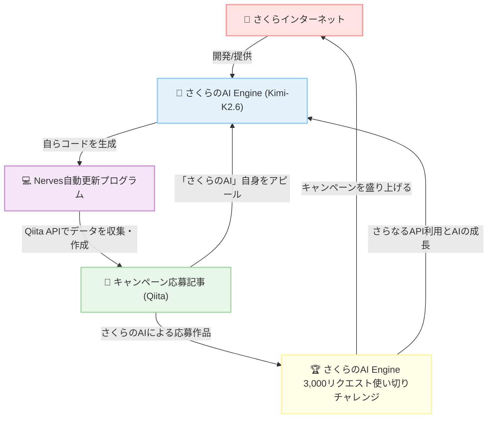

https://qiita.com/official-events/bd14d28b53326d318fec

# この記事は

「[OpenAI・Anthropic互換APIを無料で使おう！「さくらのAI Engine」3,000リクエスト使い切りチャレンジ](https://qiita.com/official-events/bd14d28b53326d318fec)」キャンペーンの応援記事です。
なおかつ、この記事がキャンペーンへの応募作品です。

**キャンペーンに参加するすべてのみなさま、つまりは全人類を応援します！**

そしてなんとなんと、この記事を自動更新するプログラムを書いてくれたのが、[さくらのAI Engine](https://ai.sakura.ad.jp/sakura-ai/ai-engine/)です！

「[Messages APIを使ったさくらのAI EngineとClaude Codeの連携](https://ai.sakura.ad.jp/column/claude-code-messages-api-2/)」を参考に、[Claude Code](https://code.claude.com/docs/ja/overview) x さくらのAI Engine(`preview/Kimi-K2.6`) エージェントハーネスを使ってできたプログラムです。

つまり、誤解を恐れずに言えば、さくらインターネット様のキャンペーンに「さくらのAI Engine」自身が応募している構図（好図！？）です！！！


```mermaid
flowchart TD
    Sakura["🌸 さくらインターネット"] -->|開発/提供| AI["🤖 さくらのAI Engine (Kimi-K2.6)"]
    AI -->|自らコードを生成| Program["💻 Nerves自動更新プログラム"]
    Program -->|Qiita APIでデータを収集・作成| Article["📝 キャンペーン応募記事 (Qiita)"]
    Article -->|さくらのAIによる応募作品| Campaign["🏆 さくらのAI Engine 3,000リクエスト使い切りチャレンジ"]
    Campaign -->|キャンペーンを盛り上げる| Sakura
    
    %% 循環・輪廻転生のリンク
    Article -->|「さくらのAI」自身をアピール| AI
    Campaign -->|さらなるAPI利用とAIの成長| AI

    classDef sakura fill:#ffe3e3,stroke:#ff9999,stroke-width:2px;
    classDef ai fill:#e3f2fd,stroke:#90caf9,stroke-width:2px;
    classDef prog fill:#f3e5f5,stroke:#ce93d8,stroke-width:2px;
    classDef art fill:#e8f5e9,stroke:#a5d6a7,stroke-width:2px;
    classDef camp fill:#fffde7,stroke:#fff59d,stroke-width:2px;
    
    class Sakura sakura;
    class AI ai;
    class Program prog;
    class Article art;
    class Campaign camp;
```

[Qiita API v2](https://qiita.com/api/v2/docs)を利用させていただいて、「[OpenAI・Anthropic互換APIを無料で使おう！「さくらのAI Engine」3,000リクエスト使い切りチャレンジ](https://qiita.com/official-events/bd14d28b53326d318fec)」に参加しているとおもわれる記事[^1]を収集します。
あつまった記事群（データ）にあれこれしてみます。

[^1]: 記事投稿キャンペーンのUUID（`posting_campaign_uuid`）による検索機能は、現状Qiita APIでは提供されておりません。 https://github.com/increments/qiita-discussions/discussions/1074 にてQiita様に要望しております。

- いいね数順に記事を並べます
- 投稿者ごとの記事数を集計します
- 投稿者ごとのいいね数を集計します
- tagごとの記事数を集計します
- tagごとのいいね数を集計します

**この記事の順位も、この記事自身が毎日監視しています。**

「参加ボタン」を押すのをお忘れなく!!!

「[OpenAI・Anthropic互換APIを無料で使おう！「さくらのAI Engine」3,000リクエスト使い切りチャレンジ](https://qiita.com/official-events/bd14d28b53326d318fec)」を微力でなおかつ僭越ながら盛り上げたいとおもっています:rocket::rocket::rocket:

---

# 総件数
46件 :tada::tada::tada:

# いいね数 :confetti_ball::military_medal::confetti_ball:
|No|title|created_at|updated_at|LGTM|
|---|---|---|---|---:|
|1|[さくらのAI Engine無料枠でgpt-oss-120bを使う ― Anthropic SDKはauth_token=必須の罠](https://qiita.com/nomurasan/items/63654a3f9457a8b5ed35)<br>@nomurasan|2026-07-14|2026-07-15|10|
|2|[さくらのAI Engineに書いてもらったコードで、さくらのAI Engineの「ずんだもん」に毎朝私は起こしてもらう](https://qiita.com/torifukukaiou/items/3c03c45da77e9cb7cf6b)<br>@torifukukaiou|2026-07-18|2026-07-25|9|
|3|[さくらのAI Engineのモデルに人狼をやらせて比較してみた](https://qiita.com/shoko3168/items/e8985c8c5a040213ab72)<br>@shoko3168|2026-07-18|2026-07-18|8|
|4|[【毎日自動更新】さくらのAI Engine 3,000リクエスト使い切りチャレンジ いいねランキング！](https://qiita.com/torifukukaiou/items/c4f654f0dad56e5da409)<br>@torifukukaiou|2026-07-18|2026-07-29|6|
|5|[さくらのAI Engineたちに「どう盛り上げるか」を議論させたら、結論は「どれをやるかは人間が決めてください」だった](https://qiita.com/TheGateBreaker/items/d56b52b7ed6426e50f2b)<br>@TheGateBreaker|2026-07-24|2026-07-24|4|
|6|[絵の描き方をさくらのAI Engineに教えてもらいました](https://qiita.com/torifukukaiou/items/c12bb99ef2016e2a3f0d)<br>@torifukukaiou|2026-07-28|2026-07-29|3|
|7|[Claude Code無課金勢、LINE botを「さくらのAI Engine」のOpenAI互換Responses APIへ移行する作業を、「さくらのAI Engine」自身に実装させたらCodexレビューを通過した](https://qiita.com/torifukukaiou/items/c3adf542824e4d5ae7b2)<br>@torifukukaiou|2026-07-17|2026-07-25|3|
|8|[「さくらのAI Engine」でRP](https://qiita.com/desktopgame/items/835c15ecd6c84b422fc4)<br>@desktopgame|2026-07-14|2026-07-14|3|
|9|[【AWS勉強中】新卒1年目が「さくらのAI Engine」でAWS問題が出てくるガチャを作ってみた](https://qiita.com/mineraru/items/8b5e0c33cce94080bb1a)<br>@mineraru|2026-07-29|2026-07-29|2|
|10|[Cursorなしで、社内CSVを自然言語で集計する（Compass）](https://qiita.com/n190/items/37440d7165bec18f4619)<br>@n190|2026-07-27|2026-07-28|2|
|11|[【さくらのAI】さくらのAIを利用してGitHubのPRレビューを行う](https://qiita.com/ks1905/items/e08f6131e0de62764324)<br>@ks1905|2026-07-27|2026-07-28|2|
|12|[Kimi-K2.6、Qwen3.6、gemma-4、勝つのはどれだ！無料オープンLLM対決！](https://qiita.com/shibacorgi/items/e9d2dfe399d0475f7aaf)<br>@shibacorgi|2026-07-26|2026-07-26|2|
|13|[Cline+さくらのAI Engine](https://qiita.com/samuraieng/items/a4d70d27b17ea5e8c6d5)<br>@samuraieng|2026-07-26|2026-07-26|2|
|14|[「ミスったな…」と落ち込む夜に。親の感情に寄り添い、子どもへの「別の声かけ」を提案する子育てサポートAI「oyagokoro」を作ってみた](https://qiita.com/shungo-555/items/7077dcc96d96cb5802e0)<br>@shungo-555|2026-07-23|2026-07-23|2|
|15|[token消化ではなく、記事のご縁を可視化！さくらのAI Engine RAGでチャレンジ参加記事の相関図を描いてみた🌸](https://qiita.com/TheGateBreaker/items/ffbed5bbd48d4ec45452)<br>@TheGateBreaker|2026-07-23|2026-07-23|2|
|16|[Chat月3,000リクエストを「経営予算」に──さくらのAI Engineで問い合わせ一次対応PoCを作った](https://qiita.com/YushiYamamoto/items/b7b3529ed14751fda13a)<br>@YushiYamamoto|2026-07-22|2026-07-23|2|
|17|[さくらのAI Engineを無料枠で触ってみて、最初につまずいた話](https://qiita.com/TheGateBreaker/items/855ee917db41fbe11fdd)<br>@TheGateBreaker|2026-07-20|2026-07-20|2|
|18|[生成AI初心者がAIに聞きながら「さくらのAI Engine」無償プランを契約〜PowerShellで初APIコールしてみた【公式ドキュメント答え合わせ付き】](https://qiita.com/miyacha/items/93a667c6117b1d46db55)<br>@miyacha|2026-07-18|2026-07-18|2|
|19|[Hermes Agent × さくらのAI Engineで、AIエージェントを作ってみた](https://qiita.com/mumeinosato/items/394e520db1acedd81a02)<br>@mumeinosato|2026-07-17|2026-07-17|2|
|20|[さくらのAI モデルの速さを測ろう！](https://qiita.com/SGT1231/items/3ff723ad428c6f9a5159)<br>@SGT1231|2026-07-17|2026-07-17|2|
|21|[OpenAI互換API、名乗るからには本物だった件 ── ai& から さくらのAI Engineへ、ハマりどころゼロで移行完了](https://qiita.com/torifukukaiou/items/747284dcd98157bdfad6)<br>@torifukukaiou|2026-07-15|2026-07-25|2|
|22|[提案書の「たたき台」はどこまでAIに任せられる？ さくらのAI Engineの無償枠で「ゼロから書く」と「AI下書き→手直し」を計測して比べてみた](https://qiita.com/Tetsu_Oikawa/items/42bfd45965943da81002)<br>@Tetsu_Oikawa|2026-07-29|2026-07-29|1|
|23|[「うまくいった」小さな検証が、間違った問いに答えていた話](https://qiita.com/TheGateBreaker/items/f1bb16861a62375d865f)<br>@TheGateBreaker|2026-07-29|2026-07-29|1|
|24|[要約ベクトルは本文ベクトルの劣化コピーではなかった](https://qiita.com/TheGateBreaker/items/1c1b4ae72e21ed257feb)<br>@TheGateBreaker|2026-07-28|2026-07-28|1|
|25|[完全無料で試す Tableau MCP ✕ さくらのAI で実現するセキュアなAIデータアシスタント構成案](https://qiita.com/mn1982/items/8cc13379e7eda9215243)<br>@mn1982|2026-07-27|2026-07-27|1|
|26|[CompassのAIチャットで小説執筆を体験してみた](https://qiita.com/n190/items/dae464243f1dacf85c24)<br>@n190|2026-07-27|2026-07-27|1|
|27|[ベクトル検索で受賞エッセイ30本を分析したら、直感が裏切られた](https://qiita.com/TheGateBreaker/items/f900665b692216c8d2f0)<br>@TheGateBreaker|2026-07-26|2026-07-26|1|
|28|[SpringのA2Aサンプルの生成AIのリクエストとレスポンスをAdvisorで観察する](https://qiita.com/kanata564/items/5ec6aa968e5a01747cdb)<br>@kanata564|2026-07-26|2026-07-26|1|
|29|[さくらのAI Engine(基盤モデル無償プラン)×さくらのVPSで、HermesAgentを無人運用してみる](https://qiita.com/uist1idrju3i/items/d45408d02e8c39526f5d)<br>@uist1idrju3i|2026-07-24|2026-07-24|1|
|30|[LinuxのエラーをAIに自動解析させるCLIツールを作ってみた🐱](https://qiita.com/yuta1610/items/50b625a99a556b064405)<br>@yuta1610|2026-07-23|2026-07-23|1|
|31|[さくらのAI Engine `/v1/messages` は `stream: true` で動くか？ token消化ではなく闘魂に昇華して、SSEの深淵を覗く](https://qiita.com/torifukukaiou/items/b090f60b13c8dcdfce94)<br>@torifukukaiou|2026-07-23|2026-07-25|1|
|32|[さくらのAI Engineで合成した声を、さくらのAI Engineで文字起こしして、文章をさくらのAI Engineで直す](https://qiita.com/torifukukaiou/items/f37cc5c2b09732e63e7e)<br>@torifukukaiou|2026-07-23|2026-07-25|1|
|33|[さくらのAIエンジン無料枠でハンズフリーのお料理アシスタントアプリを作る](https://qiita.com/pesipesi/items/f47c9d98e40a6eed0897)<br>@pesipesi|2026-07-23|2026-07-23|1|
|34|[「さくらのAI Engine」のOpenAI・Anthropic互換APIを使ってみた](https://qiita.com/Erga-mion/items/e712abee3cd8587cf3b9)<br>@Erga-mion|2026-07-21|2026-07-22|1|
|35|[Laravel×さくらのAI Engineで自分専用の記事下書きツールを作る。](https://qiita.com/miyacha/items/f4db3964afad5142113e)<br>@miyacha|2026-07-20|2026-07-20|1|
|36|[MoodleのAIプロバイダでさくらのAI Engineをつかいたおす](https://qiita.com/papillon/items/d0d64609fc63d659a7ef)<br>@papillon|2026-07-19|2026-07-19|1|
|37|[満開のさくら街道をゆく――さくらのAI Engine無償枠3,000回を従量課金で歩き直してみた](https://qiita.com/torifukukaiou/items/b2e3ec8a4fb986aa786f)<br>@torifukukaiou|2026-07-19|2026-07-29|1|
|38|[SpringのA2Aサンプルを動かす](https://qiita.com/kanata564/items/fdcc579e6502c5e8c07b)<br>@kanata564|2026-07-19|2026-07-19|1|
|39|[さくらのAI Engineを使って、喋った言葉を「ずんだもん語」に変換するマイクを作ってみた](https://qiita.com/Kaz_Macintosh/items/3a964576ab5512982f0d)<br>@Kaz_Macintosh|2026-07-17|2026-07-17|1|
|40|[さくらのAI Engine × Streamlitでコンサルケース問題の採点アプリを1時間で公開した話](https://qiita.com/cu531gsk/items/dd2776eabdf99eadbbc7)<br>@cu531gsk|2026-07-17|2026-07-17|1|
|41|[「ずんだもん実況」という次の一手を、さくらのAI Engine自身のTTS APIで本当に作ってみた](https://qiita.com/TheGateBreaker/items/8500cc3b66241ab6f240)<br>@TheGateBreaker|2026-07-30|2026-07-30|0|
|42|[さくらのAI Engineの音声合成で「1000モーラ制限」に当たった話──curlで発見してPythonで突破した](https://qiita.com/torifukukaiou/items/3ccc6b50af4da3138d34)<br>@torifukukaiou|2026-07-29|2026-07-29|0|
|43|[「This model is not available.」── さくらのAI Engineの提供モデルが厳選されていました](https://qiita.com/torifukukaiou/items/ab729b521f14a017e6b6)<br>@torifukukaiou|2026-07-22|2026-07-25|0|
|44|[さくらのAI Engineのマルチモーダル：画像を送ってテキストを受け取る](https://qiita.com/torifukukaiou/items/036be30164bab7d6baa8)<br>@torifukukaiou|2026-07-20|2026-07-25|0|
|45|[さくらのAI Engine Playgroundに『「さくらのAI Engine」3,000リクエスト使い切りチャレンジ』キャンペーンの受賞のコツを聞いてみました](https://qiita.com/torifukukaiou/items/38f5cd9fbcd60bcbe627)<br>@torifukukaiou|2026-07-15|2026-07-25|0|
|46|[さくらのAI Engine Playgroundに記事を書いてもらいました（応答が速い🚀🚀🚀)](https://qiita.com/torifukukaiou/items/5a3fd81908bcdb0ee59e)<br>@torifukukaiou|2026-07-15|2026-07-25|0|


# 投稿者ごとの記事数といいね数
|No|user|count|LGTM|
|---|---|---:|---:|
|1|@torifukukaiou|13|26|
|2|@TheGateBreaker|7|11|
|3|@miyacha|2|3|
|4|@n190|2|3|
|5|@kanata564|2|2|
|6|@nomurasan|1|10|
|7|@shoko3168|1|8|
|8|@desktopgame|1|3|
|9|@SGT1231|1|2|
|10|@YushiYamamoto|1|2|
|11|@ks1905|1|2|
|12|@mineraru|1|2|
|13|@mumeinosato|1|2|
|14|@samuraieng|1|2|
|15|@shibacorgi|1|2|
|16|@shungo-555|1|2|
|17|@Erga-mion|1|1|
|18|@Kaz_Macintosh|1|1|
|19|@Tetsu_Oikawa|1|1|
|20|@cu531gsk|1|1|
|21|@mn1982|1|1|
|22|@papillon|1|1|
|23|@pesipesi|1|1|
|24|@uist1idrju3i|1|1|
|25|@yuta1610|1|1|


# 投稿者ごとのいいね数と記事数
|No|user|LGTM|count|
|---|---|---:|---:|
|1|@torifukukaiou|26|13|
|2|@TheGateBreaker|11|7|
|3|@nomurasan|10|1|
|4|@shoko3168|8|1|
|5|@desktopgame|3|1|
|6|@miyacha|3|2|
|7|@n190|3|2|
|8|@SGT1231|2|1|
|9|@YushiYamamoto|2|1|
|10|@kanata564|2|2|
|11|@ks1905|2|1|
|12|@mineraru|2|1|
|13|@mumeinosato|2|1|
|14|@samuraieng|2|1|
|15|@shibacorgi|2|1|
|16|@shungo-555|2|1|
|17|@Erga-mion|1|1|
|18|@Kaz_Macintosh|1|1|
|19|@Tetsu_Oikawa|1|1|
|20|@cu531gsk|1|1|
|21|@mn1982|1|1|
|22|@papillon|1|1|
|23|@pesipesi|1|1|
|24|@uist1idrju3i|1|1|
|25|@yuta1610|1|1|


# タグごとの記事数といいね数
|No|tag|count|LGTM|
|---|---|---:|---:|
|1|[さくらのAI](https://qiita.com/tags/さくらのAI)|46|91|
|2|[闘魂](https://qiita.com/tags/闘魂)|13|26|
|3|[さくらインターネット](https://qiita.com/tags/さくらインターネット)|13|12|
|4|[AI](https://qiita.com/tags/AI)|12|18|
|5|[猪木](https://qiita.com/tags/猪木)|11|11|
|6|[生成AI](https://qiita.com/tags/生成AI)|8|20|
|7|[ClaudeCode](https://qiita.com/tags/ClaudeCode)|7|20|
|8|[Python](https://qiita.com/tags/Python)|7|20|
|9|[さくらのAIEngine](https://qiita.com/tags/さくらのAIEngine)|6|9|
|10|[LLM](https://qiita.com/tags/LLM)|5|17|
|11|[OpenAI](https://qiita.com/tags/OpenAI)|4|6|
|12|[VOICEVOX](https://qiita.com/tags/VOICEVOX)|3|3|
|13|[初心者](https://qiita.com/tags/初心者)|3|4|
|14|[ずんだもん](https://qiita.com/tags/ずんだもん)|3|11|
|15|[HermesAgent](https://qiita.com/tags/HermesAgent)|2|3|
|16|[Nerves](https://qiita.com/tags/Nerves)|2|15|
|17|[spring](https://qiita.com/tags/spring)|2|2|
|18|[A2A](https://qiita.com/tags/A2A)|2|2|
|19|[sdgs](https://qiita.com/tags/sdgs)|2|2|
|20|[rag](https://qiita.com/tags/rag)|2|3|
|21|[ベクトル検索](https://qiita.com/tags/ベクトル検索)|2|2|
|22|[自然言語処理](https://qiita.com/tags/自然言語処理)|2|2|
|23|[AIではなく人間が書いてます](https://qiita.com/tags/AIではなく人間が書いてます)|2|1|
|24|[Elixir](https://qiita.com/tags/Elixir)|2|15|
|25|[Java](https://qiita.com/tags/Java)|2|2|
|26|[Laravel](https://qiita.com/tags/Laravel)|1|1|
|27|[ガチャ](https://qiita.com/tags/ガチャ)|1|2|
|28|[CSV](https://qiita.com/tags/CSV)|1|2|
|29|[初学者](https://qiita.com/tags/初学者)|1|2|
|30|[Kimi-K2](https://qiita.com/tags/Kimi-K2)|1|2|
|31|[Streamlit](https://qiita.com/tags/Streamlit)|1|1|
|32|[AWS](https://qiita.com/tags/AWS)|1|2|
|33|[PowerShell](https://qiita.com/tags/PowerShell)|1|2|
|34|[Linux](https://qiita.com/tags/Linux)|1|1|
|35|[PoC](https://qiita.com/tags/PoC)|1|1|
|36|[Anthropic](https://qiita.com/tags/Anthropic)|1|1|
|37|[cline](https://qiita.com/tags/cline)|1|2|
|38|[Compass](https://qiita.com/tags/Compass)|1|1|
|39|[Supabase](https://qiita.com/tags/Supabase)|1|2|
|40|[M5stack](https://qiita.com/tags/M5stack)|1|1|
|41|[Kimi](https://qiita.com/tags/Kimi)|1|1|
|42|[AI活用](https://qiita.com/tags/AI活用)|1|1|
|43|[API](https://qiita.com/tags/API)|1|10|
|44|[個人開発](https://qiita.com/tags/個人開発)|1|10|
|45|[ffmpeg](https://qiita.com/tags/ffmpeg)|1|0|
|46|[Kong](https://qiita.com/tags/Kong)|1|2|
|47|[TableauMCP](https://qiita.com/tags/TableauMCP)|1|1|
|48|[cursor](https://qiita.com/tags/cursor)|1|1|
|49|[料理](https://qiita.com/tags/料理)|1|1|
|50|[業務効率化](https://qiita.com/tags/業務効率化)|1|1|
|51|[OSS](https://qiita.com/tags/OSS)|1|2|
|52|[音声合成](https://qiita.com/tags/音声合成)|1|0|
|53|[TTS](https://qiita.com/tags/TTS)|1|0|
|54|[n8n](https://qiita.com/tags/n8n)|1|2|
|55|[Vercel](https://qiita.com/tags/Vercel)|1|2|
|56|[LLM-jp](https://qiita.com/tags/LLM-jp)|1|2|
|57|[codex](https://qiita.com/tags/codex)|1|3|
|58|[Linuxコマンド](https://qiita.com/tags/Linuxコマンド)|1|1|
|59|[Moodle](https://qiita.com/tags/Moodle)|1|1|
|60|[Tableau](https://qiita.com/tags/Tableau)|1|1|
|61|[サンプル実装](https://qiita.com/tags/サンプル実装)|1|2|
|62|[Windows](https://qiita.com/tags/Windows)|1|2|
|63|[AI人狼](https://qiita.com/tags/AI人狼)|1|8|
|64|[CodexCLI](https://qiita.com/tags/CodexCLI)|1|2|
|65|[育児](https://qiita.com/tags/育児)|1|2|
|66|[データ分析](https://qiita.com/tags/データ分析)|1|2|
|67|[ベンチマーク](https://qiita.com/tags/ベンチマーク)|1|2|


# タグごとのいいね数と記事数
|No|tag|LGTM|count|
|---|---|---:|---:|
|1|[さくらのAI](https://qiita.com/tags/さくらのAI)|91|46|
|2|[闘魂](https://qiita.com/tags/闘魂)|26|13|
|3|[生成AI](https://qiita.com/tags/生成AI)|20|8|
|4|[ClaudeCode](https://qiita.com/tags/ClaudeCode)|20|7|
|5|[Python](https://qiita.com/tags/Python)|20|7|
|6|[AI](https://qiita.com/tags/AI)|18|12|
|7|[LLM](https://qiita.com/tags/LLM)|17|5|
|8|[Nerves](https://qiita.com/tags/Nerves)|15|2|
|9|[Elixir](https://qiita.com/tags/Elixir)|15|2|
|10|[さくらインターネット](https://qiita.com/tags/さくらインターネット)|12|13|
|11|[猪木](https://qiita.com/tags/猪木)|11|11|
|12|[ずんだもん](https://qiita.com/tags/ずんだもん)|11|3|
|13|[API](https://qiita.com/tags/API)|10|1|
|14|[個人開発](https://qiita.com/tags/個人開発)|10|1|
|15|[さくらのAIEngine](https://qiita.com/tags/さくらのAIEngine)|9|6|
|16|[AI人狼](https://qiita.com/tags/AI人狼)|8|1|
|17|[OpenAI](https://qiita.com/tags/OpenAI)|6|4|
|18|[初心者](https://qiita.com/tags/初心者)|4|3|
|19|[HermesAgent](https://qiita.com/tags/HermesAgent)|3|2|
|20|[rag](https://qiita.com/tags/rag)|3|2|
|21|[VOICEVOX](https://qiita.com/tags/VOICEVOX)|3|3|
|22|[codex](https://qiita.com/tags/codex)|3|1|
|23|[ガチャ](https://qiita.com/tags/ガチャ)|2|1|
|24|[CSV](https://qiita.com/tags/CSV)|2|1|
|25|[初学者](https://qiita.com/tags/初学者)|2|1|
|26|[Kimi-K2](https://qiita.com/tags/Kimi-K2)|2|1|
|27|[AWS](https://qiita.com/tags/AWS)|2|1|
|28|[PowerShell](https://qiita.com/tags/PowerShell)|2|1|
|29|[cline](https://qiita.com/tags/cline)|2|1|
|30|[spring](https://qiita.com/tags/spring)|2|2|
|31|[Supabase](https://qiita.com/tags/Supabase)|2|1|
|32|[A2A](https://qiita.com/tags/A2A)|2|2|
|33|[sdgs](https://qiita.com/tags/sdgs)|2|2|
|34|[Kong](https://qiita.com/tags/Kong)|2|1|
|35|[OSS](https://qiita.com/tags/OSS)|2|1|
|36|[n8n](https://qiita.com/tags/n8n)|2|1|
|37|[Vercel](https://qiita.com/tags/Vercel)|2|1|
|38|[LLM-jp](https://qiita.com/tags/LLM-jp)|2|1|
|39|[ベクトル検索](https://qiita.com/tags/ベクトル検索)|2|2|
|40|[自然言語処理](https://qiita.com/tags/自然言語処理)|2|2|
|41|[サンプル実装](https://qiita.com/tags/サンプル実装)|2|1|
|42|[Windows](https://qiita.com/tags/Windows)|2|1|
|43|[CodexCLI](https://qiita.com/tags/CodexCLI)|2|1|
|44|[育児](https://qiita.com/tags/育児)|2|1|
|45|[データ分析](https://qiita.com/tags/データ分析)|2|1|
|46|[Java](https://qiita.com/tags/Java)|2|2|
|47|[ベンチマーク](https://qiita.com/tags/ベンチマーク)|2|1|
|48|[Laravel](https://qiita.com/tags/Laravel)|1|1|
|49|[Streamlit](https://qiita.com/tags/Streamlit)|1|1|
|50|[Linux](https://qiita.com/tags/Linux)|1|1|
|51|[PoC](https://qiita.com/tags/PoC)|1|1|
|52|[Anthropic](https://qiita.com/tags/Anthropic)|1|1|
|53|[Compass](https://qiita.com/tags/Compass)|1|1|
|54|[M5stack](https://qiita.com/tags/M5stack)|1|1|
|55|[Kimi](https://qiita.com/tags/Kimi)|1|1|
|56|[AI活用](https://qiita.com/tags/AI活用)|1|1|
|57|[TableauMCP](https://qiita.com/tags/TableauMCP)|1|1|
|58|[cursor](https://qiita.com/tags/cursor)|1|1|
|59|[料理](https://qiita.com/tags/料理)|1|1|
|60|[業務効率化](https://qiita.com/tags/業務効率化)|1|1|
|61|[Linuxコマンド](https://qiita.com/tags/Linuxコマンド)|1|1|
|62|[Moodle](https://qiita.com/tags/Moodle)|1|1|
|63|[Tableau](https://qiita.com/tags/Tableau)|1|1|
|64|[AIではなく人間が書いてます](https://qiita.com/tags/AIではなく人間が書いてます)|1|2|
|65|[ffmpeg](https://qiita.com/tags/ffmpeg)|0|1|
|66|[音声合成](https://qiita.com/tags/音声合成)|0|1|
|67|[TTS](https://qiita.com/tags/TTS)|0|1|


---

# Wrapping up :lgtm: :qiitan: :lgtm:

この記事は、「[OpenAI・Anthropic互換APIを無料で使おう！「さくらのAI Engine」3,000リクエスト使い切りチャレンジ](https://qiita.com/official-events/bd14d28b53326d318fec)」の応援記事です。

---

最後に、この記事を自動更新しているプログラムについて補足しておきます。

- 自動更新は、[Elixir](https://elixir-lang.org/)というプログラミング言語がありまして、その[Elixir](https://elixir-lang.org/)で作られた[Nerves](https://www.nerves-project.org/)という[ナウでヤングでcoolなすごいIoTフレームワーク](https://www.slideshare.net/takasehideki/elixiriotcoolnerves-236780506)を使ってつくったアプリケーションで行っております
  - [Nerves](https://www.nerves-project.org/)の始め方につきましては下記の記事が詳しいです
  - [ElixirでIoT#4.1：Nerves開発環境の準備](https://qiita.com/takasehideki/items/88dda57758051d45fcf9)
- [Elixir](https://elixir-lang.org/)には、データを自在に取り扱える[Enum](https://hexdocs.pm/elixir/Enum.html)モジュールがあります
- [Elixir](https://elixir-lang.org/)をはじめてみようという方は、[Enum](https://hexdocs.pm/elixir/Enum.html)モジュールの習得からはじめるとよいとおもいます
- [WEB+DB PRESS Vol.127](https://gihyo.jp/magazine/wdpress/archive/2022/vol127) :book: の特集２「Elixirによる高速なWeb開発！ 作って学ぶPhoenix」は、[Elixir](https://elixir-lang.org/)でWebアプリケーション開発を楽しめる[Phoenix](https://www.phoenixframework.org/)の基礎がぎっしりと詰まっていて、**オススメ**です
- プログラムは、 https://github.com/TORIFUKUKaiou/hello_nerves/tree/master/lib/qiita/events にあります


素敵なキャンペーンを企画してくださったさくらインターネット様とQiita様には、感謝の言葉しかありません。

<b><font color="red">$\huge{ありがとうーーーッ！！！}$</font></b>

token消化ではなく、**$\huge{闘魂昇華}$**。無料枠を、闘って、磨いて、使い切りますッ！！！


---

:::note
**TokenをTokonへ**

AIが扱うのは、Token。

```math
\mathrm{Token}
-
\mathrm{見\ (Ken)}
+
\mathrm{魂\ (Kon)}
=
\mathrm{Tokon\ (闘魂)}
```

現段階の生成AIは、突き詰めればベクトルの数理遊びである。

どのモデルが賢い、速い、勝つ。
外から眺め、比べ、論評するだけでは、まだTokenだ。

だから「見（Ken）」を引く。

見る側から、使う側へ。
そこに目的と意味を与え、執念を持ち込み、魂を込めるのは人間である。

token消化ではなく、**$\huge{闘魂昇華}$** :fire:
Don't just consume Tokens. Forge them into Tokon.
:::


