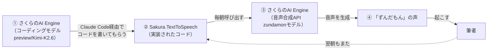

## はじめに

本記事は、さくらインターネット主催の記事投稿キャンペーン「[OpenAI・Anthropic互換APIを無料で使おう！「さくらのAI Engine」3,000リクエスト使い切りチャレンジ](https://qiita.com/official-events/bd14d28b53326d318fec)」への参加記事です。

やったことを一言でまとめると、こうなります。

> **さくらのAI Engineに搭載されたコーディングモデルを使って、さくらのAI Engineの音声合成APIを呼び出すプログラムを書いてもらい、そのプログラムが毎朝、さくらのAI Engineの音声合成APIで生成した「ずんだもん」の声で、筆者（私）を起こしてくれる仕組みを作った。**

実装も呼び出しも、全部さくらのAI Engineの中で完結しています。この「輪廻転生」感、あるいは脚本・監督・主演をすべて一人でこなしてしまうような感覚こそが今回一番アピールしたいポイントです。詳しくは後述します。

――これは、無料枠3,000リクエストに挑んだ、ひとりの技術者が、tokenをただ消化するのではなく、闘魂へと昇華させたドラマである。

## 使った技術

- Elixir
- Nerves
- Raspberry Pi 2

自宅で動かしているNervesデバイス上で、毎朝の天気予報を音声で読み上げて筆者（私）を起こしてくれる仕組みをすでに運用していました。今回はその音声合成部分を、これまで使っていたAzure Cognitive ServicesのText-to-Speechから、さくらのAI Engineが提供する[Create speech(text-to-speech)](https://manual.sakura.ad.jp/api/cloud/portal/?api=ai-engine-inference-api#operation/createSpeech)APIへ移行しました。声は`zundamon`モデルです。

なお、[さくらのAI Engine](https://ai.sakura.ad.jp/sakura-ai/ai-engine/)のText-to-Speech機能は、1ヶ月あたり50リクエストまでが無料枠です。毎朝1回起こしてもらう程度の使い方であれば十分に収まる範囲です。

## Claude Codeからさくらのモデルを呼ぶ

実装にあたっては、以下の記事を参考に、Claude Codeの接続先モデルをさくらのAI Engine上の`preview/Kimi-K2.6`に切り替えて使いました。

https://ai.sakura.ad.jp/column/claude-code-messages-api-2/

Anthropic互換のMessages APIとして提供されているため、Claude Codeのモデル指定を変えるだけで、Anthropic課金を発生させずにコーディングエージェントとして動かせます。

```
claude --model preview/Kimi-K2.6
```

この状態で、以下のプロンプトを投げました。

```txt
音声合成機能を、さくらのAI Engineが提供する「Create speech (text-to-speech)」に移行したいです。
モデルは、 zundamon です。

APIドキュメント
- https://manual.sakura.ad.jp/api/cloud/portal/?api=ai-engine-inference-api#operation/createSpeech
- https://manual.sakura.ad.jp/cloud/ai-engine/02-howto.html#api
```

## Planモードで出てきた計画

Claude Codeのplanモードで、既存のAzure実装を読み込んだ上で以下のような移行計画が出てきました。要点だけ抜粋します。

- 既存の`Azure.TextToSpeech`（Azureのアクセストークン取得→SSML生成→TTS呼び出し）を廃止する
- 新たに`Sakura.TextToSpeech`モジュールを作り、`POST https://api.ai.sakura.ad.jp/v1/audio/speech`をBearer認証で呼ぶ
- モデルは`zundamon`をデフォルトにしつつ、コンパイル時設定で変更可能にする

既存コードの呼び出し口を変えずに、内部実装だけをそっくり差し替える設計になっていて、無駄のない計画だったと感じました。

## 実装の核

実際にできあがった`Sakura.TextToSpeech`モジュールは以下の通りです。

```elixir
defmodule Sakura.TextToSpeech do
  @token Application.compile_env(:hello_nerves, :sakura_ai_engine_token)
  @model Application.compile_env(:hello_nerves, :sakura_ai_engine_model, "zundamon")
  @voice Application.compile_env(:hello_nerves, :sakura_ai_engine_voice)
  @base_url "https://api.ai.sakura.ad.jp/v1"

  def run!(text) do
    body =
      %{"model" => @model, "input" => text}
      |> maybe_put_voice()

    "#{@base_url}/audio/speech"
    |> Req.post!(
      json: body,
      headers: [authorization: "Bearer #{@token}"],
      pool_timeout: 50000,
      receive_timeout: 50000
    )
    |> Map.get(:body)
  end

  defp maybe_put_voice(map) do
    if @voice, do: Map.put(map, "voice", @voice), else: map
  end
end
```

OpenAI互換のシンプルなJSONボディ（`model`・`input`、任意で`voice`）をBearerトークン付きでPOSTするだけの、非常にコンパクトな実装です。エンドポイントの仕様は[APIリファレンス](https://manual.sakura.ad.jp/api/cloud/portal/?api=ai-engine-inference-api#operation/createSpeech)の`createSpeech`に定義されています。既存プロジェクトで使っていた`Req`ライブラリをそのまま使い、呼び出し元の`AwesomeNerves`側は`Azure.TextToSpeech.run!/1`を`Sakura.TextToSpeech.run!/1`に差し替えるだけで移行が完了しました。

コミットはこちらです。

https://github.com/TORIFUKUKaiou/hello_nerves/commit/7bb27b8998437240a9dfbaf85d8dcdccc8bdbc73

## 完璧に動作するものができあがった

Azureからの移行は一発で完了し、ドキュメントの更新も含めて満足のいく結果になりました。実装に要したリクエスト回数は90回。無償枠の月3,000リクエストからすればごくわずかで、コストを気にせず試行錯誤できるのはこのキャンペーンの無償プランのありがたいところです。


なお、筆者は「ずんだもん」が何者なのかを実はよく知らないまま実装しています。それでも動くところが生成AI開発の面白いところだと思います。

## 一番アピールしたいこと

今回の実装で一番伝えたいのは、次の「円環」です。

1. **さくらのAI Engineが提供するコーディングモデル**（`preview/Kimi-K2.6`）を、Claude Codeというエージェントハーネス経由で呼び出し、
2. そのモデルに、**さくらのAI Engineが提供する音声合成API**（`Create speech`、`zundamon`モデル）を呼び出すプログラムを書いてもらい、
3. 実際にできあがったプログラムは、毎朝、**さくらのAI Engineの音声合成API**を叩いて「ずんだもん」の声を生成し、
4. その声で私を起こしてくれる。



コードを書いたのもさくらのAI Engine、そのコードが呼び出す先もさくらのAI Engine。開発から実行まで、さくらのAI Engineだけで完結しているという意味で、まさに輪廻転生的というか、自ら生み出したものが自らのもとへ還ってくる円環をなしています。3,000リクエストの無償枠は、こうした「AIにAIを呼ばせる」実験を気兼ねなく試せる懐の深さがあると感じました。

関連記事はこちらです。

https://qiita.com/torifukukaiou/items/c3adf542824e4d5ae7b2

## おわりに

さくらのAI EngineのAnthropic互換Messages APIを使えば、Claude Codeのようなエージェントハーネスをそのまま流用しつつ、Anthropic課金を発生させずにコーディングを進められます。今回のように「さくらのAI Engineに、さくらのAI Engine用のコードを書いてもらう」といった実験もしやすく、無料枠だからこそ思い切った使い方ができました。

引き続き3,000リクエストを使い切る2兆個のアイデアを実践します。

token消化ではなく、**$\huge{闘魂昇華}$**。無料枠を、闘って、磨いて、使い切りますッ！！！
