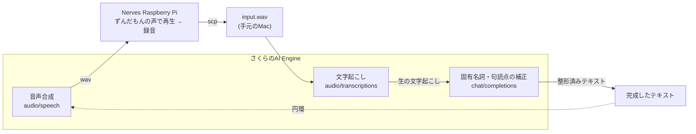
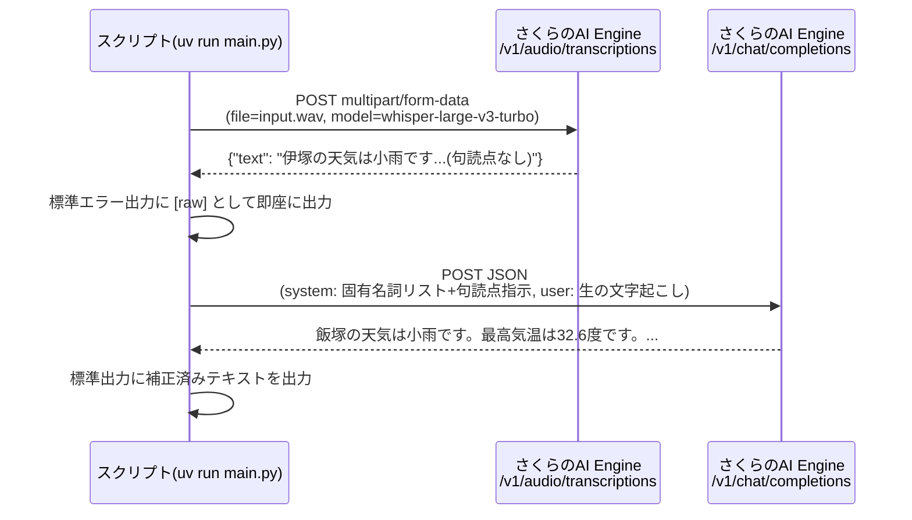

## はじめに

[「OpenAI・Anthropic互換APIを無料で使おう！『さくらのAI Engine』3,000リクエスト使い切りチャレンジ」](https://qiita.com/official-events/bd14d28b53326d318fec) への応募記事です。

前回は[画像入力のマルチモーダル呼び出し](https://qiita.com/torifukukaiou/items/036be30164bab7d6baa8)を試しました。今回は音声まわりです。

やったことはシンプルで、

1. さくらのAI Engineの音声合成でずんだもんの声を作る
2. [Nerves](https://nerves-project.org/)のRaspberry Piでその音声データを`.wav`として保存
3. [さくらのAI Engine](https://ai.sakura.ad.jp/sakura-ai/ai-engine/)のWhisperで文字起こしする
4. 文字起こし結果の固有名詞と句読点を、さくらのAI Engineの`chat.completions`で直す

というだけなのですが、よく考えると**音声を作ったのも、聞き取ったのも、直したのも、全部さくらのAI Engine**です。1つのプラットフォームの中を音声とテキストが円環を描いて回っている、という構図になっています。今回はその「円環」を軸に書きます。

## 全体像(円環図)

言葉を尽くすよりも図で見た方が早いです。



さくらのAI Engineが「声を作る係」「聞く係」「校正する係」を一人三役でこなしていて、素材もさくらのAI Engine製、聞き取るのもさくらのAI Engine、直すのもさくらのAI Engine。完全に自給自足です。

## 実装

### 環境

[uv](https://docs.astral.sh/uv/)でプロジェクトを作りました。

```toml:pyproject.toml
[project]
name = "sakura-transcribe"
version = "0.1.0"
description = "さくらのAI Engineで文字起こし→固有名詞補正まで一気にやる"
readme = "README.md"
requires-python = ">=3.14"
dependencies = [
    "openai>=2.45.0",
]
```

アカウントトークンは環境変数で渡します。

```bash
export SAKURA_AI_ENGINE_ACCOUNT_TOKEN="<UUID>:<シークレット>"
```

### 材料集め: Nervesのラズパイからwavを取り出す

Nervesの`ssh`は繋いだ瞬間にIExが立ち上がる構成でしたが、`sftp`サブシステムはちゃんと生きていたので、`scp`がそのまま使えました。

```bash
scp nerves.local:/tmp/output.wav ./input.wav
```

余談ですが、IExシェルの環境だと「じゃあ`nc`で流し込むか…」と身構えていたら普通に`scp`が通ったので、拍子抜けしました。案ずるより試すが易しです。

### 1. 文字起こし(audio/transcriptions)

さくらのAI EngineのAudio transcriptions APIはOpenAI互換で、モデルは`whisper-large-v3-turbo`です。本来30秒までしか対応していないモデルですが、内部でチャンク分割・結合をしてくれるため最長30分/30MBまで扱えます[^1]。

まずはcurlで素の挙動を確認します。

```bash
curl --request POST \
  --url https://api.ai.sakura.ad.jp/v1/audio/transcriptions \
  --header 'Accept: application/json' \
  --header "Authorization: Bearer ${SAKURA_AI_ENGINE_ACCOUNT_TOKEN}" \
  --header 'Content-Type: multipart/form-data' \
  --form 'file=@input.wav' \
  --form 'model=whisper-large-v3-turbo'
```

```json
{"text":"伊塚の天気は小雨です最高気温は32.6度です最低気温は27.96度ですI use nerves I like it","model":"whisper-large-v3-turbo"}
```

内容はほぼ合っていますが、2つ気になる点があります。

- 「飯塚」が「伊塚」になっている(固有名詞なので仕方ない)
- 句読点が一切ない。畳み掛けるような文体で、これはこれで味がある（放浪の天才画家・山下清画伯がおっしゃったとされる、しゃべるときには、「。」とか「、」とか言わないんだな、に通じるものがあります）

固有名詞のヒントとして`prompt`パラメータに「飯塚市の天気予報。Nerves。」のような文章を渡してみたところ、**本文が丸ごと消えて`"I like it!"`だけが返ってくる**という逆効果が発生しました。Whisperの`prompt`は「直前セグメントの書き起こし文」を渡して文脈をつなげるための機能[^2]で、指示文のように使うとモデルによっては生成自体を壊しかねない、という良い実例が取れました。というわけで`prompt`には頼らず、後段のLLMで補正する方針にしました。

### 2. 固有名詞・句読点の補正(chat/completions)

文字起こし結果をそのまま`chat.completions`に投げて、既知の固有名詞リストに基づいた誤字修正と、読みやすくするための句読点補完だけをやらせます。

```python:main.py
import argparse
import os
import sys

from openai import OpenAI

KNOWN_TERMS = ["飯塚市", "飯塚", "Nerves", "Elixir"]


def get_client() -> OpenAI:
    token = os.environ.get("SAKURA_AI_ENGINE_ACCOUNT_TOKEN")
    if not token:
        sys.exit("環境変数 SAKURA_AI_ENGINE_ACCOUNT_TOKEN が未設定です")
    return OpenAI(api_key=token, base_url="https://api.ai.sakura.ad.jp/v1")


def transcribe(client: OpenAI, wav_path: str) -> str:
    with open(wav_path, "rb") as f:
        result = client.audio.transcriptions.create(
            model="whisper-large-v3-turbo",
            file=f,
        )
    return result.text


def fix_terms(client: OpenAI, text: str, terms: list[str]) -> str:
    system_prompt = (
        "あなたは音声認識結果の誤字修正係です。以下の既知固有名詞リストに含まれる語だけを対象に、"
        "音が近い誤認識(同音異義語・当て字ミス)を正しい表記に直してください。"
        "また、文意が変わらない範囲で、読みやすくなるよう適切な位置に句読点(、。)を補ってください。"
        "固有名詞の修正と句読点の追加以外は、語句・文体を一切変更しないでください。"
        "修正後の全文だけを出力し、説明や前置きは不要です。\n\n"
        f"既知固有名詞リスト: {', '.join(terms)}"
    )
    resp = client.chat.completions.create(
        model="gpt-oss-120b",
        messages=[
            {"role": "system", "content": system_prompt},
            {"role": "user", "content": text},
        ],
        temperature=0,
    )
    return resp.choices[0].message.content


def main() -> None:
    parser = argparse.ArgumentParser(description="音声ファイルを文字起こしして固有名詞を補正する")
    parser.add_argument("wav_path")
    parser.add_argument("--term", action="append", default=[])
    parser.add_argument("--raw-only", action="store_true")
    args = parser.parse_args()

    client = get_client()
    raw_text = transcribe(client, args.wav_path)
    print(f"[raw] {raw_text}", file=sys.stderr)

    if args.raw_only:
        print(raw_text)
        return

    fixed_text = fix_terms(client, raw_text, KNOWN_TERMS + args.term)
    print(fixed_text)


if __name__ == "__main__":
    main()
```

実行します。

```bash
uv run main.py input.wav
```

```
[raw] 伊塚の天気は小雨です最高気温は32.6度です最低気温は27.96度ですI use nerves I like it
飯塚の天気は小雨です。最高気温は32.6度です。最低気温は27.96度です。I use Nerves. I like it.
```

「伊塚」→「飯塚」、「nerves」→「Nerves」がちゃんと直り、句読点も自然な位置に入りました。文体や語順は変えず、指定した範囲だけをピンポイントで直させる、という制約がうまく効いています。

### 処理のシーケンス図

2回のAPI呼び出しの流れを図にするとこうなります。



## まとめ

- さくらのAI Engineの`audio/transcriptions`(Whisper)はOpenAI互換で、SDKの`client.audio.transcriptions.create()`がそのまま使える
- Whisperの`prompt`パラメータは「固有名詞のヒント」用途には向いておらず、下手に使うと出力が壊れることがある。固有名詞補正は`chat/completions`に別途投げる方が安定する
- そして何より、**音声合成も、文字起こしも、校正も、全部さくらのAI Engineの中だけで完結した**。ずんだもんの声がAPIを円環を描いて回って、少しずつ綺麗になって戻ってきた、という一連の流れでした

token消化ではなく、**$\huge{闘魂昇華}$**。
あなたの闘魂昇華をもっと見たいです。

## 参考

- [さくらのAI Engine マニュアル](https://manual.sakura.ad.jp/cloud/manual-ai-engine.html)
- [利用手順(APIエンドポイント一覧)](https://manual.sakura.ad.jp/cloud/ai-engine/02-howto.html#api)
- [さくらのAI Engineことはじめ(2): 音声ファイルの文字起こし | さくらのナレッジ](https://knowledge.sakura.ad.jp/47088/)

[^1]: [さくらのAI Engineことはじめ(2): 音声ファイルの文字起こし | さくらのナレッジ](https://knowledge.sakura.ad.jp/47088/) によると、whisper-large-v3-turbo自体は本来30秒までの音声にしか対応していないが、さくらのAI Engineがアップロードされた音声を内部で30秒以内のチャンクに分割して個別に文字起こしし、結果を結合して返す処理を行っているため、最長30分・30MBまでのファイルに対応しているとのこと。
[^2]: [Speech to text | OpenAI API](https://developers.openai.com/api/docs/guides/speech-to-text) にある説明。ファイルが複数セグメントに分割された際、直前セグメントの書き起こしを`prompt`として渡すことで文脈を引き継がせ、精度を上げる使い方が想定されている(whisper-1の場合、`prompt`の末尾224トークンのみが考慮される)。固有名詞のヒント注入のような用途は公式に想定された使い方ではない。
