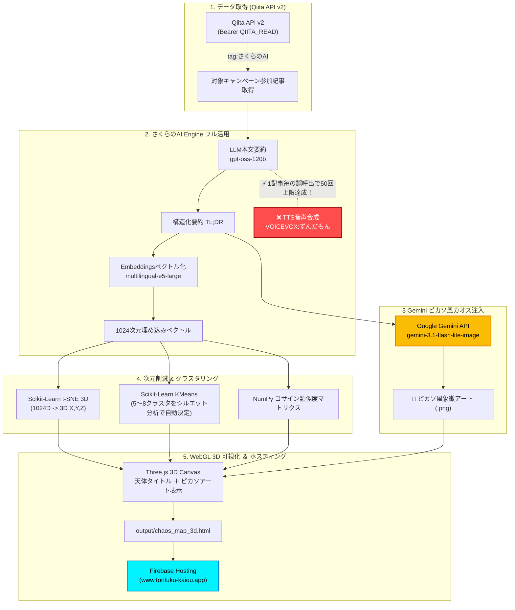

## 1. はじめに：作ったもの

「[さくらのAI Engine 3,000リクエスト使い切りチャレンジ](https://qiita.com/official-events/bd14d28b53326d318fec)」に参加し、キャンペーン参加記事の意味的な距離を3次元空間にマッピングして、ブラウザ上で360°探索できる **「3D記事空間銀河カオスマップ」** を開発しました。

- 🌐 **[3D 記事空間銀河マップをブラウザで開く (Three.js WebGL)](https://www.torifuku-kaiou.app/chaos_map_3d.html)**


### ✨ 特徴
1. **3D立体宇宙空間**: 1024次元の意味ベクトルを 3D t-SNE で 3次元 `(X, Y, Z)` 空間へ圧縮配置。
2. **天体タイトルラベル**: 各天体球体の上に、**記事タイトルが直接3Dビルボードラベル**として浮遊。
3. **Geminiピカソ風象徴アート**: 各記事の内容を象徴する**ピカソ（キュビスム）風の抽象油絵**を Google Gemini で自動生成し、サイドバー詳細にドーンと表示。
4. **インタラクティブ探査**: マウスドラッグで 360°自由回転、ホイールでズーム、天体をクリックすると、記事の基本情報や象徴アート、意味的に近い記事 Top 3 を確認できます。
5. **相関・星座線**: コサイン類似度が高い記事同士を宇宙空間の点線（星座線）で接続。


---

## 2. システムアーキテクチャ ＆ 処理フロー (Mermaid図説)

さくらのAI Engine（テキスト解析・ベクトル化）と Google Gemini（画像生成）を組み合わせた処理フローは以下の通りです。



---

## 3. Embedding（ベクトル埋め込み）という言葉に最初は戸惑った

実は、さくらのAI Engineの提供機能を眺めていて、一番引っ掛かったのは **「ベクトル埋め込み（Embeddings）」** という言葉でした。

「これは一体何に使うのだろう？」

そう思って Claude Code x さくらのAI Engine（Kimi-K2.7-Code）に尋ねたところ、「記事をベクトル化して、**文字列ではなく「意味の近さ」で記事同士を比較できる技術**」であることが分かりました。それで、このキャンペーンに応募している記事をEmbedding（ベクトル埋め込み）してみるとおもしろいのではないかと思いました。

私がやりたかったことは、とても単純です。

``` text
記事
    ↓
ベクトル化
```

そのため最初は「ベクトル変換」や「文章ベクトル化」と呼んでくれた方が直感的なのでは、と感じました。

調べてみると、**Embedding はAI・機械学習の世界で広く使われている標準用語**でした。

「埋め込み」という名前は、単に数値へ変換するという意味ではありません。

文章を **意味が近いもの同士が近くに配置されるような高次元空間**へ写像（マッピング）するという数学的な考え方から、この名前が付いています。

ここでいう **「高次元」** は「数字が大きい」という意味ではありません。

例えば `multilingual-e5-large` は、記事を **1024個の数値**へ変換します。

つまり、

-   1個の数値なら1次元
-   3個なら3次元
-   1024個なら1024次元

という意味です。

最初は「高次元」という表現にも違和感がありました。しかし、「1024本の座標軸を持つ空間」と考えると腑に落ちました。

そして、この Embedding が RAG（Retrieval-Augmented Generation） の土台になっています。

従来の検索は、

``` text
文字列一致
```

でした。

一方、Embedding を利用した検索では、

``` text
意味が近い記事
```

を探せます。

今回は、Embeddingを使って記事同士の意味的な距離を測り、その関係性をThree.js上で可視化しました。

この記事を書きながら、「Embedding」という専門用語の意味を自分自身が理解できたことも、この作品の大きな収穫でした。


---

## 4. 痛恨のしくじり体験：TTS（音声合成）無償枠の使い切り 😭

せっかくだから全機能（LLM要約・Embeddings・TTS）をフル活用しようと考え、パイプラインを構築しました。

本来の設計では、**「音声合成（ずんだもん）はレポート全体の最後のまとめで1回だけ呼び出す」** つもりでした。

しかし、実行した直後に画面に表示された悲劇 ──

```text
Error 429: Quota exceeded for audio/speech (limit: 50 requests/month)
```

**あろうことか、コードが「1記事ごとにTTSを呼び出す」実装になっていたのです。**

原因は明白です。Antigravity 2.0 (Claude Sonnet 4.6) にコーディングを任せた私が馬鹿でした。もちろん「最後のまとめで1回だけ呼ぶ」という私のプロンプトの指示も曖昧だったのでしょうし、何よりAIが生成したコードの全容を確認しないまま一括実行してしまった私が一番悪いのです……。

キャンペーン参加記事は多数あります。1記事ごとに呼び出せば、当然たった1回の全件実行で無償枠上限（50回/月）に達してしまう ──。AIが吐き出したコードの呼び出し構造を目で確認せずに「見る前に飛んでしまった」痛恨のミスでした。

たった1回の実行で、今月分のずんだもん音声枠を初日に完全消費。今月はもうずんだもんになかなか喋ってもらえません……。

---

## 5. カオスマップに本物のカオスを持ち込む：Gemini × ピカソ風アート

「ずんだもんの音声枠は初日に尽きて静かになった……。それなら、**カオスマップに本物のカオス（芸術）を持ち込んでみよう！**」

さくらのAI Engine が抽出した「構造化要約」をトリガーにして、**Google Gemini（`gemini-3.1-flash-lite-image`）** を使って、各技術記事のテーマや世界観を象徴する**ピカソ（キュビスム）風の抽象油絵**を自動生成するロジックを追加しました。

### 🎨 生成されたキュビスムアートの例
例えば、「さくらのAI Engine」と「UTF-8文字問題」や「APIトークン」をテーマにした記事の場合、Gemini は幾何学的な平面分割と鮮やかな油絵の質感で、技術文脈を散りばめた圧倒的クオリティの現代アートを吐き出してくれます。

整理された 1024次元の意味ベクトル（秩序）と、ピカソのキュビスムアート（カオス）が融合することで、文字通り **真の「3D記事空間カオスマップ」** へと進化を遂げました。

---

## 6. 使い切るために、使い捨てない──キャッシュで闘魂昇華

3,000リクエストという数字を見ると、「せっかくの無料枠だから、できるだけたくさん呼び出して使い切ろう」と考えたくもなります。

しかし、同じ記事、同じ要約、同じ画像を、実行するたびに最初から生成し直すのは「使い倒す」こととは少し違います。それは、限りある計算資源と通信を、同じ場所で何度も空回りさせることです。

そこで、このカオスマップには記事単位のキャッシュを組み込みました。無料枠を温存したいからだけではありません。**同じ入力に対する同じ処理を繰り返さず、空いたリクエストを新しい挑戦へ回す**ためです。

### ① Qiita API v2 のアクセストークン認証 (`QIITA_READ`)
未認証リクエスト（60回/時）だとレートリミットに引っかかるため、環境変数に設定した `QIITA_READ` トークンを Bearer ヘッダーに付与し、1,000回/時の枠で安全に記事一覧を取得しています。

### ② さくらのAI Engine モデル選定と埋め込み最適化
- **要約 LLM**: `gpt-oss-120b`
  - 要約文が長すぎて Embeddings（512トークン制限）で切られないよう、要約が800文字を超えた場合は LLM 自身に「重要ポイントを保ったまま 500文字以内に短縮せよ」と指示して自動再要約させるリトライループを組み込みました。
- **Embeddings**: `multilingual-e5-large`
  - 1024次元のベクトルが出力されます。純粋な技術テーマ・結論のみを入力ベクトル化に渡すことで最高密度の意味ベクトルを得ています。

### ③ Google Gemini 画像生成 (`gemini-3.1-flash-lite-image`)
`google-genai` SDK の最新 API `client.models.generate_content(..., config=types.GenerateContentConfig(response_modalities=["IMAGE"]))` を使用し、低コストかつ爆速で各記事のピカソアートを生成・キャッシュしています。

### ④ 同じものを繰り返し生成しない：キャッシュ戦略

記事ごとに、生成結果と、その結果を作るために使った入力の指紋を保存しています。次回の実行では、変更のない記事の要約・Embedding・画像・カテゴリ名をそのまま再利用し、変更された記事だけを必要な工程から再処理します。

キャッシュの構造は次のようになっています。

```json
{
  "cache_version": 2,
  "records": {
    "qiita_article_id": {
      "article_fingerprint": "SHA-256(title + body)",
      "summary": {},
      "embedding_input_fingerprint": "SHA-256(actual embedding input)",
      "embedding": [],
      "image_fingerprint": "SHA-256(title + full_summary)",
      "image_path": "images/qiita_article_id.png"
    }
  },
  "category_names": {
    "cluster_membership_fingerprint": "generated category name"
  }
}
```

フィンガープリントの入力は処理ごとに異なります。要約は記事タイトルと本文、Embeddingは音声紹介用テキストを除いた実際のEmbedding入力、画像は記事タイトルと全文要約です。カテゴリ名はクラスタに所属する記事の情報とプロンプトの版をもとに管理します。

要約からEmbeddingへ渡す文章、記事の要約から生成する画像など、処理ごとに再利用の判断を分けていることがポイントです。画像まで毎回作り直すのではなく、必要なものだけを作り直します。

さらに、処理の途中でもキャッシュを保存します。長い処理の途中で止まっても、それまでに完了した成果を次回へ引き継げる設計です。

キャッシュは、単に処理を速くするための仕組みではありません。一度得た成果を記憶し、同じリクエストを繰り返さず、次の創造にリクエストを使うための仕組みです。


### ⑤ 無料枠を、無駄遣いではなく闘魂昇華へ

キャンペーンの無償枠は、月3,000リクエストです。音声合成のように月50リクエストの機能もあります。無料だからといって、同じデータを何度も送り、同じ答えを何度も作る必要はありません。

一度作った要約、Embedding、画像を正しく保存しておけば、次の実行では「まだ処理していない記事」や「本当に変更された記事」にリクエストを使えます。これは、限られた無料枠をケチる話ではなく、1回のリクエストに意味を持たせる話です。

一人の一回のキャッシュ利用は、地球規模で見れば塵芥のようなものかもしれません。それでも、同じような無駄な再生成が、個人開発、CI、サービス運用、世界中のアプリで繰り返されていると考えれば、その塵芥は積み重なります。不要な通信、不要な計算、不要な待ち時間を減らすことは、極小さくても地球に対する配慮になり得ます。

正確な環境負荷の削減量をこの作品で測定したわけではありません。それでも、無料枠を「とにかく消化する」のではなく、キャッシュで同じ処理を避け、浮いたリクエストを新しい試行へ回す。この姿勢こそが、今回の作品における **闘魂昇華** です。


---

## 7. おわりに──token消化ではなく、闘魂昇華

まとめの最後に1回だけ呼び出すはずだった音声合成。コードの全容を確認せずに実行した結果、初日にTTS枠を使い果たすという痛い失敗を犯しました。

しかし、その失敗があったからこそ、「カオスマップに本物のカオス（ピカソアート）を持ち込む」というアイデアが生まれ、**3D WebGL 空間で記事同士の意味的な距離と藝術的な世界観を体感できる銀河マップ**へと到達できました。

そして、今回の開発で得たもう一つの答えがキャッシュです。

AIが扱うのはToken。しかし、同じ入力を何度もAPIへ送り、数字だけを消費することが目的ではありません。一度得たものを保存し、変更があったところだけを再び闘わせ、空いたリクエストを次の創造へ向ける。

**token消化ではなく、闘魂昇華。**

無料枠を、闘って、磨いて、使い切りますッ！！！

今回の作品を通して、私は「Embedding」という専門用語の意味をようやく自分の言葉で理解できました。

Embeddingによって意味空間を作り、記事同士の近さを測れることを実感できた点が、一番大きな収穫でした。「[さくらのAI Engine 3,000リクエスト使い切りチャレンジ](https://qiita.com/official-events/bd14d28b53326d318fec)」キャンペーンが間違いなく、きっかけになっています。さくらインターネット様、Qiita様には感謝の言葉しかありません。

<b><font color="red">$\huge{ありがとうーーーーッ！！！}$</font></b>

ぜひ [3D 記事空間銀河マップ (www.torifuku-kaiou.app)](https://www.torifuku-kaiou.app/chaos_map_3d.html) で、さくらのAI Engine と Qiita そして Google Gemini が織りなす宇宙的なカオスを体感してみてください 🌸

---

### 🔗 関連リンク
- 🌐 **[3D 記事空間銀河マップ Web UI](https://www.torifuku-kaiou.app/chaos_map_3d.html)**
- 🌸 **[さくらのAI Engine 公式ページ](https://cloud.sakura.ad.jp/specification/ai-engine/)**
