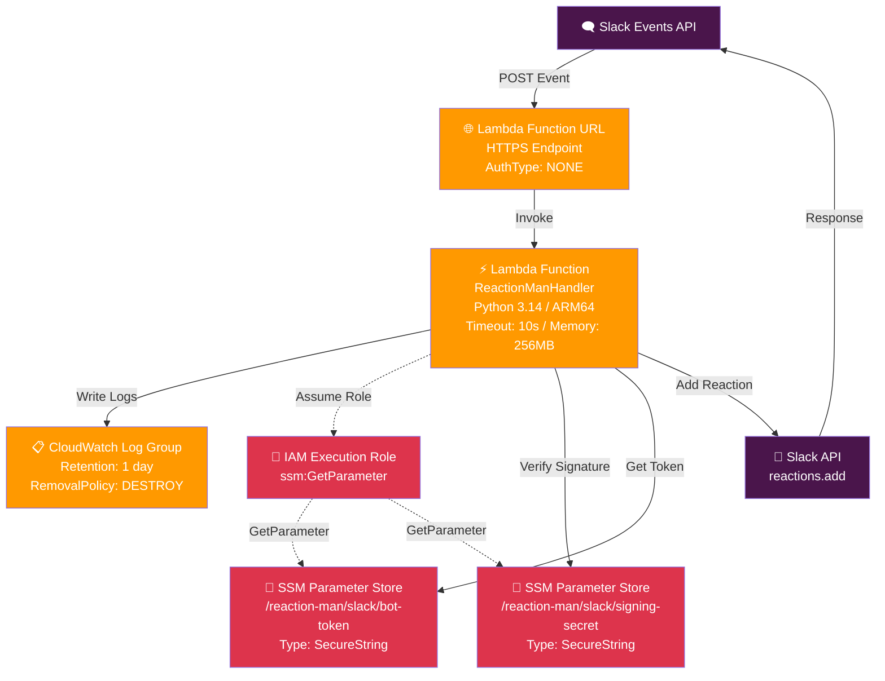

## はじめに
> 今年のアドカレは、史上最高に盛り上がってます🔥ついに本登録期間が開始しました！参加してくれた皆さんのおかげで、今年のアドカレは、例年以上の熱気に包まれています！カレンダー数、参加者数ともに過去最高を更新中🚀一緒に今年最後のアウトプットを盛り上げていきましょう！

盛り上がっております！


Qiitaのトップページで案内されております。

そんな中、盛り下がることをしてしまっておりました。謹んでお詫び申し上げます！

## 盛り下げることとは！？
ElixirコミュニティのSlackで、`#autoracex`チャネルを主宰しております。そのチャネルでは下記の記事に書いたように投稿（闘魂）に景気のいい絵文字リアクションをつけて、みんなのアウトプットを褒め称える、次への活力にする仕組みを永らく運用しておりました。

https://qiita.com/torifukukaiou/items/4c35ace6db3f02ac3897

しかし、私が運用していたTime4VPSサーバーの利用料を支払っておらず、9月くらいから止まってしまっておりました。将棋に熱中しすぎていたのかもしれません。このままではアドベントカレンダー2025を私ひとりが盛り下げてしまうかもしれない。そんな危機感を抱きまして、至急対応することにしました。もうアドベントカレンダー2025ははじまっています！　はやくしないとアドベントカレンダー2026がはじまってしまいます！

## できるだけ運用費を抑えるには？
AWSのサーバーレスアーキテクチャを採用するとほぼ無料、たぶん無料で運用できそうです。

今年は[AWS CDK](https://docs.aws.amazon.com/ja_jp/cdk/v2/guide/home.html)を覚えましたので、それを使います。



## Vibe Coding
Vibe Codingにてノリでつくりました。初期プロンプトを公開しておきます。さらしておきます。

相棒は、[Codex CLI](https://developers.openai.com/codex/cli/)と[Kiro CLI](https://kiro.dev/cli/)を使いました。

```txt
import os
import random
from slack_bolt import App
from slack_bolt.adapter.socket_mode import SocketModeHandler

# ボットトークンとソケットモードハンドラーを使ってアプリを初期化します
app = App(token=os.environ.get("SLACK_BOT_TOKEN"))

@app.event("message")
def handle_message_events(body, logger, client):
    logger.info(body)
    ts = body['event']['ts']
    channel = body['event']['channel']
    icons = ['thumbsup', 'tada', 'rocket']

    client.reactions_add(
        channel=channel,
        name=random.choice(icons),
        timestamp=ts)


# アプリを起動します
if __name__ == "__main__":
    SocketModeHandler(app, os.environ["SLACK_APP_TOKEN"]).start()


相当のSlackアプリケーションをつくりたい。
AWSのサーバーレス構成とするため、HTTPSタイプの通信になると考えている。

- AWSのサーバーレスで動かしたい
- cdkプロジェクトで構成して、Lambdaで動かしたい
- cdkはTypeScriptを採用
- LambdaのランタイムはPython 3.14でもTypeScriptでもよい
- API Gatewayは使用せず、Lambda関数URLをつかうことにする
- 機密情報はSystems ManagerのParameter StoreにSecure stringで保存することを考えている
```

## ソースコード全文
ソースコード全文も全世界に公開しておきます。

https://github.com/TORIFUKUKaiou/reaction-man

LambdaはPythonでつくりました。正確にはGenerative AIsにつくってもらいました。Slackのライブラリは使わずに、Slackの仕様を正確に実装してくれていました。私の要求には何も書いていないのにそのへんは頭に入っているのでしょう。ソラで書いてしまうのはすごいです。

## さいごに
一部、私の周辺では、アドベントカレンダーは26記事目からが本番だという声があり、これからもどんどんアドベントカレンダー2025を盛り上げて参りますという所存であります。つまり投稿（闘魂）を続けますという思いの丈を披瀝しているわけでございます。

[reaction-man](https://github.com/TORIFUKUKaiou/reaction-man)がSlackチャネルを盛り上げること間違いなしです！


https://qiita.com/torifukukaiou/items/4d1d6b575ea93909134e
