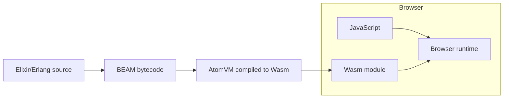
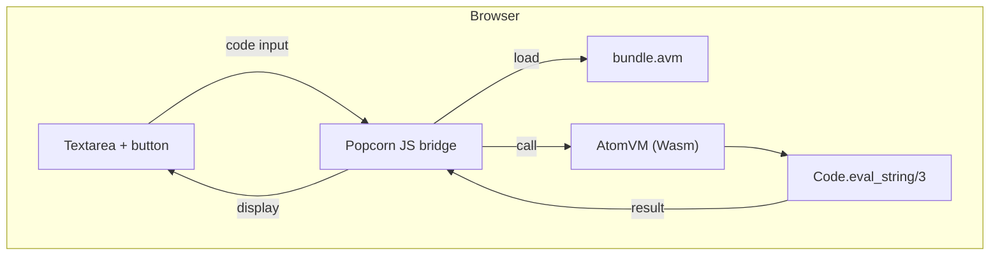

## はじめに

Elixir をブラウザで動かしてみました。サーバー不要、インストール不要です。

遅ればせながら、[AtomVM](https://atomvm.org/)にようやく触れてみました。

**デモ**: https://elixir-browser-eval.torifuku-kaiou.app/

たとえば、以下のコードを打ち込んで`Evaluate`してみてください。

```elixir
Enum.map(1..10, & &1 * 2)
```


この記事では、WebAssembly (Wasm)、AtomVM、Popcorn という3つの技術を紹介し、実際に Cloudflare Pages にデプロイするまでの過程をまとめます。

## WebAssembly (Wasm) とは

WebAssembly は、モダンブラウザで動作するコンパクトなバイナリフォーマットです。JavaScript 以外の言語を「Wasm にコンパイルして」ブラウザ内で実行できるようにします。

特徴：
- **高速**: ネイティブに近い速度で実行
- **安全**: サンドボックス内で動作
- **ポータブル**: どのブラウザでも同じように動く



## AtomVM とは

[AtomVM](https://github.com/atomvm/AtomVM) は、軽量な Erlang VM です。

通常の BEAM VM は数十MBのメモリを必要としますが、AtomVM は構成によって数百KB〜数MB程度のフットプリントで動作します。主なターゲットは：

- **マイクロコントローラー**: ESP32、STM32 など
- **WebAssembly**: ブラウザ内で BEAM バイトコードを実行

AtomVM は Erlang/Elixir のサブセットをサポートしており、`Code.eval_string/3` も動作します。

## Popcorn とは

[Popcorn](https://github.com/software-mansion/popcorn) は、Software Mansion が開発した Elixir を WebAssembly で動かすためのライブラリです。

Popcorn がやってくれること：
1. ビルド時に Elixir コードを BEAM バイトコードにコンパイル（`mix popcorn.cook`）
2. AtomVM (Wasm版) と一緒に `bundle.avm` としてパッケージング
3. ブラウザ側の JavaScript ブリッジを提供（`popcorn.js`）



## 手元で動かしてみる

Popcorn のサンプル `eval_in_wasm` を動かします。

```bash
git clone https://github.com/software-mansion/popcorn.git
cd popcorn

# mise で OTP と Elixir のバージョンを合わせる
mise trust
mise install

cd examples/eval_in_wasm
mix deps.get
mix popcorn.cook
```

`mix popcorn.cook` を実行すると、`static/` ディレクトリに成果物が生成されます：

```
static/
├── index.html
├── script.js
├── style.css
└── wasm/
    ├── AtomVM.mjs
    ├── AtomVM.wasm
    ├── bundle.avm      # BEAM バイトコード
    ├── popcorn.js
    └── popcorn_iframe.js
```

ローカルサーバーを起動：

```bash
elixir server.exs
# http://localhost:4000 でアクセス
```

## eval_in_wasm.ex

Elixir側の主要な実装です。美しいです。感動です。


https://github.com/software-mansion/popcorn/blob/c135f0101687d0c10a23c178bc329a375b45a035/examples/eval_in_wasm/lib/eval_in_wasm.ex

---

## Cloudflare Pages にデプロイ

### ハマりポイント：ヘッダー設定

Wasm を動かすには、ページが **Cross-Origin Isolated** になる必要があります。これを満たすために COOP/COEP が必須です。さらに、`.avm` と `.wasm` を正しい MIME で配信するために `Content-Type` を明示しておくと安全です。

| ヘッダー | 値 | 理由 |
|---------|-----|------|
| `Cross-Origin-Opener-Policy` | `same-origin` | Cross-Origin Isolated を有効化 |
| `Cross-Origin-Embedder-Policy` | `require-corp` | Cross-Origin Isolated を有効化 |
| `Content-Type` | `application/octet-stream` | `.avm` をバイナリとして配信 |
| `Content-Type` | `application/wasm` | `.wasm` の正しい MIME |

Cloudflare Pages では `_headers` ファイルで設定します：

```
/*
  Cross-Origin-Opener-Policy: same-origin
  Cross-Origin-Embedder-Policy: require-corp

/wasm/*.avm
  Content-Type: application/octet-stream

/wasm/*.wasm
  Content-Type: application/wasm
```

※ 同一オリジン配信だけなら `Access-Control-Allow-Origin` は不要です。別オリジンのリソースを読み込む場合は、CORS / CORP の設定が追加で必要になります。

### デプロイ手順

1. GitHub にリポジトリを作成し、`static/` の中身と `_headers` を push
2. Cloudflare Pages でプロジェクトを作成
3. GitHub リポジトリを連携
4. ビルド設定は不要（静的ファイルをそのまま配信）

## リポジトリ

https://github.com/TORIFUKUKaiou/elixir-browser-eval

## まとめ

- **WebAssembly**: ブラウザで JavaScript 以外の言語を動かす技術
- **AtomVM**: 軽量 Erlang VM、Wasm にもコンパイル可能
- **Popcorn**: Elixir を Wasm で動かすためのライブラリ
- **Cloudflare Pages**: `_headers` ファイルで COOP/COEP ヘッダーを設定

Elixir がブラウザで動く時代が来ました。来ていました。ぜひ試してみてください。

## 参考リンク

- [Popcorn - GitHub](https://github.com/software-mansion/popcorn)
- [AtomVM - GitHub](https://github.com/atomvm/AtomVM)
- [Software Mansion](https://swmansion.com/)
- [Cloudflare Pages Headers](https://developers.cloudflare.com/pages/configuration/headers/)
- [Elixirのライブラリpopcornを触って、GitHub Pages上でデモを作ってみた](https://qiita.com/FRICK/items/801e2a919c13c1062268)
- [AtomVM: 最新のソースコードからビルド (2025年12月)](https://qiita.com/mnishiguchi/items/d4ee6fbfa9d24378446f)
