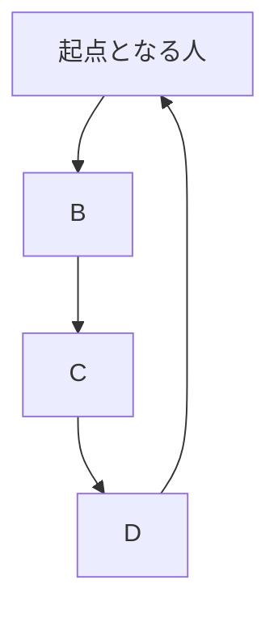

https://qiita.com/official-events/5cb794f7cb9ac194ed70

**修身斉家治国平天下**

Advent Calendar 2022 24日目[^1]の記事です。
I'm ready for 12/25,2022 :santa::santa_tone1::santa_tone2::santa_tone3::santa_tone4::santa_tone5:
I'm looking forward to 12/25,2022 :santa::santa_tone1::santa_tone2::santa_tone3::santa_tone4::santa_tone5:
I can't wait for 12/25,2022 :santa::santa_tone1::santa_tone2::santa_tone3::santa_tone4::santa_tone5:
私の[Advent Calendar 2022 一覧](https://docs.google.com/spreadsheets/d/1HQvFjagQLRPjOYAjDVzWp9S4b8dKixxvvaz_TtbZWto/edit#gid=1723448955)。

[^1]: @kaizen_nagoya さんの「[「@e99h2121 アドベントカレンダーではありますまいか Advent Calendar 2020」の改訂版ではありますまいか Advent Calendar 2022 １日目　Most Breakthrough Generator](https://qiita.com/kaizen_nagoya/items/49ebebee3a0377f3b59b)」から着想を得て、模倣いたしました。 

---

# はじめに

[Elixir](https://elixir-lang.org/)を楽しんでいますか:bangbang::bangbang::bangbang:
[Livebook](https://github.com/livebook-dev/nerves_livebook)を楽しんでいますか:bangbang::bangbang::bangbang:
[Nerves Livebook](https://github.com/livebook-dev/nerves_livebook)を楽しんでいますか:bangbang::bangbang::bangbang:

明日2022/01/25(火)は、「[LiveView JP#3](https://liveviewjp.connpass.com/event/234692/)」でLTをします。

3つ話します。

1. [Req](https://github.com/wojtekmach/req)
1. [Mermaid](https://mermaid-js.github.io/mermaid/#/)
1. ウェブチカ[^2]

[^2]: ウェブチカの初出は、@nishiuchikazuma さんの https://speakerdeck.com/nishiuchikazuma/elixir-nervesru-men-jian-lao-naiot-edgedebaisupuroguraminguwooshou-qing-ni-nervesdetukuruuebutika-number-algyan


# 話さないこと

しまった :sweat_smile: 
**LiveUpload特集**と銘打たれていますが、
LiveUploadの話を用意していません。

う〜ん、そうですねー、あーそうだ**LiveUpload**関連でコントリビューションしたことがあることを思い出しました。

https://github.com/phoenixframework/phoenix_live_view/commit/46d870c9f0101dcdf721807053c9ca2bd0c9f766

docの修正です。


この当時、**LiveUpload**のレビューに
<font color="purple">$\huge{勝手に参加していました🚀}$</font>

**LiveUpload**と全く無関係の人ではないことをアピールしておきます。
詳しいことは、@piacerex さんと @the_haigo さんにお任せして、私は違う話をします。


# 主役たち

[Elixir](https://elixir-lang.org/) の主役たちを私の感じ方でざっくり説明します。
[Elixir](https://elixir-lang.org/)エコシステムの
<font color="purple">$\huge{ど真ん中}$</font>
にいらっしゃる本体、ライブラリたちです。

|  | 私の感じ方、ざっくりとした説明 |
|:-|:-|
| [Elixir](https://elixir-lang.org/)  | 世俗派関数型言語[^4]。なんとなく知らない間にゆるふわで「アタシ、関数型言語でプログラミングしちゃってました」 てな具合にプログラミングを楽しめます。 |
| [Phoenix](https://www.phoenixframework.org/)  | Webアプリケーションの開発を楽しめます  |
| [LiveView](https://github.com/phoenixframework/phoenix_live_view)  | 高性能なバックエンド開発もリッチなフロントエンド開発も[Elixir](https://elixir-lang.org/)一本で楽しめます！  |
| [Livebook](https://github.com/livebook-dev/livebook)  | [Jupyter](https://jupyter.org/)に相当するもの。[LiveView](https://github.com/phoenixframework/phoenix_live_view)を利用したアプリケーションの代表例ともいうべき金字塔。[LiveView](https://github.com/phoenixframework/phoenix_live_view)を利用したアプリケーションのお手本であり、最高峰。  |
| [Nx](https://github.com/elixir-nx) | AI関係のゲームチェンジャー |
|[Nerves](https://www.nerves-project.org/)| [Elixir](https://elixir-lang.org/)でIoTを楽しめるフレームワークです。[ナウでヤングでcoolなすごいやつ](https://www.slideshare.net/takasehideki/elixirnervescool-249038510)です。(誤解を恐れずにいえば)[Nerves](https://www.nerves-project.org/)は、[Elixir](https://elixir-lang.org/)専用OSです!!! sshで中に入ったら`iex>`~~しかできません~~だけができて**一生[Elixir](https://elixir-lang.org/)だけを楽しめます:rocket::rocket::rocket:**　|
|[Nerves Livebook](https://github.com/livebook-dev/nerves_livebook) |[Livebook](https://github.com/livebook-dev/livebook)は、[Nerves](https://www.nerves-project.org/)の上でイゴきます[^2]|

[^4]: @kikuyuta 先生の「[世俗派関数型言語 Elixir を関数型言語風に使ってみたらやっぱり関数型言語みたいだった](https://qiita.com/kikuyuta/items/afa4c264720eb29d9760)」より。[Elixir](https://elixir-lang.org/)はコワくないですよ〜。

[^2]: 「動きます」の意。おそらく西日本の方言、たぶん。[NervesJP](https://nerves-jp.connpass.com/)ではおなじみ。少し古いオートレースの映像ですが、実況アナウンサーが「針[^3]イゴきます」とはっきり言っています。https://autorace.jp/netstadium/SearchMovie/Movie/iizuka?date=2017-01-04&p=5&race_number=11&pg=

[^3]: 大時計の針のこと。針がイゴいてある地点まで到達すると選手はスタートを切って良い発走の合図。針がイゴきはじめると(おそらく)選手は緊張するし、スタートはその後のレース展開に大きく影響するので、車券を握りしめている観客たちがもっとも緊張する瞬間であるため、先の尖った鋭いものを連想させる針は緊張の暗喩としても言い得て妙。


# [Req](https://github.com/wojtekmach/req)

[Nerves Livebook](https://github.com/livebook-dev/nerves_livebook)にデフォルトでプリセットされるようになったHTTPクライアントです。
プリセットされるようになったのは、何を隠そう私の[プルリク](https://github.com/livebook-dev/nerves_livebook/pull/148)です。

https://qiita.com/torifukukaiou/items/66e21a5a497ef5dbf4b2

[Qiita API](https://qiita.com/api/v2/docs)を利用させていただいて[Elixirタグ](https://qiita.com/tags/elixir)がついた最新記事20件を取得しています。

```elixir
"https://qiita.com/api/v2/items?query=tag:Elixir"
|> URI.encode()
|> Req.get!(finch_options: [pool_timeout: 50000, receive_timeout: 50000])
|> Map.get(:body)
|> Enum.map(& Map.take(&1, ["title", "url"]))

```

海外のAlchemistは、[Req](https://github.com/wojtekmach/req)推しのようです。

Ownerの[Wojtek Mach](https://github.com/wojtekmach)さんは、Elixir本体にもたくさん[コミットされています](https://github.com/elixir-lang/elixir/commits?author=wojtekmach)。

https://github.com/elixir-lang/elixir/commits?author=wojtekmach


# [Mermaid](https://mermaid-js.github.io/mermaid/#/)

https://qiita.com/torifukukaiou/items/b5b173e80ac5682e6d48

[Livebook](https://github.com/livebook-dev/livebook)のmarkdownでこげなことをかくと、いい感じに表示されます。
@ShozF さんに[Nerves Livebook](https://github.com/livebook-dev/nerves_livebook)でも動くことを[教えてもらいました](https://qiita.com/torifukukaiou/items/b5b173e80ac5682e6d48#comment-1312334874a0c9df1832)。
この場をお借りして厚く御礼申し上げます。

当日はデモ or 動画共有をします。

<iframe width="856" height="482" src="https://www.youtube.com/embed/zdVBmd_NFBA" title="YouTube video player" frameborder="0" allow="accelerometer; autoplay; clipboard-write; encrypted-media; gyroscope; picture-in-picture" allowfullscreen></iframe>

:::note

:::


[Mermaid](https://mermaid-js.github.io/mermaid/#/)のトップページにあるサンプルは、**Sequence diagram**を除いてそのまま動きます。
**Sequence diagram**で一部パースエラーが発生してしまう件は、Issueの[報告](https://github.com/livebook-dev/livebook/issues/923)をしています。

https://github.com/livebook-dev/livebook/issues/923

[José Valim](https://twitter.com/josevalim)さんご本人から直々にご返信をいただきました。


# Webチカ

当日お知らせするURLに代表でどなたかにアクセスしていただいて、以下のプログラムにてLチカをしていただきます。

## 点灯

```elixir
{:ok, gpio} = Circuits.GPIO.open(18, :output)
Circuits.GPIO.write(gpio, 1)
```

## 消灯

```elixir
{:ok, gpio} = Circuits.GPIO.open(18, :output)
Circuits.GPIO.write(gpio, 0)
```

## 仕組み

[ngrok](https://ngrok.com/)を使っています。

> One command for an instant, secure URL to your localhost server through any NAT or firewall.


# Wrapping up :lgtm::lgtm::lgtm::lgtm::lgtm:

Enjoy [Elixir](https://elixir-lang.org/):bangbang::bangbang::bangbang:
<font color="purple">$\huge{Enjoy\ Elixir🚀}$</font>

「[LiveView JP#3](https://liveviewjp.connpass.com/event/234692/)」のLTにて3つ話をしました。

1. [Req](https://github.com/wojtekmach/req)
1. [Mermaid](https://mermaid-js.github.io/mermaid/#/)
1. Webチカ


[Elixir](https://elixir-lang.org/)の誕生日は、**2012年5月24日**です。
そのため、今年の2022年5月24日は10周年を迎えます。

```elixir
iex(1)> Date.diff(~D[2022-05-24], ~D[2022-01-24])
120
```


2022年に流行る技術予想 ーー それは、[Livebook](https://github.com/livebook-dev/livebook)です:rocket::rocket::rocket:

---


# [Elixir](https://elixir-lang.org/)

最後の最後に、[Elixir](https://elixir-lang.org/)について紹介します。

- [|>](https://hexdocs.pm/elixir/Kernel.html#%7C%3E/2)でスイスイ、プログラミングしていくことができる素敵なプログラミング言語です
- さっそくプログラムの例を示します
- [Qiita API](https://qiita.com/api/v2/docs)を使わせていただいて、`Elixir`タグがついた最新の記事を20件取得しています
- ここでは雰囲気をつかんでいただければ大丈夫です

```elixir
Mix.install [{:req, "~> 0.2.1"}]

"https://qiita.com/api/v2/items?query=tag:Elixir"
|> URI.encode()
|> Req.get!(finch_options: [pool_timeout: 50000, receive_timeout: 50000])
|> Map.get(:body)
|> Enum.map(& Map.take(&1, ["title", "url"]))

```

## Webアプリケーションを楽しむなら
- [Phoenix](https://www.phoenixframework.org/)

## IoTを楽しむなら
- [Nerves](https://www.nerves-project.org/)

## AIを楽しむなら
- [Nx](https://github.com/elixir-nx/nx) + [Livebook](https://github.com/livebook-dev/livebook)

## もっと[Elixir](https://elixir-lang.org/)のことを知りたい方へオススメの書籍 :books: 
- [プログラミングElixir（第2版）](https://www.ohmsha.co.jp/book/9784274226373/) -- オーム社
- [Elixir実践ガイド](https://book.impress.co.jp/books/1120101021) -- インプレス
- [アルケミスト − 夢を旅した少年](https://www.kadokawa.co.jp/product/199999275001/) -- KADOKAWA

## コミュニティ
- [elixir.jp](https://join.slack.com/t/elixirjp/shared_invite/zt-ae8m5bad-WW69GH1w4iuafm1tKNgd~w) Slack workspaceに参加してみてください
    - マヂ、やさしい人ばっかりのコミュニティ
    - あなたの**困った**をきっと解決してくれるでしょう
- [NervesJP Slack](https://join.slack.com/t/nerves-jp/shared_invite/zt-9vteokip-iVAqi8TkT0ID_uK9dSqVHA) workspaceでは、NervesやIoTが好きな愉快なfolksたちがあなたの訪れを歓迎します :tada:
- たくさんのコミュニティがあります

([EDI／fukuoka.ex／kokura.ex](https://fukuokaex.connpass.com/) ＆ [LiveView JP](https://liveviewjp.connpass.com/) の @piacerex さん作 :pray::pray_tone1::pray_tone2::pray_tone3::pray_tone4::pray_tone5:)


# <u><b>Elixirコミュニティに初めて接する方は下記がオススメです</b></u>

**Elixirコミュニティ の歩き方 －国内オンライン編－**<br>
https://speakerdeck.com/elijo/elixirkomiyunitei-falsebu-kifang-guo-nei-onrainbian
[](https://speakerdeck.com/elijo/elixirkomiyunitei-falsebu-kifang-guo-nei-onrainbian)
([piyopiyo.ex](https://piyopiyoex.connpass.com/) ＆ [エリジョ](https://elijo.connpass.com/) の nakoさん(@nako_sleep_9h) 作、素敵な資料:clap::clap_tone1::clap_tone2::clap_tone3::clap_tone4::clap_tone5:)


---

I organize [autoracex](https://autoracex.connpass.com/).
And I belong to [NervesJP](https://nerves-jp.connpass.com/), [fukuoka.ex](https://fukuokaex.connpass.com/), [EDI](https://fukuokaex.connpass.com/).
I hope someday you'll join us.

[We Are The Alchemists, my friends!](https://www.youtube.com/watch?v=04854XqcfCY)
